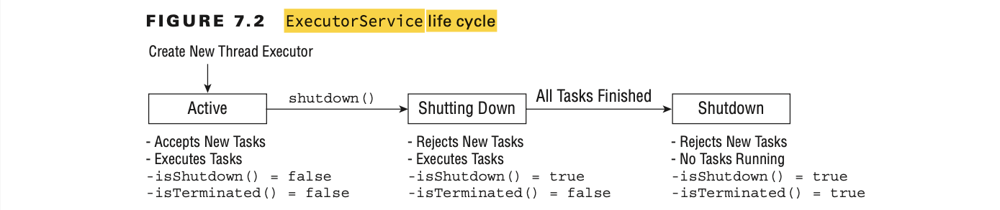

# Concurrency

## Introducing Threads

- A thread is the smallest unit of execution that can be scheduled by the operating system.
- A process is a group of associated threads that execute in the same, shared environment.
- By shared environment, we mean that the threads in the same process share the same memory space 
and can communicate directly with one another.

### Distinguishing Thread Types

- A system thread is created by the JVM and runs in the background of the application.
For example, the garbage-collection thread is a system thread that is created by the JVM
and runs in the background.
- A user-defined thread is one created by the application developer to accomplish a specific task.
- Both system and user-defined threads can be marked as daemon threads. 

### Understanding Thread Concurrency 

- The property of executing multiple threads and processes at the same time is referred to as concurrency.
- Operating systems use a thread scheduler to determine which threads should be currently executing.
- A context switch is the process of storing a thread’s current state and later restoring the state of the thread to continue execution.

**Java thread priority constants**

| Constant Variable     | Value |
|-----------------------|-------|
| Thread.MIN_PRIORITY   | 1     |
| Thread.NORM_PRIORITY  | 5     | // default
| Thread.MAX_PRIORITY   | 10    |


### Introducing Runnable

In Java, the `Runnable` interface is used to create a thread that can be executed concurrently with other threads. It's typically used to define the task or code that should be executed by a thread.

Here's the `Runnable` interface and its `run()` method signature:

```java
public interface Runnable {
    public abstract void run();
}
```

The `run()` method contains the code that defines the task to be performed by the thread. When a class implements the `Runnable` interface, it must provide an implementation for the `run()` method. This method will be executed when the thread is started.

### Creating a Thread

Two common ways to define the task for a `Thread` instance in Java:

1. **Provide a Runnable object or lambda expression to the Thread constructor:** This approach involves implementing the `Runnable` interface and passing an instance of the class implementing `Runnable` to the `Thread` constructor. Alternatively, you can use a lambda expression to represent the `Runnable` instance.

2. **Create a class that extends Thread and overrides the run() method:** In this approach, you create a new class that extends the `Thread` class and override its `run()` method. This method will contain the code that you want the thread to execute when it's started.

```java
public class Main {
    public static void main(String[] args) {
        // Approach 1: Using a Runnable object
        Runnable myRunnable = () -> {
            for (int i = 0; i < 5; i++) {
                System.out.println("Hello from Runnable thread: " + Thread.currentThread().getName());
                try {
                    Thread.sleep(1000); // Sleep for 1 second
                } catch (InterruptedException e) {
                    e.printStackTrace();
                }
            }
        };

        Thread thread1 = new Thread(myRunnable);
        thread1.start();

        // Approach 2: Extending the Thread class
        Thread thread2 = new Thread() {
            public void run() {
                for (int i = 0; i < 5; i++) {
                    System.out.println("Hello from Extended Thread: " + Thread.currentThread().getName());
                    try {
                        Thread.sleep(1000); // Sleep for 1 second
                    } catch (InterruptedException e) {
                        e.printStackTrace();
                    }
                }
            }
        };

        thread2.start();
    }
}
```
| Criteria               | Using Runnable Object                                                       | Extending Thread Class                                                  |
|------------------------|-----------------------------------------------------------------------------|-------------------------------------------------------------------------|
| Separation of concerns | Promotes separation of task logic from threading mechanism, adhering to SRP | Tight coupling between task logic and threading mechanism               |
| Flexibility            | Allows class to extend another class                                        | Prevents class from extending any other class due to single inheritance |
| Reusability            | Same Runnable instance can be passed to multiple threads                    | Not applicable - each thread has its own task logic                     |
| Simplicity             | Requires creating a separate Runnable object                                | May be simpler for small, one-off tasks                                 |
| Familiarity            | May seem less intuitive for developers used to extending thread class       | More intuitive for developers accustomed to extending thread class      |

### Polling with Sleep

Thread.sleep() method requests the current thread of execution rest for a specified number of milliseconds. 

```java
public class CheckResults {
    private static int counter = 0;

    public static void main(String[] args) throws InterruptedException {
        // Creating a new thread that increments the counter
        new Thread(() -> {
            for(int i = 0; i < 500; i++)
                CheckResults.counter++;
        }).start();

        // Main thread checks if the counter has reached 100
        while(CheckResults.counter < 100) {
            System.out.println("Not reached yet");
            Thread.sleep(1000); // Sleep for 1 second
        }

        // Once the counter reaches 100, print "Reached!"
        System.out.println("Reached!");
    }
}
```

## Creating Threads with the ExecutorService

With the announcement of the Concurrency API, Java introduced the ExecutorService, which creates and manages threads for you. 

### Introducing the Single-Thread Executor

The `SingleThreadExecutor` is a type of `ExecutorService` in Java that manages a single worker thread for executing tasks sequentially. It's suitable for scenarios where you need tasks to be executed in a predictable order, one after the other, without the need for parallelism or concurrency.

Here's a brief overview of the `SingleThreadExecutor`:

1. **Creating a SingleThreadExecutor:**
   You can create a `SingleThreadExecutor` using the `Executors.newSingleThreadExecutor()` factory method.

   ```java
   ExecutorService executorService = Executors.newSingleThreadExecutor();
   ```

   This creates an `ExecutorService` with a single worker thread.

2. **Submitting tasks for execution:**
   Tasks can be submitted for execution using the `submit()` method, similar to other `ExecutorService` implementations.

   ```java
   executorService.submit(() -> {
       // Task logic goes here
       System.out.println("Task executed by thread: " + Thread.currentThread().getName());
   });
   ```

   Tasks are executed sequentially, one after the other, in the order they are submitted.

3. **Shutting down the SingleThreadExecutor:**
   After you're done using the `SingleThreadExecutor`, you should shut it down to release its resources properly.

   ```java
   executorService.shutdown();
   ```

   This initiates an orderly shutdown of the executor, allowing previously submitted tasks to execute before terminating the thread.

Here's a simple example demonstrating the usage of `SingleThreadExecutor`:

```java
import java.util.concurrent.ExecutorService;
import java.util.concurrent.Executors;

public class SingleThreadExecutorExample {
    public static void main(String[] args) {
        ExecutorService executorService = Executors.newSingleThreadExecutor();

        // Submit tasks for execution
        for (int i = 0; i < 5; i++) {
            executorService.submit(() -> {
                System.out.println("Task executed by thread: " + Thread.currentThread().getName());
            });
        }

        // Shutdown the SingleThreadExecutor
        executorService.shutdown();
    }
}
```

In this example, a `SingleThreadExecutor` is created, and 5 tasks are submitted for execution. The tasks will be executed sequentially by the single worker thread managed by the executor. Finally, the executor is shut down to release its resources.

### Shutting Down a Thread Executor

- Once you have finished using a thread executor, it is important that you call the shutdown() method. A thread executor creates a non-daemon thread on the first task that is executed, so failing to call shutdown() will result in your application never terminating.

- If a new task is submitted to the thread executor while it is shutting down, a RejectedExecutionException will be thrown. Once all active tasks have been completed, isShutdown() and isTerminated() will both return true.



Both `shutdown()` and `shutdownNow()` are methods provided by the `ExecutorService` interface in Java for shutting down the executor and releasing its resources. However, they differ in their behavior:

1. **shutdown():**
    - The `shutdown()` method initiates an orderly shutdown of the executor.
    - It allows previously submitted tasks to execute before terminating the executor.
    - After calling `shutdown()`, the executor will not accept new tasks for execution, but it will continue to execute any tasks that have already been submitted.
    - This method returns immediately without waiting for the previously submitted tasks to complete.

   ```java
   executorService.shutdown();
   ```

2. **shutdownNow():**
    - The `shutdownNow()` method attempts to stop all actively executing tasks and halts the processing of waiting tasks.
    - It interrupts the executor's worker threads and attempts to stop them immediately.
    - This method returns a list of tasks that were awaiting execution but were never started.
    - Tasks that have already begun execution may not be gracefully stopped and may continue running to completion, depending on the nature of the tasks.

   ```java
   List<Runnable> unfinishedTasks = executorService.shutdownNow();
   ```

Both `shutdown()` and `shutdownNow()` should be followed by a call to `awaitTermination()` if you want to wait for all tasks to complete before proceeding further.

Here's a simplified example demonstrating the usage of `shutdown()` and `shutdownNow()`:

```java
import java.util.List;
import java.util.concurrent.ExecutorService;
import java.util.concurrent.Executors;

public class ShutdownExample {
    public static void main(String[] args) {
        ExecutorService executorService = Executors.newFixedThreadPool(3);

        // Submit tasks for execution
        for (int i = 0; i < 5; i++) {
            executorService.submit(() -> {
                // Task logic goes here
                System.out.println("Task executed by thread: " + Thread.currentThread().getName());
            });
        }

        // Initiating shutdown of the executor
        executorService.shutdown();

        // Optional: Wait for all tasks to complete
        try {
            executorService.awaitTermination(Long.MAX_VALUE, java.util.concurrent.TimeUnit.NANOSECONDS);
        } catch (InterruptedException e) {
            e.printStackTrace();
        }

        // Alternatively, you can use shutdownNow() to forcefully terminate the executor
        // List<Runnable> unfinishedTasks = executorService.shutdownNow();
    }
}
```

In this example, the `shutdown()` method is used to initiate an orderly shutdown of the executor, allowing previously submitted tasks to complete. Optionally, you can use `shutdownNow()` to forcefully terminate the executor and obtain a list of tasks that were awaiting execution.

### Submitting Tasks

- The `execute()` method takes a Runnable lambda expression or instance and completes the task asynchronously.
- `submit()` returns a Future object that can be used to determine if the task is complete.

**ExecutorService method**

| Method Name                                                              | Description                                                                                                                                                           |
|--------------------------------------------------------------------------|-----------------------------------------------------------------------------------------------------------------------------------------------------------------------|
| `void execute(Runnable command)`                                         | Executes a Runnable task at some point in the future.                                                                                                                 |
| `Future<?> submit(Runnable task)`                                        | Executes a Runnable task at some point in the future and returns a Future representing the task.                                                                      |
| `<T> Future<T> submit(Callable<T> task)`                                 | Executes a Callable task at some point in the future and returns a Future representing the pending results of the task.                                               |
| `<T> List<Future<T>> invokeAll(Collection<? extends Callable<T>> tasks)` | Executes the given tasks, synchronously returning the results of all tasks as a Collection of Future objects, in the same order they were in the original collection. |
| `<T> T invokeAny(Collection<? extends Callable<T>> tasks)`               | Executes the given tasks, synchronously returning the result of one of finished tasks, cancelling any unfinished tasks.                                               |

Here's an example demonstrating each of the methods you provided:

```java
import java.util.ArrayList;
import java.util.Collection;
import java.util.List;
import java.util.concurrent.*;

public class ExecutorServiceExample {
    public static void main(String[] args) throws InterruptedException, ExecutionException {
        ExecutorService executor = Executors.newFixedThreadPool(3);

        // Method: execute(Runnable command)
        executor.execute(() -> {
            System.out.println("Task executed by thread: " + Thread.currentThread().getName());
        });

        // Method: submit(Runnable task)
        Future<?> futureRunnable = executor.submit(() -> {
            System.out.println("Runnable task executed by thread: " + Thread.currentThread().getName());
        });

        // Method: submit(Callable<T> task)
        Future<String> futureCallable = executor.submit(() -> {
            System.out.println("Callable task executed by thread: " + Thread.currentThread().getName());
            return "Callable Result";
        });

        // Method: invokeAll(Collection<? extends Callable<T>> tasks)
        Collection<Callable<String>> callableTasks = new ArrayList<>();
        callableTasks.add(() -> "Task 1");
        callableTasks.add(() -> "Task 2");
        List<Future<String>> futures = executor.invokeAll(callableTasks);
        for (Future<String> future : futures) {
            System.out.println("Result of invokeAll task: " + future.get());
        }

        // Method: invokeAny(Collection<? extends Callable<T>> tasks)
        Collection<Callable<Integer>> callableTasks2 = new ArrayList<>();
        callableTasks2.add(() -> {
            Thread.sleep(2000); // Simulating task 1 taking 2 seconds
            return 1;
        });
        callableTasks2.add(() -> {
            Thread.sleep(1000); // Simulating task 2 taking 1 second
            return 2;
        });
        Integer result = executor.invokeAny(callableTasks2);
        System.out.println("Result of invokeAny task: " + result);

        executor.shutdown();
    }
}
```

This example demonstrates each method as follows:

1. `execute(Runnable command)`: Submits a Runnable task for execution.
2. `submit(Runnable task)`: Submits a Runnable task for execution and returns a Future representing the task.
3. `submit(Callable<T> task)`: Submits a Callable task for execution and returns a Future representing the pending result of the task.
4. `invokeAll(Collection<? extends Callable<T>> tasks)`: Executes the given tasks synchronously, returning the results of all tasks as a Collection of Future objects.
5. `invokeAny(Collection<? extends Callable<T>> tasks)`: Executes the given tasks synchronously, returning the result of one of the finished tasks, cancelling any unfinished tasks.

**Submitting Task Collections**

- The `invokeAll()` method executes all tasks in a provided collection and returns a List of ordered Future objects, with one Future object corresponding to each submitted task, in the order they were in the original collection. 
- The `invokeAny()` method executes a collection of tasks and returns the result of one of the tasks that successfully completes execution, cancelling all unfinished tasks.
- Finally, the `invokeAll()` method will wait indefinitely until all tasks are complete, while the `invokeAny()` method will wait indefinitely until at least one task completes.

### Waiting for Results

**Future methods**

| Method Name                                     | Description                                                                                                                                                           |
|-------------------------------------------------|-----------------------------------------------------------------------------------------------------------------------------------------------------------------------|
| `boolean isDone()`                              | Returns true if the task was completed, threw an exception, or was cancelled.                                                                                         |
| `boolean isCancelled()`                         | Returns true if the task was cancelled before it completely normally.                                                                                                  |
| `boolean cancel(boolean mayInterruptIfRunning)` | Attempts to cancel execution of the task.                                                                                                                           |
| `V get()`                                       | Retrieves the result of a task, waiting endlessly if it is not yet available.                                                                                         |
| `V get(long timeout, TimeUnit unit)`            | Retrieves the result of a task, waiting the specified amount of time. If the result is not ready by the time the timeout is reached, a checked TimeoutException will be thrown. |

Here's a Java code example demonstrating each of the methods you provided:

```java
import java.util.concurrent.*;

public class FutureExample {
    public static void main(String[] args) throws InterruptedException, ExecutionException, TimeoutException {
        ExecutorService executor = Executors.newSingleThreadExecutor();

        // Submit a task that returns a result
        Future<Integer> future = executor.submit(() -> {
            Thread.sleep(2000); // Simulate some task taking time
            return 42;
        });

        // Method: isDone()
        System.out.println("Task done? " + future.isDone());

        // Method: isCancelled()
        System.out.println("Task cancelled? " + future.isCancelled());

        // Method: cancel()
        // Uncomment to test cancelling the task
        // future.cancel(true);

        // Method: get()
        // Retrieves the result of a task, waiting endlessly if it is not yet available.
        Integer result = future.get();
        System.out.println("Task result: " + result);

        // Method: get(long timeout, TimeUnit unit)
        // Retrieves the result of a task, waiting the specified amount of time.
        // If the result is not ready by the time the timeout is reached, a TimeoutException will be thrown.
        Future<Integer> futureWithTimeout = executor.submit(() -> {
            Thread.sleep(5000); // Simulate some task taking time
            return 84;
        });

        try {
            Integer resultWithTimeout = futureWithTimeout.get(3, TimeUnit.SECONDS);
            System.out.println("Task result with timeout: " + resultWithTimeout);
        } catch (TimeoutException e) {
            System.out.println("Task timed out!");
        }

        executor.shutdown();
    }
}
```

In this example:

1. We create an `ExecutorService` using a single-threaded executor.
2. Submit a task that returns a result (`Integer` in this case).
3. Demonstrate each of the methods:
   - `isDone()`: Checks if the task is done.
   - `isCancelled()`: Checks if the task is cancelled.
   - `cancel(boolean mayInterruptIfRunning)`: Attempts to cancel the task.
   - `get()`: Retrieves the result of the task, waiting indefinitely if necessary.
   - `get(long timeout, TimeUnit unit)`: Retrieves the result of the task, waiting the specified amount of time, throwing a `TimeoutException` if the timeout is reached.

**TimeUnit values**

| Enum Name                  | Description                                         |
|----------------------------|-----------------------------------------------------|
| `TimeUnit.NANOSECONDS`     | Time in one-billionth of a second (1/1,000,000,000) |
| `TimeUnit.MICROSECONDS`    | Time in one-millionth of a second (1/1,000,000)     |
| `TimeUnit.MILLISECONDS`    | Time in one-thousandth of a second (1/1,000)        |
| `TimeUnit.SECONDS`         | Time in seconds                                     |
| `TimeUnit.MINUTES`         | Time in minutes                                     |
| `TimeUnit.HOURS`           | Time in hours                                       |
| `TimeUnit.DAYS`            | Time in days                                        |

#### Introducing Callable

The `Callable` interface in Java is similar to `Runnable`, but it can return a result and throw a checked exception. It represents a task that can be executed asynchronously by a thread and is primarily used in conjunction with `ExecutorService` to submit tasks for execution.

Here's a brief overview of `Callable`:

1. **Definition:**
   - `Callable` is a functional interface introduced in Java 5 (along with `ExecutorService` and `Future`) in the `java.util.concurrent` package.
   - It declares a single method: `call()`, which returns a result of a specified type (`V`) and may throw an `Exception`.

2. **Usage:**
   - To use a `Callable`, you typically create a class that implements the `Callable` interface and provides the implementation for the `call()` method.

   ```java
   import java.util.concurrent.Callable;

   public class MyCallable implements Callable<String> {
       public String call() throws Exception {
           // Task logic goes here
           return "Result of the Callable";
       }
   }
   ```

3. **Submitting Callable to ExecutorService:**
   - You can submit a `Callable` task for execution by an `ExecutorService` using the `submit()` method.
   - The `submit()` method returns a `Future` object representing the pending result of the task.

   ```java
   ExecutorService executorService = Executors.newFixedThreadPool(5);
   Future<String> future = executorService.submit(new MyCallable());
   ```

4. **Getting the Result:**
   - You can obtain the result of a `Callable` task by calling the `get()` method on the `Future` object returned by `submit()`.
   - The `get()` method blocks until the result is available or throws an exception if the computation fails.

   ```java
   String result = future.get();
   ```

5. **Exception Handling:**
   - Since the `call()` method of `Callable` can throw a checked exception, you need to handle it either by catching it or by declaring it in the method signature.

   ```java
   public String call() throws Exception {
       // Task logic goes here
   }
   ```

The `Callable` interface provides a way to execute tasks asynchronously and obtain results, making it a valuable tool for concurrent programming in Java. It's commonly used in scenarios where tasks need to perform computations or operations that may take some time to complete.

#### Waiting for All Tasks to Finish

To wait for all tasks to finish in an `ExecutorService`, you can use the `awaitTermination()` method after shutting down the executor. This method blocks the current thread until all tasks have completed execution after a shutdown request, or until the specified timeout is reached.

Here's how you can wait for all tasks to finish:

```java
import java.util.concurrent.*;

public class WaitForAllTasksExample {
    public static void main(String[] args) {
        ExecutorService executor = Executors.newFixedThreadPool(5);

        // Submit tasks for execution
        for (int i = 0; i < 10; i++) {
            executor.submit(() -> {
                System.out.println("Task executed by thread: " + Thread.currentThread().getName());
            });
        }

        // Shutdown the ExecutorService
        executor.shutdown();

        try {
            // Wait for all tasks to complete
            executor.awaitTermination(Long.MAX_VALUE, TimeUnit.NANOSECONDS);
        } catch (InterruptedException e) {
            System.err.println("Task interrupted");
        }

        System.out.println("All tasks have finished.");
    }
}
```

In this example:

1. We create an `ExecutorService` with a fixed thread pool of size 5.
2. We submit 10 tasks for execution using the `submit()` method.
3. After submitting all tasks, we shut down the executor using the `shutdown()` method.
4. We call `awaitTermination()` on the executor, specifying `Long.MAX_VALUE` as the timeout, which means waiting indefinitely until all tasks complete.
5. We catch `InterruptedException` in case the current thread is interrupted while waiting for termination.
6. Once all tasks have finished, we print a message indicating that all tasks have finished.

### Scheduling Tasks

To schedule tasks for execution at a specific time or after a certain delay, you can use the ScheduledExecutorService interface in Java. This interface extends the ExecutorService interface and provides additional methods for scheduling tasks.

You can create a ScheduledExecutorService using the factory method Executors.newScheduledThreadPool(int).

```java
ScheduledExecutorService scheduler = Executors.newScheduledThreadPool(1);
```

**ScheduledExecutorService methods**

| Method Name                                                                            | Description                                                                                                                                                                           |
|----------------------------------------------------------------------------------------|---------------------------------------------------------------------------------------------------------------------------------------------------------------------------------------|
| `schedule(Callable<V> callable, long delay, TimeUnit unit)`                            | Creates and executes a `Callable` task after the given delay.                                                                                                                         |
| `schedule(Runnable command, long delay, TimeUnit unit)`                                | Creates and executes a `Runnable` task after the given delay.                                                                                                                         |
| `scheduleAtFixedRate(Runnable command, long initialDelay, long period, TimeUnit unit)` | Creates and executes a `Runnable` task after the given initial delay, creating a new task every period value that passes.                                                             |
| `scheduleAtFixedDelay(Runnable command, long initialDelay, long delay, TimeUnit unit)` | Creates and executes a `Runnable` task after the given initial delay and subsequently with the given delay between the termination of one execution and the commencement of the next. |

Here's a Java code example demonstrating the use of each scheduling method in the `ScheduledExecutorService`:

```java
import java.util.concurrent.*;

public class ScheduledTaskExample {
    public static void main(String[] args) {
        ScheduledExecutorService scheduler = Executors.newScheduledThreadPool(1);

        // Method: schedule(Callable<V> callable, long delay, TimeUnit unit)
        // Creates and executes a Callable task after the given delay
        scheduler.schedule(() -> {
            System.out.println("Callable task executed after 2 seconds.");
            return "Callable Result";
        }, 2, TimeUnit.SECONDS);

        // Method: schedule(Runnable command, long delay, TimeUnit unit)
        // Creates and executes a Runnable task after the given delay
        scheduler.schedule(() -> {
            System.out.println("Runnable task executed after 3 seconds.");
        }, 3, TimeUnit.SECONDS);

        // Method: scheduleAtFixedRate(Runnable command, long initialDelay, long period, TimeUnit unit)
        // Creates and executes a Runnable task after the given initial delay, creating a new task every period value that passes
        scheduler.scheduleAtFixedRate(() -> {
            System.out.println("Task executed repeatedly with fixed rate, initial delay of 1 second, and period of 2 seconds.");
        }, 1, 2, TimeUnit.SECONDS);

        // Method: scheduleAtFixedDelay(Runnable command, long initialDelay, long delay, TimeUnit unit)
        // Creates and executes a Runnable task after the given initial delay and subsequently with the given delay between the termination of one execution and the commencement of the next
        scheduler.scheduleAtFixedDelay(() -> {
            System.out.println("Task executed repeatedly with fixed delay, initial delay of 1 second, and subsequent delay of 2 seconds.");
        }, 1, 2, TimeUnit.SECONDS);

        // Sleep for some time to observe the scheduled tasks
        try {
            Thread.sleep(10000);
        } catch (InterruptedException e) {
            e.printStackTrace();
        }

        // Shut down the scheduler
        scheduler.shutdown();
    }
}
```

In this example:

1. We create a `ScheduledExecutorService` with a single thread.
2. We schedule tasks using each of the scheduling methods:
   - `schedule(Callable<V> callable, long delay, TimeUnit unit)`
   - `schedule(Runnable command, long delay, TimeUnit unit)`
   - `scheduleAtFixedRate(Runnable command, long initialDelay, long period, TimeUnit unit)`
   - `scheduleAtFixedDelay(Runnable command, long initialDelay, long delay, TimeUnit unit)`
3. We observe the scheduled tasks for a while.
4. Finally, we shut down the scheduler.

**ScheduledFuture<V>**

`ScheduledFuture<V>` is an interface in Java that represents the result of a scheduled task executed by a `ScheduledExecutorService`. It extends the `Future<V>` interface and provides additional methods for retrieving information about the scheduled task.

Here are some key points about `ScheduledFuture<V>`:

1. **Extended from `Future<V>`:**
   - Like `Future<V>`, `ScheduledFuture<V>` represents the result of an asynchronous computation.
   - It provides methods for checking if the computation is complete, retrieving the result, and handling exceptions.

2. **Additional Methods:**
   - `ScheduledFuture<V>` provides methods to retrieve information specific to scheduled tasks, such as the time remaining until the task is executed.

3. **Cancellation:**
   - Like `Future<V>`, `ScheduledFuture<V>` can be cancelled using the `cancel(boolean mayInterruptIfRunning)` method.
   - This allows you to cancel the execution of a scheduled task before it runs or after it has started, depending on the value of the `mayInterruptIfRunning` parameter.

4. **Time Information:**
   - `ScheduledFuture<V>` provides methods to retrieve information about the scheduled time of the task.
   - You can get the delay remaining before the task is executed using the `getDelay(TimeUnit unit)` method.

5. **Usage with `ScheduledExecutorService`:**
   - When you schedule a task using a `ScheduledExecutorService`, you receive a `ScheduledFuture<V>` object representing the pending result of the task.
   - You can use this object to interact with the scheduled task, such as cancelling it or retrieving information about its execution.

Here's a simplified example demonstrating the usage of `ScheduledFuture<V>` with a scheduled task:

```java
import java.util.concurrent.*;

public class ScheduledFutureExample {
    public static void main(String[] args) {
        ScheduledExecutorService scheduler = Executors.newScheduledThreadPool(1);

        // Schedule a task to execute after a delay of 2 seconds
        ScheduledFuture<?> future = scheduler.schedule(() -> {
            System.out.println("Task executed after 2 seconds.");
        }, 2, TimeUnit.SECONDS);

        // Check if the task is done
        if (future.isDone()) {
            System.out.println("Task is done.");
        }

        // Get the remaining delay until the task is executed
        long delay = future.getDelay(TimeUnit.SECONDS);
        System.out.println("Remaining delay: " + delay + " seconds");

        // Cancel the task
        future.cancel(false);

        // Shut down the scheduler
        scheduler.shutdown();
    }
}
```

In this example, we schedule a task using a `ScheduledExecutorService` and receive a `ScheduledFuture<?>` object representing the pending result of the task. We then interact with this object by checking if the task is done, retrieving the remaining delay until the task is executed, and cancelling the task. Finally, we shut down the scheduler.

### Increasing Concurrency with Pools

A thread pool is a group of pre-instantiated reusable threads that are available to perform a set of arbitrary tasks.

**Executors methods**

| Method Name                            | Return Type                | Description                                                                                                                                                                        |
|----------------------------------------|----------------------------|------------------------------------------------------------------------------------------------------------------------------------------------------------------------------------|
| `newSingleThreadExecutor()`            | `ExecutorService`          | Creates a single-threaded executor that uses a single worker thread operating off an unbounded queue. Results are processed sequentially in the order in which they are submitted. |
| `newSingleThreadScheduledExecutor()`   | `ScheduledExecutorService` | Creates a single-threaded executor that can schedule commands to run after a given delay or to execute periodically.                                                               |
| `newCachedThreadPool()`                | `ExecutorService`          | Creates a thread pool that creates new threads as needed, but will reuse previously constructed threads when they are available.                                                   |
| `newFixedThreadPool(int nThreads)`     | `ExecutorService`          | Creates a thread pool that reuses a fixed number of threads operating off a shared unbounded queue.                                                                                |
| `newScheduledThreadPool(int nThreads)` | `ScheduledExecutorService` | Creates a thread pool that can schedule commands to run after a given delay or to execute periodically.                                                                            |

Here's a Java code example demonstrating the use of each thread pool creation method:

```java
import java.util.concurrent.*;

public class ThreadPoolExample {
    public static void main(String[] args) {
        // Method: newSingleThreadExecutor()
        // Creates a single-threaded executor that uses a single worker thread operating off an unbounded queue
        ExecutorService singleThreadExecutor = Executors.newSingleThreadExecutor();
        singleThreadExecutor.execute(() -> {
            System.out.println("Task executed by singleThreadExecutor.");
        });

        // Method: newSingleThreadScheduledExecutor()
        // Creates a single-threaded executor that can schedule commands to run after a given delay or to execute periodically
        ScheduledExecutorService singleThreadScheduledExecutor = Executors.newSingleThreadScheduledExecutor();
        singleThreadScheduledExecutor.schedule(() -> {
            System.out.println("Task scheduled by singleThreadScheduledExecutor to run after 2 seconds.");
        }, 2, TimeUnit.SECONDS);

        // Method: newCachedThreadPool()
        // Creates a thread pool that creates new threads as needed, but will reuse previously constructed threads when they are available
        ExecutorService cachedThreadPool = Executors.newCachedThreadPool();
        cachedThreadPool.execute(() -> {
            System.out.println("Task executed by cachedThreadPool.");
        });

        // Method: newFixedThreadPool(int nThreads)
        // Creates a thread pool that reuses a fixed number of threads operating off a shared unbounded queue
        ExecutorService fixedThreadPool = Executors.newFixedThreadPool(3);
        fixedThreadPool.execute(() -> {
            System.out.println("Task executed by fixedThreadPool.");
        });

        // Method: newScheduledThreadPool(int nThreads)
        // Creates a thread pool that can schedule commands to run after a given delay or to execute periodically
        ScheduledExecutorService scheduledThreadPool = Executors.newScheduledThreadPool(2);
        scheduledThreadPool.schedule(() -> {
            System.out.println("Task scheduled by scheduledThreadPool to run after 3 seconds.");
        }, 3, TimeUnit.SECONDS);

        // Shutdown all the thread pools
        singleThreadExecutor.shutdown();
        singleThreadScheduledExecutor.shutdown();
        cachedThreadPool.shutdown();
        fixedThreadPool.shutdown();
        scheduledThreadPool.shutdown();
    }
}
```

In this example:

1. We use each thread pool creation method to create different types of thread pools.
2. We execute tasks or schedule tasks using each thread pool accordingly.
3. Finally, we shut down all the thread pools to release their resources properly.

Using `Runtime.getRuntime().availableProcessors()` is a common approach to determine an appropriate pool size for a thread pool based on the number of available processors on the system. This method returns the number of processors available to the Java virtual machine.

Here's how you can use it to choose a pool size:

```java
import java.util.concurrent.*;

public class ThreadPoolWithAvailableProcessors {
    public static void main(String[] args) {
        int availableProcessors = Runtime.getRuntime().availableProcessors();

        // Create a thread pool with a size based on available processors
        ExecutorService executor = Executors.newFixedThreadPool(availableProcessors);

        // Submit tasks for execution
        for (int i = 0; i < 10; i++) {
            executor.execute(() -> {
                System.out.println("Task executed by thread: " + Thread.currentThread().getName());
            });
        }

        // Shutdown the executor
        executor.shutdown();
    }
}
```

In this example:

1. We use `Runtime.getRuntime().availableProcessors()` to get the number of available processors.
2. We create a fixed-size thread pool using `Executors.newFixedThreadPool()` with the number of available processors as the pool size.
3. We submit tasks for execution to the thread pool.
4. Finally, we shut down the executor to release its resources properly.

By using the number of available processors as the pool size, you can maximize the utilization of system resources while avoiding excessive thread creation, which can lead to resource contention and performance degradation.

## Synchronizing Data Access

### Protecting Data with Atomic Classes

- Atomic is the property of an operation to be carried out as a single unit of execution without any interference by another thread. 
- A thread-safe atomic version of the increment operator would be one that performed the read and write of the variable as a single operation, not allowing any other threads to access the variable during the operation.

**Atomic classes**

| Class Name             | Description                                                                       |
|------------------------|-----------------------------------------------------------------------------------|
| `AtomicBoolean`        | A boolean value that may be updated atomically                                    |
| `AtomicInteger`        | An int value that may be updated atomically                                       |
| `AtomicIntegerArray`   | An int array in which elements may be updated atomically                          |
| `AtomicLong`           | A long value that may be updated atomically                                       |
| `AtomicLongArray`      | A long array in which elements may be updated atomically                          |
| `AtomicReference`      | A generic object reference that may be updated atomically                         |
| `AtomicReferenceArray` | An array of generic object references in which elements may be updated atomically |

Here's a Java code example demonstrating the usage of some atomic classes:

```java
import java.util.concurrent.atomic.*;

public class AtomicClassesExample {
    public static void main(String[] args) {
        // AtomicBoolean example
        AtomicBoolean atomicBoolean = new AtomicBoolean(true);
        System.out.println("AtomicBoolean value: " + atomicBoolean.get());

        // AtomicInteger example
        AtomicInteger atomicInteger = new AtomicInteger(10);
        System.out.println("AtomicInteger value: " + atomicInteger.get());

        // AtomicIntegerArray example
        AtomicIntegerArray atomicIntegerArray = new AtomicIntegerArray(3);
        atomicIntegerArray.set(0, 100);
        atomicIntegerArray.set(1, 200);
        atomicIntegerArray.set(2, 300);
        System.out.println("AtomicIntegerArray values: " +
                atomicIntegerArray.get(0) + ", " +
                atomicIntegerArray.get(1) + ", " +
                atomicIntegerArray.get(2));

        // AtomicLong example
        AtomicLong atomicLong = new AtomicLong(1000L);
        System.out.println("AtomicLong value: " + atomicLong.get());

        // AtomicLongArray example
        AtomicLongArray atomicLongArray = new AtomicLongArray(2);
        atomicLongArray.set(0, 500L);
        atomicLongArray.set(1, 1000L);
        System.out.println("AtomicLongArray values: " +
                atomicLongArray.get(0) + ", " +
                atomicLongArray.get(1));

        // AtomicReference example
        AtomicReference<String> atomicReference = new AtomicReference<>("Hello");
        System.out.println("AtomicReference value: " + atomicReference.get());

        // AtomicReferenceArray example
        AtomicReferenceArray<String> atomicReferenceArray = new AtomicReferenceArray<>(2);
        atomicReferenceArray.set(0, "One");
        atomicReferenceArray.set(1, "Two");
        System.out.println("AtomicReferenceArray values: " +
                atomicReferenceArray.get(0) + ", " +
                atomicReferenceArray.get(1));
    }
}
```

This example demonstrates the creation and usage of various atomic classes:

- `AtomicBoolean`: Demonstrates the creation of an `AtomicBoolean` object and retrieval of its value.
- `AtomicInteger`: Demonstrates the creation of an `AtomicInteger` object and retrieval of its value.
- `AtomicIntegerArray`: Demonstrates the creation of an `AtomicIntegerArray` object and setting/retrieval of its values.
- `AtomicLong`: Demonstrates the creation of an `AtomicLong` object and retrieval of its value.
- `AtomicLongArray`: Demonstrates the creation of an `AtomicLongArray` object and setting/retrieval of its values.
- `AtomicReference`: Demonstrates the creation of an `AtomicReference` object and retrieval of its value.
- `AtomicReferenceArray`: Demonstrates the creation of an `AtomicReferenceArray` object and setting/retrieval of its values.

These atomic classes provide atomic operations for various data types and are useful for synchronizing data access in multithreading environments.

**Common atomic methods**

| Class Name          | Description                                                                |
|---------------------|----------------------------------------------------------------------------|
| get()               | Retrieve the current value                                                 |
| set()               | Set the given value, equivalent to the assignment = operator               |
| getAndSet()         | Atomically sets the new value and returns the old value                    |
| incrementAndGet()   | For numeric classes, atomic pre-increment operation equivalent to ++value  |
| getAndIncrement()   | For numeric classes, atomic post-increment operation equivalent to value++ |
| decrementAndGet()   | For numeric classes, atomic pre-decrement operation equivalent to --value  |
| getAndDecrement()   | For numeric classes, atomic post-decrement operation equivalent to value-- |

Here's a Java code example demonstrating the usage of atomic methods:

```java
import java.util.concurrent.atomic.AtomicInteger;

public class AtomicMethodsExample {
    public static void main(String[] args) {
        // Create an AtomicInteger
        AtomicInteger atomicInt = new AtomicInteger(0);

        // get(): Retrieve the current value
        int currentValue = atomicInt.get();
        System.out.println("Current value: " + currentValue);

        // set(int newValue): Set the given value
        atomicInt.set(10);
        System.out.println("New value after set(): " + atomicInt.get());

        // getAndSet(int newValue): Atomically sets the new value and returns the old value
        int oldAndSet = atomicInt.getAndSet(20);
        System.out.println("Old value returned by getAndSet(): " + oldAndSet);
        System.out.println("Current value after getAndSet(): " + atomicInt.get());

        // incrementAndGet(): Atomic pre-increment operation
        int incrementedValue = atomicInt.incrementAndGet();
        System.out.println("Value after incrementAndGet(): " + incrementedValue);

        // getAndIncrement(): Atomic post-increment operation
        int oldIncrementedValue = atomicInt.getAndIncrement();
        System.out.println("Old value returned by getAndIncrement(): " + oldIncrementedValue);
        System.out.println("Current value after getAndIncrement(): " + atomicInt.get());

        // decrementAndGet(): Atomic pre-decrement operation
        int decrementedValue = atomicInt.decrementAndGet();
        System.out.println("Value after decrementAndGet(): " + decrementedValue);

        // getAndDecrement(): Atomic post-decrement operation
        int oldDecrementedValue = atomicInt.getAndDecrement();
        System.out.println("Old value returned by getAndDecrement(): " + oldDecrementedValue);
        System.out.println("Current value after getAndDecrement(): " + atomicInt.get());
    }
}
```

In this example:

- We create an `AtomicInteger` and perform various atomic operations on it.
- Each atomic method is demonstrated with its corresponding description:
   - `get()`: Retrieve the current value.
   - `set(int newValue)`: Set the given value.
   - `getAndSet(int newValue)`: Atomically sets the new value and returns the old value.
   - `incrementAndGet()`: Atomic pre-increment operation.
   - `getAndIncrement()`: Atomic post-increment operation.
   - `decrementAndGet()`: Atomic pre-decrement operation.
   - `getAndDecrement()`: Atomic post-decrement operation.

This example illustrates how atomic methods can be used to perform thread-safe operations on shared variables without the need for explicit synchronization.

### Improving Access with Synchronized Blocks

Synchronized blocks in Java provide a way to control access to critical sections of code, ensuring that only one thread can execute the synchronized block at a time. This helps prevent race conditions and maintains data consistency in multithreaded environments.

Here's how synchronized blocks work and how you can use them to improve access:

1. **Syntax**:
   ```java
   synchronized (object) {
       // Critical section of code
   }
   ```

2. **Working Principle**:
   - When a thread enters a synchronized block, it acquires the intrinsic lock (also known as the monitor lock) associated with the specified object.
   - Other threads attempting to enter synchronized blocks synchronized on the same object must wait until the lock is released by the current thread.
   - Once the critical section of code within the synchronized block is executed or an exception is thrown, the lock is released, allowing other waiting threads to acquire it.

3. **Improving Access**:
   - You can use synchronized blocks to ensure that only one thread at a time can access critical sections of your code where shared data is being modified.
   - This prevents concurrent access to shared resources, avoiding potential data corruption or inconsistent states.

4. **Example**:
   ```java
   public class SynchronizedExample {
       private int count = 0;

       public void increment() {
           synchronized (this) {
               count++;
           }
       }

       public int getCount() {
           synchronized (this) {
               return count;
           }
       }
   }
   ```
   - In this example, both the `increment()` and `getCount()` methods are synchronized on the same object (`this`), ensuring that only one thread can execute them at a time.
   - This guarantees that the `count` variable is accessed and modified atomically, preventing race conditions.

5. **Performance Considerations**:
   - While synchronized blocks ensure thread safety, they can introduce performance overhead due to thread contention.
   - It's essential to synchronize only the critical sections of code that modify shared data, keeping the synchronized blocks as short as possible to minimize the impact on performance.

By using synchronized blocks effectively, you can improve access to shared resources and maintain data integrity in multithreaded Java applications.

### Synchronizing Methods

Synchronizing methods in Java is another way to control access to critical sections of code, similar to synchronized blocks. When a method is declared as synchronized, only one thread can execute that method on a particular instance of the class at a time. This ensures that multiple threads cannot concurrently execute synchronized methods on the same instance, thereby preventing data corruption or inconsistent states.

Here's how you can synchronize methods and improve access:

1. **Syntax**:
   ```java
   public synchronized void methodName() {
       // Critical section of code
   }
   ```

2. **Working Principle**:
   - When a synchronized method is called, the intrinsic lock (monitor lock) associated with the object instance on which the method is invoked is acquired.
   - Other threads attempting to execute synchronized methods on the same object instance must wait until the lock is released.
   - Once the method execution completes or an exception is thrown, the lock is released, allowing other waiting threads to acquire it.

3. **Improving Access**:
   - By synchronizing methods, you can ensure that only one thread at a time can execute critical sections of code within those methods.
   - This prevents concurrent access to shared resources and helps maintain data consistency in multithreaded environments.

4. **Example**:
   ```java
   public class SynchronizedMethodExample {
       private int count = 0;

       public synchronized void increment() {
           count++;
       }

       public synchronized int getCount() {
           return count;
       }
   }
   ```
   - In this example, both the `increment()` and `getCount()` methods are declared as synchronized, ensuring that only one thread can execute them at a time on a particular instance of the class.
   - This guarantees atomic access to the `count` variable, preventing race conditions and ensuring data integrity.

5. **Performance Considerations**:
   - While synchronized methods provide thread safety, they may introduce performance overhead due to contention for the intrinsic lock.
   - It's important to synchronize only the critical methods that modify shared data, avoiding unnecessary synchronization on methods that don't require it.

By synchronizing methods effectively, you can improve access to shared resources and mitigate potential concurrency issues in your Java applications.

### Understanding the Cost of Synchronization

Understanding the cost of synchronization is crucial for designing efficient multithreaded Java applications. While synchronization ensures thread safety and prevents race conditions, it can introduce overhead that impacts performance. Here are some key considerations regarding the cost of synchronization:

1. **Locking Overhead**:
   - Synchronization typically involves acquiring and releasing locks, which incurs overhead.
   - Acquiring a lock requires the thread to enter a monitor state and possibly wait until the lock becomes available.
   - Releasing a lock involves notifying waiting threads and transitioning the thread out of the monitor state.

2. **Contention**:
   - Contention occurs when multiple threads compete for access to synchronized resources.
   - High contention can lead to threads spending significant time waiting for locks, reducing overall throughput and responsiveness.
   - Designing concurrency control mechanisms to minimize contention is essential for improving performance.

3. **Granularity**:
   - The granularity of synchronization impacts performance.
   - Fine-grained locking, where locks are acquired for small sections of code, can reduce contention but may increase overhead due to frequent lock acquisition and release.
   - Coarse-grained locking, where locks are acquired for larger sections of code, may reduce overhead but can increase contention if multiple threads need access to the same lock.

4. **Locking Mechanisms**:
   - Java provides various locking mechanisms, such as intrinsic locks (synchronized methods and blocks), explicit locks (ReentrantLock), and atomic variables.
   - Different locking mechanisms have different performance characteristics.
   - Choosing the appropriate locking mechanism based on the application's concurrency requirements and performance goals is essential.

5. **Locking Hierarchy**:
   - Nested locking or acquiring multiple locks in different order can lead to deadlock.
   - Deadlock occurs when two or more threads are blocked indefinitely, waiting for each other to release locks.
   - Careful design and analysis of locking hierarchies are necessary to avoid deadlock scenarios.

6. **Alternative Approaches**:
   - In some cases, avoiding synchronization altogether may be possible by using thread-local variables, immutable objects, or non-blocking algorithms.
   - Non-blocking algorithms, such as atomic variables and concurrent collections, provide thread safety without the need for locks and can improve scalability in highly concurrent scenarios.

7. **Performance Profiling**:
   - Performance profiling tools, such as profilers and thread profilers, can help identify synchronization bottlenecks and areas for optimization.
   - Profiling should be performed under realistic workload conditions to accurately assess the impact of synchronization on performance.

In summary, while synchronization is essential for ensuring thread safety in multithreaded Java applications, it's important to carefully consider its cost and optimize synchronization strategies to achieve the desired balance between concurrency and performance.

## Using Concurrent Collections

### Introducing Concurrent Collections

Concurrent collections are data structures designed to be safely accessed and modified concurrently by multiple threads or processes. They provide mechanisms for synchronization and coordination to ensure that operations on the collection are atomic and thread-safe, meaning that they can be performed reliably in a concurrent environment without causing race conditions or other synchronization issues.

### Understanding Memory Consistency Errors

- A memory consistency error occurs when two threads have inconsistent views of what should be the same data. 
- When two threads try to modify the same non-concurrent collection, the JVM may throw a ConcurrentModificationException at runtime.

```java
Map<String, Object> foodData = new HashMap<String, Object>(); 
foodData.put("penguin", 1);
foodData.put("flamingo", 2);
for(String key: foodData.keySet())
    foodData.remove(key);   
```

This snippet will throw a ConcurrentModificationException at runtime, since the iterator keyset() is not properly updated after the first element is removed. Changing the first line to use a ConcurrentHashMap will prevent the code from throwing an exception at runtime.

### Working with Concurrent Classes

**Concurrent collection classes**

| Class Name            | Interface     | Ordered? | Sorted? | Blocking? |
|-----------------------|---------------|----------|---------|-----------|
| ConcurrentHashMap     | ConcurrentMap | No       | No      | No        |
| ConcurrentLinkedDeque | Deque         | No       | No      | No        |
| ConcurrentLinkedQueue | Queue         | No       | No      | No        |
| ConcurrentSkipListMap | ConcurrentMap | Yes      | Yes     | Yes       |
| ConcurrentSkipListSet | SortedSet     | No       | No      | No        |
| CopyOnWriteArrayList  | List          | No       | No      | No        |
| CopyOnWriteArraySet   | Set           | Yes      | No      | No        |
| LinkedBlockingDeque   | BlockingDeque | No       | No      | Yes       |
| LinkedBlockingQueue   | BlockingQueue | No       | No      | Yes       |

Here are code examples for `ConcurrentHashMap`, `ConcurrentLinkedQueue`, and `ConcurrentLinkedDeque`:

1. `ConcurrentHashMap`:

```java
import java.util.concurrent.ConcurrentHashMap;

public class ConcurrentHashMapExample {
    public static void main(String[] args) {
        ConcurrentHashMap<String, Integer> map = new ConcurrentHashMap<>();
        map.put("one", 1);
        map.put("two", 2);
        map.put("three", 3);

        // Accessing elements
        System.out.println("Value of 'two': " + map.get("two"));

        // Iterating over elements
        for (String key : map.keySet()) {
            System.out.println("Key: " + key + ", Value: " + map.get(key));
        }
    }
}
```

2. `ConcurrentLinkedQueue`:

```java
import java.util.concurrent.ConcurrentLinkedQueue;

public class ConcurrentLinkedQueueExample {
    public static void main(String[] args) {
        ConcurrentLinkedQueue<Integer> queue = new ConcurrentLinkedQueue<>();
        queue.add(1);
        queue.add(2);
        queue.add(3);

        // Removing elements
        System.out.println("Removed element: " + queue.poll());

        // Iterating over elements
        for (Integer value : queue) {
            System.out.println("Value: " + value);
        }
    }
}
```

3. `ConcurrentLinkedDeque`:

```java
import java.util.concurrent.ConcurrentLinkedDeque;

public class ConcurrentLinkedDequeExample {
    public static void main(String[] args) {
        ConcurrentLinkedDeque<Integer> deque = new ConcurrentLinkedDeque<>();
        deque.addFirst(1);
        deque.addLast(2);
        deque.addLast(3);

        // Removing elements
        System.out.println("Removed first element: " + deque.pollFirst());
        System.out.println("Removed last element: " + deque.pollLast());

        // Iterating over elements
        for (Integer value : deque) {
            System.out.println("Value: " + value);
        }
    }
}
```

These examples demonstrate basic usage of each concurrent collection class, including adding elements, accessing elements, removing elements, and iterating over the collection.

#### Understanding Blocking Queues

- Two queue classes that implement blocking interfaces: LinkedBlockingQueue and LinkedBlockingDeque. 
- The BlockingQueue is just like a regular Queue, except that it includes methods that will wait a specific amount of time to complete an operation.

**BlockingQueue waiting methods**

| Method Name                                 | Description                                                                                                                                             |
|---------------------------------------------|---------------------------------------------------------------------------------------------------------------------------------------------------------|
| `offer(E e, long timeout, TimeUnit unit)`   | Adds an item to the queue, waiting for the specified time duration. Returns `false` if the time elapses before space is available.                      |
| `poll(long timeout, TimeUnit unit)`         | Retrieves and removes an item from the queue, waiting for the specified time duration. Returns `null` if the time elapses before the item is available. |

```java
import java.util.concurrent.LinkedBlockingQueue;
import java.util.concurrent.TimeUnit;

public class LinkedBlockingQueueExample {
    public static void main(String[] args) {
        LinkedBlockingQueue<Integer> queue = new LinkedBlockingQueue<>(3);

        // Adding items to the queue with a timeout
        try {
            boolean offerResult = queue.offer(1, 1, TimeUnit.SECONDS);
            System.out.println("Offer result: " + offerResult); // true

            offerResult = queue.offer(2, 1, TimeUnit.SECONDS);
            System.out.println("Offer result: " + offerResult); // true

            offerResult = queue.offer(3, 1, TimeUnit.SECONDS);
            System.out.println("Offer result: " + offerResult); // true

            // The queue is full, this will time out
            offerResult = queue.offer(4, 1, TimeUnit.SECONDS);
            System.out.println("Offer result: " + offerResult); // false
        } catch (InterruptedException e) {
            e.printStackTrace();
        }

        // Retrieving items from the queue with a timeout
        try {
            Integer pollResult = queue.poll(1, TimeUnit.SECONDS);
            System.out.println("Polled value: " + pollResult); // 1

            pollResult = queue.poll(1, TimeUnit.SECONDS);
            System.out.println("Polled value: " + pollResult); // 2

            pollResult = queue.poll(1, TimeUnit.SECONDS);
            System.out.println("Polled value: " + pollResult); // 3

            // The queue is empty, this will time out
            pollResult = queue.poll(1, TimeUnit.SECONDS);
            System.out.println("Polled value: " + pollResult); // null
        } catch (InterruptedException e) {
            e.printStackTrace();
        }
    }
}
```

**BlockingDeque waiting methods**

| Method Name                                    | Description                                                                                                                                                            |
|------------------------------------------------|------------------------------------------------------------------------------------------------------------------------------------------------------------------------|
| `offerFirst(E e, long timeout, TimeUnit unit)` | Adds an item to the front of the queue, waiting for the specified time duration. Returns `false` if the time elapses before space is available.                        |
| `offerLast(E e, long timeout, TimeUnit unit)`  | Adds an item to the tail of the queue, waiting for the specified time duration. Returns `false` if the time elapses before space is available.                         |
| `pollFirst(long timeout, TimeUnit unit)`       | Retrieves and removes an item from the front of the queue, waiting for the specified time duration. Returns `null` if the time elapses before the item is available.   |
| `pollLast(long timeout, TimeUnit unit)`        | Retrieves and removes an item from the tail of the queue, waiting for the specified time duration. Returns `null` if the time elapses before the item is available.    |

Certainly! Here's a code example demonstrating the use of the `offerFirst`, `offerLast`, `pollFirst`, and `pollLast` methods with a `LinkedBlockingDeque`:

```java
import java.util.concurrent.LinkedBlockingDeque;
import java.util.concurrent.TimeUnit;

public class LinkedBlockingDequeExample {
    public static void main(String[] args) {
        LinkedBlockingDeque<Integer> deque = new LinkedBlockingDeque<>(3);

        // Adding items to the front and back of the deque with a timeout
        try {
            boolean offerFirstResult = deque.offerFirst(1, 1, TimeUnit.SECONDS);
            System.out.println("Offer first result: " + offerFirstResult); // true

            boolean offerLastResult = deque.offerLast(2, 1, TimeUnit.SECONDS);
            System.out.println("Offer last result: " + offerLastResult); // true

            // The deque is full, these will time out
            offerFirstResult = deque.offerFirst(3, 1, TimeUnit.SECONDS);
            System.out.println("Offer first result: " + offerFirstResult); // false

            offerLastResult = deque.offerLast(4, 1, TimeUnit.SECONDS);
            System.out.println("Offer last result: " + offerLastResult); // false
        } catch (InterruptedException e) {
            e.printStackTrace();
        }

        // Retrieving items from the front and back of the deque with a timeout
        try {
            Integer pollFirstResult = deque.pollFirst(1, TimeUnit.SECONDS);
            System.out.println("Polled first value: " + pollFirstResult); // 1

            Integer pollLastResult = deque.pollLast(1, TimeUnit.SECONDS);
            System.out.println("Polled last value: " + pollLastResult); // 2

            // The deque is empty, these will time out
            pollFirstResult = deque.pollFirst(1, TimeUnit.SECONDS);
            System.out.println("Polled first value: " + pollFirstResult); // null

            pollLastResult = deque.pollLast(1, TimeUnit.SECONDS);
            System.out.println("Polled last value: " + pollLastResult); // null
        } catch (InterruptedException e) {
            e.printStackTrace();
        }
    }
}
```

This code example creates a `LinkedBlockingDeque` with a capacity of 3. It then adds two elements to the deque using the `offerFirst` and `offerLast` methods with a timeout of 1 second for each offer operation. Afterward, it tries to add more elements, which fail due to the deque being full.

Next, it retrieves the elements from the front and back of the deque using the `pollFirst` and `pollLast` methods with a timeout of 1 second for each poll operation. It prints the retrieved values. Finally, it tries to retrieve more elements, which fail due to the deque being empty.

#### Understanding SkipList Collections

The SkipList classes, ConcurrentSkipListSet and ConcurrentSkipListMap, are concurrent versions of their sorted counterparts, TreeSet and TreeMap, respectively.
Here are code examples demonstrating the use of `ConcurrentSkipListSet` and `ConcurrentSkipListMap`:

```java
import java.util.concurrent.ConcurrentSkipListSet;

public class ConcurrentSkipListSetExample {
    public static void main(String[] args) {
        ConcurrentSkipListSet<Integer> set = new ConcurrentSkipListSet<>();

        // Adding elements to the set
        set.add(3);
        set.add(1);
        set.add(2);

        // Printing the set
        System.out.println("Set: " + set);

        // Removing an element from the set
        set.remove(2);

        // Printing the set after removal
        System.out.println("Set after removal: " + set);
    }
}
```

```java
import java.util.concurrent.ConcurrentSkipListMap;

public class ConcurrentSkipListMapExample {
    public static void main(String[] args) {
        ConcurrentSkipListMap<String, Integer> map = new ConcurrentSkipListMap<>();

        // Adding key-value pairs to the map
        map.put("one", 1);
        map.put("two", 2);
        map.put("three", 3);

        // Printing the map
        System.out.println("Map: " + map);

        // Removing a key-value pair from the map
        map.remove("two");

        // Printing the map after removal
        System.out.println("Map after removal: " + map);
    }
}
```

In these examples:

- `ConcurrentSkipListSet` is a concurrent, navigable set backed by a skip list. It maintains its elements in sorted order, and allows for concurrent access from multiple threads without the need for external synchronization.

- `ConcurrentSkipListMap` is a concurrent, navigable map backed by a skip list. It maintains its key-value mappings in sorted order of the keys, and allows for concurrent access from multiple threads without the need for external synchronization.

Both classes provide efficient and scalable alternatives to `TreeSet` and `TreeMap` for concurrent applications. They support operations such as adding, removing, and accessing elements or key-value pairs, while maintaining thread safety and concurrent access.

#### Understanding CopyOnWrite Collections

- Included two classes, CopyOnWriteArrayList and CopyOnWriteArraySet.
- These classes copy all of their elements to a new underlying structure anytime an element is added, modified, or removed from the collection.
- By a modified element, we mean that the reference in the collection is changed.

Here's a code example demonstrating the use of `CopyOnWriteArrayList`:

```java
import java.util.concurrent.CopyOnWriteArrayList;

public class CopyOnWriteArrayListExample {
    public static void main(String[] args) {
        // Creating a CopyOnWriteArrayList
        CopyOnWriteArrayList<String> list = new CopyOnWriteArrayList<>();

        // Adding elements to the list
        list.add("apple");
        list.add("banana");
        list.add("orange");

        // Creating and starting a thread to modify the list
        Thread thread = new Thread(() -> {
            for (String fruit : list) {
                System.out.println("Thread 1: " + fruit);
                try {
                    Thread.sleep(1000); // Simulate some work
                } catch (InterruptedException e) {
                    e.printStackTrace();
                }
            }
        });
        thread.start();

        // Modifying the list from the main thread
        list.add("grape");
        list.remove("banana");

        // Waiting for the thread to finish
        try {
            thread.join();
        } catch (InterruptedException e) {
            e.printStackTrace();
        }

        // Printing the final contents of the list
        System.out.println("Final list: " + list);
    }
}
```

In this example:

- We create a `CopyOnWriteArrayList` named `list` and add some fruits to it.
- We create a thread that iterates over the elements of the list and prints them with a delay of 1 second between each fruit.
- Meanwhile, in the main thread, we modify the list by adding a new fruit ("grape") and removing an existing one ("banana").
- Finally, we wait for the thread to finish and print the final contents of the list.

Since `CopyOnWriteArrayList` creates a copy of the underlying array whenever it is modified, the iterator in the thread will iterate over the original snapshot of the list, ensuring that it does not encounter any `ConcurrentModificationException` even though the list is being modified concurrently.

### Obtaining Synchronized Collections

**Synchronized collections methods**

| Method Name                                   | Description                                                                                                         |
|-----------------------------------------------|---------------------------------------------------------------------------------------------------------------------|
| synchronizedCollection(Collection<T> c)       | Returns a synchronized (thread-safe) view of the specified collection.                                              |
| synchronizedList(List<T> list)                | Returns a synchronized (thread-safe) list backed by the specified list.                                             |
| synchronizedMap(Map<K,V> m)                   | Returns a synchronized (thread-safe) map backed by the specified map.                                               |
| synchronizedNavigableMap(NavigableMap<K,V> m) | Returns a synchronized (thread-safe) navigable map backed by the specified navigable map.                           |
| synchronizedNavigableSet(NavigableSet<T> s)   | Returns a synchronized (thread-safe) navigable set backed by the specified navigable set.                           |
| synchronizedSet(Set<T> s)                     | Returns a synchronized (thread-safe) set backed by the specified set.                                               |
| synchronizedSortedMap(SortedMap<K,V> m)       | Returns a synchronized (thread-safe) sorted map backed by the specified sorted map.                                 |
| synchronizedSortedSet(SortedSet<T> s)         | Returns a synchronized (thread-safe) sorted set backed by the specified sorted set.                                 |

Unlike the concurrent collections, the synchronized collections also throw an exception if they are modified within an iterator by a single thread.

Here's a code example demonstrating the use of a synchronized collection and the `ConcurrentModificationException` that can occur if it's modified during iteration by a single thread:

```java
import java.util.ArrayList;
import java.util.Collections;
import java.util.Iterator;
import java.util.List;

public class SynchronizedCollectionExample {
    public static void main(String[] args) {
        // Creating a synchronized list
        List<Integer> synchronizedList = Collections.synchronizedList(new ArrayList<>());

        // Adding elements to the list
        synchronizedList.add(1);
        synchronizedList.add(2);
        synchronizedList.add(3);

        // Creating an iterator and modifying the list during iteration
        Iterator<Integer> iterator = synchronizedList.iterator();
        while (iterator.hasNext()) {
            Integer element = iterator.next();
            System.out.println("Element: " + element);
            
            // Modifying the list while iterating
            synchronizedList.add(4); // This will throw ConcurrentModificationException
        }
    }
}
```

In this example:

- We create a synchronized list using `Collections.synchronizedList()` method.
- We add elements (1, 2, 3) to the list.
- We create an iterator to iterate over the list.
- Within the loop, we attempt to add an element (4) to the list while iterating over it.
- This modification during iteration by a single thread will result in a `ConcurrentModificationException` being thrown.

## Working with Parallel Streams

- A serial stream is a stream in which the results are ordered, with only one entry being processed at a time.
- A parallel stream is a stream that is capable of processing results concurrently, using multiple threads. 

### Creating Parallel Streams

#### parallel()

The first way to create a parallel stream is from an existing stream. You just call parallel() on an existing stream to convert it to one that supports multi-threaded processing

```java
import java.util.Arrays;
import java.util.stream.Stream;

public class ParallelStreamExample {
    public static void main(String[] args) {
        // Create a sequential stream
        Stream<Integer> sequentialStream = Arrays.stream(new Integer[]{1, 2, 3, 4, 5});

        // Convert the sequential stream into a parallel stream
        Stream<Integer> parallelStream = sequentialStream.parallel();

        // Perform some operations on the parallel stream
        parallelStream.forEach(System.out::println);
    }
}
```

#### parallelStream()

The second way to create a parallel stream is from a Java collection class. The Collection interface includes a method parallelStream() that can be called on any collection and returns a parallel stream. 

```java
import java.util.Arrays;
import java.util.List;

public class ParallelStreamExample {
    public static void main(String[] args) {
        // Create a list of integers
        List<Integer> numbers = Arrays.asList(1, 2, 3, 4, 5);

        // Create a parallel stream from the list
        numbers.parallelStream()
               .forEach(System.out::println);
    }
}
```

### Processing Tasks in Parallel

```java
import java.util.Arrays;

public class ParallelStreamExample {
    public static void main(String[] args) {
        // Create a parallel stream from an array
        Arrays.stream(new Integer[]{1, 2, 3, 4, 5})
              .parallel()
              .forEach(System.out::println);
    }
}
```

The forEach() operation on a parallel stream is equivalent to submitting multiple Runnable lambda expressions to a pooled thread executor.

#### Understanding Performance Improvements

here's an example comparing the performance of a computation using `parallelStream()` and without using it:

```java
import java.util.stream.IntStream;

public class ParallelStreamComparison {
    public static void main(String[] args) {
        int[] array = IntStream.rangeClosed(1, 1000000).toArray();

        long startTime = System.currentTimeMillis();

        // Perform computation without parallelStream()
        int sum = 0;
        for (int num : array) {
            sum += num * num;
        }

        long endTime = System.currentTimeMillis();
        System.out.println("Computation without parallelStream() took " + (endTime - startTime) + " milliseconds");
        System.out.println("Result: " + sum);

        startTime = System.currentTimeMillis();

        // Perform computation using parallelStream()
        sum = IntStream.of(array)
                       .parallel()
                       .map(num -> num * num)
                       .sum();

        endTime = System.currentTimeMillis();
        System.out.println("Computation using parallelStream() took " + (endTime - startTime) + " milliseconds");
        System.out.println("Result: " + sum);
    }
}
```

In this example:

- We generate an array of integers from 1 to 1,000,000 using `IntStream.rangeClosed()` and convert it to an array.
- We perform the same computation twice: once without using `parallelStream()` (using a sequential stream and a loop) and once using `parallelStream()` (using a parallel stream and the `map()` and `sum()` operations).
- We measure the time taken for each computation using `System.currentTimeMillis()` before and after the computation.

By comparing the execution times of the two computations, we can observe the performance difference between using and not using `parallelStream()` for parallel processing. Keep in mind that the effectiveness of parallel processing depends on factors such as the nature of the computation, the size of the data set, and the hardware capabilities.

#### Understanding Independent Operations

- Parallel streams can improve performance because they rely on the property that many stream operations can be executed independently. 
- By independent operations, we mean that the results of an operation on one element of a stream do not require or impact the results of another element of the stream. 
- When using streams, you should avoid any lambda expressions that can produce side effects.

Independent operations in parallel processing refer to tasks or computations that can be executed concurrently without relying on the results of each other. This allows for efficient parallelization and can lead to performance improvements. Here's an example demonstrating independent operations using parallel streams:

```java
import java.util.Arrays;

public class IndependentOperationsExample {
    public static void main(String[] args) {
        // Example array of integers
        int[] numbers = {1, 2, 3, 4, 5, 6, 7, 8, 9, 10};

        // Example of a computation: square each number and then sum the squares
        long sumOfSquares = Arrays.stream(numbers)
                                  .parallel()
                                  .mapToLong(num -> num * num) // Square each number
                                  .sum(); // Sum the squares

        // Example of another computation: double each number and then sum the doubled values
        long sumOfDoubles = Arrays.stream(numbers)
                                  .parallel()
                                  .mapToLong(num -> num * 2) // Double each number
                                  .sum(); // Sum the doubled values

        // Print the results
        System.out.println("Sum of squares: " + sumOfSquares);
        System.out.println("Sum of doubles: " + sumOfDoubles);
    }
}
```

In this example:

- We have an array of integers `numbers`.
- We perform two independent computations in parallel streams:
   1. We square each number in the array using `mapToLong()` and then sum the squares using `sum()`.
   2. We double each number in the array using `mapToLong()` and then sum the doubled values using `sum()`.
- Both computations can be executed concurrently because they don't depend on each other's results.
- Parallel processing allows these independent operations to be performed simultaneously, potentially improving performance compared to sequential execution.

This example illustrates how independent operations can be parallelized to take advantage of multi-core processors and improve overall throughput.

#### Avoiding Stateful Operations

- A stateful lambda expression is one whose result depends on any state that might change dur- ing the execution of a pipeline. 
- On the other hand, a stateless lambda expression is one whose.

Sure, here's an example demonstrating how to avoid stateful operations in parallel streams:

```java
import java.util.ArrayList;
import java.util.List;
import java.util.concurrent.atomic.AtomicInteger;

public class AvoidingStatefulOperationsExample {
    public static void main(String[] args) {
        // Create a list of integers
        List<Integer> numbers = new ArrayList<>();
        for (int i = 1; i <= 10; i++) {
            numbers.add(i);
        }

        // Example of using stateful operation (incorrect approach)
        AtomicInteger sum = new AtomicInteger();
        numbers.parallelStream()
               .forEach(num -> sum.addAndGet(num)); // Avoid stateful operation like summing in parallel

        System.out.println("Sum using stateful operation: " + sum);

        // Example of using stateless operation (correct approach)
        int sumWithoutStatefulOp = numbers.parallelStream()
                                          .mapToInt(Integer::intValue)
                                          .sum(); // Stateless operation like summing in parallel

        System.out.println("Sum using stateless operation: " + sumWithoutStatefulOp);
    }
}
```

In this example:

- We have a list of integers named `numbers`.
- We demonstrate two approaches for summing the elements of the list in parallel streams.
- The first approach (using `forEach`) uses a stateful operation (`AtomicInteger`) to accumulate the sum. This approach is incorrect for parallel streams because it relies on mutable shared state, which can lead to data races and incorrect results.
- The second approach (using `mapToInt` and `sum`) uses a stateless operation to calculate the sum. This approach is correct for parallel streams because it avoids mutable shared state and relies only on the elements of the stream being processed independently.
- By using stateless operations in parallel streams, we ensure that the computations can be safely performed in parallel without the risk of data corruption or incorrect results due to concurrent access to shared mutable state.

### Processing Parallel Reductions

#### Performing Order-Based Tasks

With a parallel stream, the JVM can create any number of threads to process the stream. When you call findAny() on a parallel stream, the JVM selects the first thread to finish the task and retrieves its data:

```java
System.out.print(Arrays.asList(1,2,3,4,5,6).parallelStream().findAny().get());
```

#### Combining Results with reduce()

- The stream operation reduce() combines a stream into a single object. 
- Recall that first parameter to `the reduce()` method is called the identity, the second parameter
is called the accumulator, and the third parameter is called the combiner.

**Requirements for reduce() arguments**
- The identity must be defined such that for all elements in the stream u ,
combiner.apply(identity, u) is equal to u .
- The accumulator operator op must be associative and stateless such that (a op b) op c
is equal to a op (b op c) .
- The combiner operator must also be associative and stateless and compatible with the
identity, such that for all u and t combiner.apply(u,accumulator.apply(identity,t))
is equal to accumulator.apply(u,t) . 

```java
import java.util.Arrays;
import java.util.List;

public class Main {
    public static void main(String[] args) {
        List<Integer> numbers = Arrays.asList(1, 2, 3, 4, 5);
        
        // Using reduce to find the sum of all elements in the list
        int sum = numbers.stream()
                        .reduce(0, (a, b) -> a + b);
        
        System.out.println("Sum of all elements: " + sum);
    }
}
```

#### Combing Results with collect()

- Like reduce(), the Streams API includes a three-argument version of collect() that takes
accumulator and combiner operators, along with a supplier operator instead of an identity. 
- Also like reduce(), the accumulator and combiner operations must be associative and
stateless, with the combiner operation compatible with the accumulator operator, as previously discussed.

```java
import java.util.SortedSet;
import java.util.concurrent.ConcurrentSkipListSet;
import java.util.stream.Stream;

public class Main {
    public static void main(String[] args) {
        // Create a parallel stream of strings
        Stream<String> stream = Stream.of("w", "o", "l", "f").parallel();
        
        // Use collect() to collect the elements into a ConcurrentSkipListSet
        SortedSet<String> set = stream.collect(
            ConcurrentSkipListSet::new,  // Supplier: Create a new ConcurrentSkipListSet
            SortedSet::add,              // Accumulator: Add each element to the set
            SortedSet::addAll           // Combiner: Merge partial results (for parallel streams)
        );
        
        // Print the sorted set
        System.out.println(set); // [f, l, o, w]
    }
}
```

##### Using the One-Argument collect() Method

```java
import java.util.Set;
import java.util.stream.Collectors;
import java.util.stream.Stream;

public class Main {
    public static void main(String[] args) {
        // Create a parallel stream of strings
        Stream<String> stream = Stream.of("w", "o", "l", "f").parallel();
        
        // Use collect() to collect the elements into a Set
        Set<String> set = stream.collect(Collectors.toSet());
        
        // Print the set
        System.out.println(set); // [f, w, l, o]
    }
}
```

##### Requirements for Parallel Reduction with collect()

- The stream is parallel.
- The parameter of the collect operation has the Collector.Characteristics.CONCURRENT
characteristic.
- Either the stream is unordered, or the collector has the characteristic
Collector.Characteristics.UNORDERED.

**Example 1**

```java
import java.util.concurrent.ConcurrentHashMap;
import java.util.concurrent.ConcurrentMap;
import java.util.stream.Collectors;
import java.util.stream.Stream;

public class Main {
    public static void main(String[] args) {
        // Create a parallel stream of strings
        Stream<String> ohMy = Stream.of("lions", "tigers", "bears").parallel();

        // Use collect() to collect the elements into a ConcurrentMap
        ConcurrentMap<Integer, String> map = ohMy
                .collect(Collectors.toConcurrentMap(
                        String::length,    // Key mapper function: length of the string
                        k -> k,            // Value mapper function: identity
                        (s1, s2) -> s1 + "," + s2)); // Merge function: concatenate strings

        // Print the map
        System.out.println(map); // {5=lions,bears, 6=tigers}

        // Print the class of the map
        System.out.println(map.getClass()); // java.util.concurrent.ConcurrentHashMap
    }
}
```

**Example 2**

```java
import java.util.List;
import java.util.concurrent.ConcurrentHashMap;
import java.util.concurrent.ConcurrentMap;
import java.util.stream.Collectors;
import java.util.stream.Stream;

public class Main {
    public static void main(String[] args) {
        // Create a parallel stream of strings
        Stream<String> ohMy = Stream.of("lions", "tigers", "bears").parallel();

        // Use collect() to group elements by length into a ConcurrentMap
        ConcurrentMap<Integer, List<String>> map = ohMy.collect(
                Collectors.groupingByConcurrent(String::length));

        // Print the map
        System.out.println(map); // {5=[lions, bears], 6=[tigers]}
    }
}
```

## Managing Concurrent Processes

### Creating a CyclicBarrier

1. The `CyclicBarrier` class has constructors that take a limit value as an argument. This limit value specifies the number of threads that the barrier will wait for before allowing them to proceed.

2. Each thread participating in the barrier will call the `await()` method when it reaches the barrier point in its execution. The `await()` method signals that the thread has reached the barrier and waits for other threads to also reach the barrier.

3. Once the specified number of threads (determined by the limit value) have all called `await()`, the barrier is released. At this point, all threads waiting at the barrier are allowed to continue their execution.

In summary, a `CyclicBarrier` is a synchronization mechanism that allows a group of threads to wait for each other at a predefined point in their execution. Once the specified number of threads have reached this point, the barrier is released, enabling all threads to continue their tasks concurrently. This mechanism is particularly useful in scenarios where multiple threads need to perform certain tasks independently but synchronize at specific points in their execution flow.

Here's the rewritten example with improved formatting and comments:

```java
import java.util.concurrent.*;

public class LionPenManager {
    private void removeAnimals() { System.out.println("Removing animals"); }
    private void cleanPen() { System.out.println("Cleaning the pen"); }
    private void addAnimals() { System.out.println("Adding animals"); }

    public void performTask(CyclicBarrier c1, CyclicBarrier c2) {
        try {
            removeAnimals();
            c1.await(); // Wait for all animals to be removed
            cleanPen();
            c2.await(); // Wait for pen to be cleaned by all threads
            addAnimals();
        } catch (InterruptedException | BrokenBarrierException e) {
            // Handle checked exceptions here
            e.printStackTrace();
        }
    }

    public static void main(String[] args) {
        ExecutorService service = null;
        try {
            service = Executors.newFixedThreadPool(4);
            LionPenManager manager = new LionPenManager();
            CyclicBarrier c1 = new CyclicBarrier(4);
            // The second CyclicBarrier has a Runnable to execute when all threads reach the barrier
            CyclicBarrier c2 = new CyclicBarrier(4, () -> System.out.println("*** Pen Cleaned!"));

            // Submit tasks to the ExecutorService
            for (int i = 0; i < 4; i++) {
                service.submit(() -> manager.performTask(c1, c2));
            }
        } finally {
            if (service != null) {
                service.shutdown();
            }
        }
    }
}
```

Explanation:

- The `LionPenManager` class encapsulates the logic for managing a lion pen.
- It defines methods `removeAnimals()`, `cleanPen()`, and `addAnimals()` to simulate tasks involved in managing the pen.
- The `performTask()` method represents the main task performed by the manager. It waits for all animals to be removed (`c1.await()`), then cleans the pen, and finally waits for the pen to be cleaned by all threads (`c2.await()`).
- In the `main()` method, an `ExecutorService` is created to manage a pool of threads.
- The manager's `performTask()` method is submitted to the executor service four times, each with its own set of `CyclicBarrier` instances (`c1` and `c2`).
- Finally, the executor service is shut down after all tasks are submitted.

### Applying the Fork/Join Framework

#### Introducing Recursion

- The fork/join framework relies on the concept of recursion to solve complex tasks. Recursion is the 
process by which a task calls itself to solve a problem. A recursive solution is constructed with a base 
case and a recursive case:
   + *Base case*: A non-recursive method that is used to terminate the recursive path
   + *Recursive case*: A recursive method that may call itself one or multiple times to solve a problem

- Applying the fork/join framework requires us to perform three steps:
   + Create a ForkJoinTask.
   + Create the ForkJoinPool.
   + Start the ForkJoinTask

- RecursiveAction and RecursiveTask, both of which implement the ForkJoinTask interface.
- The first class, RecursiveAction, is an abstract class that requires us to implement `the compute()` 
method, which returns void, to perform the bulk of the work.
- The second class, RecursiveTask, is an abstract generic class that requires us to implement `the compute()`
method, which returns the generic type, to perform the bulk of the work.

```java
import java.util.Arrays;
import java.util.Random;
import java.util.concurrent.ForkJoinPool;
import java.util.concurrent.RecursiveAction;
import java.util.concurrent.RecursiveTask;

public class WeighAnimalAction extends RecursiveAction {
    private final int start;
    private final int end;
    private final Double[] weights;

    public WeighAnimalAction(Double[] weights, int start, int end) {
        this.start = start;
        this.end = end;
        this.weights = weights;
    }

    @Override
    protected void compute() {
        // If the task is small enough, weigh the animals sequentially
        if (end - start <= 3) {
            for (int i = start; i < end; i++) {
                weights[i] = (double) new Random().nextInt(100);
                System.out.println("Animal Weighed: " + i);
            }
        } else {
            // Otherwise, divide the task into smaller subtasks and fork them for parallel execution
            int middle = start + ((end - start) / 2);
            System.out.println("[start=" + start + ", middle=" + middle + ", end=" + end + "]");
            invokeAll(new WeighAnimalAction(weights, start, middle),
                    new WeighAnimalAction(weights, middle, end));
        }
    }

    public static void main(String[] args) {
        Double[] weights = new Double[10];
        ForkJoinTask<?> task = new WeighAnimalAction(weights, 0, weights.length);
        ForkJoinPool pool = new ForkJoinPool();
        pool.invoke(task);

        // Print results
        System.out.println();
        System.out.print("Weights: ");
        Arrays.asList(weights).forEach(d -> System.out.print(d.intValue() + " "));
    }
}
```

Explanation:

- The `WeighAnimalAction` class extends `RecursiveAction` because it performs an action (weighing animals) without returning a result.
- The `compute()` method is overridden to define the logic for weighing animals. If the number of animals to be weighed is small enough, they are weighed sequentially. Otherwise, the task is divided into smaller subtasks and forked for parallel execution.
- In the `main()` method, a `ForkJoinPool` is created to manage the parallel execution of tasks. The `invoke()` method is used to start the computation and block until it completes.
- Finally, the weighed weights are printed.

#### Working with a RecursiveTask 

Example code, which calculates the sum of weights for animals in a zoo using the fork/join framework:

```java
import java.util.concurrent.RecursiveTask;
import java.util.concurrent.ForkJoinPool;
import java.util.concurrent.ForkJoinTask;
import java.util.Random;

public class WeighAnimalTask extends RecursiveTask<Double> {
    private int start;
    private int end;
    private Double[] weights;

    public WeighAnimalTask(Double[] weights, int start, int end) {
        this.start = start;
        this.end = end;
        this.weights = weights;
    }

    protected Double compute() {
        if (end - start <= 3) { // Base case: if there are 3 or fewer animals to weigh
            double sum = 0;
            for (int i = start; i < end; i++) {
                weights[i] = (double) new Random().nextInt(100); // Simulating animal weights
                System.out.println("Animal Weighed: " + i);
                sum += weights[i];
            }
            return sum;
        } else { // Recursive case: split the task into smaller subtasks
            int middle = start + ((end - start) / 2);
            System.out.println("[start=" + start + ", middle=" + middle + ", end=" + end + "]");

            // Create a new task to handle the first half of the animals concurrently
            RecursiveTask<Double> otherTask = new WeighAnimalTask(weights, start, middle);
            otherTask.fork(); // Start the task in a separate thread
            
            // Compute the sum for the second half of the animals using the current thread
            Double secondHalfSum = new WeighAnimalTask(weights, middle, end).compute();
            
            // Wait for the first half task to finish and retrieve its result
            return secondHalfSum + otherTask.join(); // Combine both results
        }
    }

    public static void main(String[] args) {
        Double[] weights = new Double[10]; // Array to store weights of animals
        ForkJoinTask<Double> task = new WeighAnimalTask(weights, 0, weights.length); // Task to weigh animals
        ForkJoinPool pool = new ForkJoinPool(); // Create a pool of threads
        Double sum = pool.invoke(task); // Invoke the task to calculate the total sum
        System.out.println("Sum: " + sum); // Display the total sum of weights
    }
}
```

In this code:

- The `WeighAnimalTask` class extends `RecursiveTask<Double>`, which means it will return a `Double` result.
- The `compute()` method checks if there are 3 or fewer animals to weigh. If so, it calculates the sum directly. Otherwise, it splits the task into two subtasks, each handling half of the animals.
- The `main()` method creates a task to weigh all animals and invokes it using a `ForkJoinPool`.
- The `fork()` method starts the first subtask in a separate thread, and `join()` waits for it to finish before combining the results.

> - One thing to be careful about when using the fork() and join() methods is the order in
which they are applied.
> -  For the exam, make sure that fork() is
     called before the current thread begins a subtask and that join() is called after it finishes
     retrieving the results, in order for them to be done in parallel.

#### Identifying Fork/Join Issues

Tips for reviewing a Fork/Join class:

- Ensure that the class extends either `RecursiveAction` or `RecursiveTask`.
- If the class extends `RecursiveAction`, it should override a protected `compute()` method that returns `void` and takes no arguments.
- If the class extends `RecursiveTask`, it should override a protected `compute()` method that returns a generic type specified in the class definition and takes no arguments.
- When using `invokeAll()`, ensure it takes two instances of the fork/join class and doesn't return any result.
- The `fork()` method submits a new task to the pool, akin to the `submit()` method in a thread executor.
- `join()` is called after `fork()` and makes the current thread wait for the results of a subtask.
- Unlike `fork()`, calling `compute()` within a `compute()` method causes the task to wait for the results of the subtask.
- Ensure `fork()` is called before the current thread performs a `compute()` operation, with `join()` called to retrieve the results afterward.
- As `compute()` takes no arguments, use the constructor of the class to pass instructions to the task.

## Identifying Threading Problems

### Understanding Liveness

Liveness is the ability of an application to be able to execute in a timely manner. 

#### Deadlock

- Deadlock occurs when two or more threads are blocked forever, each waiting on the other. 

Here's a simple example of a deadlock scenario in Java:

```java
public class DeadlockExample {
    private static final Object lock1 = new Object();
    private static final Object lock2 = new Object();

    public static void main(String[] args) {
        Thread thread1 = new Thread(() -> {
            synchronized (lock1) {
                System.out.println("Thread 1: Holding lock 1...");
                try {
                    Thread.sleep(100);
                } catch (InterruptedException e) {
                    e.printStackTrace();
                }
                System.out.println("Thread 1: Waiting for lock 2...");
                synchronized (lock2) {
                    System.out.println("Thread 1: Acquired lock 2");
                }
            }
        });

        Thread thread2 = new Thread(() -> {
            synchronized (lock2) {
                System.out.println("Thread 2: Holding lock 2...");
                try {
                    Thread.sleep(100);
                } catch (InterruptedException e) {
                    e.printStackTrace();
                }
                System.out.println("Thread 2: Waiting for lock 1...");
                synchronized (lock1) {
                    System.out.println("Thread 2: Acquired lock 1");
                }
            }
        });

        thread1.start();
        thread2.start();
    }
}
```

In this example, two threads (`thread1` and `thread2`) are trying to acquire locks on `lock1` and `lock2` in different orders.

- `thread1` acquires `lock1` and then tries to acquire `lock2`.
- `thread2` acquires `lock2` and then tries to acquire `lock1`.

If these threads start simultaneously, there's a chance that `thread1` acquires `lock1` and `thread2` acquires `lock2`, and then they both get blocked forever waiting for the lock the other thread is holding. This results in a deadlock.

To prevent deadlocks, it's essential to acquire locks consistently in the same order across all threads. If multiple locks are needed, acquire them atomically or use higher-level constructs like `java.util.concurrent.locks.ReentrantLock` with try-lock mechanisms and timeouts to avoid deadlocks.

#### Starvation

Starvation is a concurrency issue where a thread is unable to gain access to resources or CPU time due to unfair scheduling or resource management. Unlike deadlock, where threads are blocked indefinitely, a thread suffering from starvation might eventually get access to resources but is continually delayed compared to other threads.

In Java, starvation can occur due to various reasons, such as:

1. **Priority-based Scheduling**: Threads with lower priority may starve if higher priority threads continuously consume CPU time, preventing lower priority threads from executing.

2. **Resource Contention**: If a resource is heavily contended, some threads might starve waiting for access to that resource, especially if other threads repeatedly acquire and hold the resource.

3. **Fairness Issues**: Some synchronization mechanisms or resource management strategies might not ensure fair access to resources, leading to certain threads being starved of resources.

Here's a simple example demonstrating starvation in Java:

```java
public class StarvationExample {
    private static final Object lock = new Object();

    public static void main(String[] args) {
        Thread starvedThread = new Thread(() -> {
            synchronized (lock) {
                while (true) {
                    // Performing some task
                    System.out.println(Thread.currentThread().getName() + " is executing...");

                    // Intentionally not releasing the lock immediately
                    try {
                        Thread.sleep(1000); // Simulating long processing
                    } catch (InterruptedException e) {
                        e.printStackTrace();
                    }
                }
            }
        });

        Thread highPriorityThread = new Thread(() -> {
            synchronized (lock) {
                while (true) {
                    // Performing some task
                    System.out.println(Thread.currentThread().getName() + " is executing...");

                    // Intentionally not releasing the lock immediately
                    try {
                        Thread.sleep(1000); // Simulating long processing
                    } catch (InterruptedException e) {
                        e.printStackTrace();
                    }
                }
            }
        });

        // Setting high priority to the high priority thread
        highPriorityThread.setPriority(Thread.MAX_PRIORITY);

        starvedThread.start();
        highPriorityThread.start();
    }
}
```

In this example, we have two threads: `starvedThread` and `highPriorityThread`. Both threads acquire a lock on the same object. `highPriorityThread` has a higher priority than `starvedThread`. However, both threads perform a long-running task while holding the lock. Since `highPriorityThread` has higher priority, it will more frequently acquire and hold the lock, potentially starving `starvedThread` from accessing the shared resource indefinitely.

To mitigate starvation, it's essential to ensure fair resource allocation and scheduling. This might involve using mechanisms like priority adjustment, fair locks, or alternative scheduling policies to prevent any thread from being unfairly starved of resources.

#### Livelock

Livelock is another concurrency issue similar to deadlock, but with a key difference: in a livelock, threads are not blocked, but they are unable to make progress because they keep reacting to each other's actions in a way that prevents any of them from completing their task.

In essence, livelock occurs when threads are continuously responding to each other's actions in such a way that they cannot progress towards completing their task or releasing resources.

Here's a simple example demonstrating a livelock scenario in Java:

```java
public class LivelockExample {
    static class Spoon {
        private Diner owner;

        public Spoon(Diner d) {
            owner = d;
        }

        public synchronized void use() {
            System.out.printf("%s has eaten!", owner.getName());
        }
    }

    static class Diner {
        private boolean isHungry;

        private String name;

        public Diner(String name) {
            this.name = name;
            isHungry = true;
        }

        public String getName() {
            return name;
        }

        public synchronized void eatWith(Spoon spoon, Diner otherDiner) {
            while (isHungry) {
                // Check if the other diner is also hungry
                if (spoon.owner != this) {
                    try {
                        Thread.sleep(1); // Simulate thinking
                    } catch (InterruptedException e) {
                        e.printStackTrace();
                    }
                    continue;
                }

                // Check if both diners are hungry
                if (otherDiner.isHungry) {
                    System.out.printf("%s: You eat first, %s!\n", name, otherDiner.getName());
                    spoon.owner = otherDiner;
                    continue;
                }

                // Eat if both diners are not hungry
                spoon.use();
                isHungry = false;
                System.out.printf("%s: I'm not hungry anymore!\n", name);
                spoon.owner = otherDiner;
            }
        }
    }

    public static void main(String[] args) {
        final Diner husband = new Diner("Bob");
        final Diner wife = new Diner("Alice");

        final Spoon sharedSpoon = new Spoon(husband);

        Thread husbandThread = new Thread(() -> {
            husband.eatWith(sharedSpoon, wife);
        });

        Thread wifeThread = new Thread(() -> {
            wife.eatWith(sharedSpoon, husband);
        });

        husbandThread.start();
        wifeThread.start();
    }
}
```

In this example, two diners (represented by threads `husbandThread` and `wifeThread`) are sharing a spoon (`sharedSpoon`). Each diner tries to eat with the spoon but allows the other diner to eat first if they are both hungry. However, due to a misunderstanding in communication (represented by the simulation of thinking with `Thread.sleep(1)`), they end up continuously yielding the spoon to each other without ever eating themselves. This results in a livelock where both threads are active but unable to make progress towards completing their task.

To resolve livelock issues, it's crucial to introduce mechanisms or protocols that break the cycle of action and reaction between threads, allowing them to eventually make progress towards completing their tasks. This might involve introducing timeouts, randomization, or coordination mechanisms to ensure that threads can continue their execution even in situations where they are continually responding to each other's actions.

#### Managing Race Conditions

Managing race conditions is essential in concurrent programming to ensure the correctness and reliability of your software. A race condition occurs when the behavior of a program depends on the relative timing of events executed by multiple threads or processes. Here are some strategies for managing race conditions in Java:

1. **Synchronization**:
   - Use synchronized blocks or methods to control access to shared resources. This ensures that only one thread can execute the synchronized code block or method at a time, preventing race conditions.
   - Example:
     ```java
     public class Counter {
         private int count;

         public synchronized void increment() {
             count++;
         }

         public synchronized int getCount() {
             return count;
         }
     }
     ```

2. **Locks**:
   - Use explicit lock objects from the `java.util.concurrent.locks` package for more fine-grained control over synchronization. This allows for more flexible locking strategies such as try-locking and locking with timeouts.
   - Example using ReentrantLock:
     ```java
     import java.util.concurrent.locks.ReentrantLock;

     public class Counter {
         private int count;
         private final ReentrantLock lock = new ReentrantLock();

         public void increment() {
             lock.lock();
             try {
                 count++;
             } finally {
                 lock.unlock();
             }
         }

         public int getCount() {
             lock.lock();
             try {
                 return count;
             } finally {
                 lock.unlock();
             }
         }
     }
     ```

3. **Thread-Safe Data Structures**:
   - Use thread-safe data structures provided by the `java.util.concurrent` package, such as `ConcurrentHashMap` or `CopyOnWriteArrayList`, which are designed to handle concurrent access safely without the need for external synchronization.
   - Example using ConcurrentHashMap:
     ```java
     import java.util.concurrent.ConcurrentHashMap;

     public class ConcurrentCounter {
         private final ConcurrentHashMap<String, Integer> map = new ConcurrentHashMap<>();

         public void increment(String key) {
             map.compute(key, (k, v) -> (v == null) ? 1 : v + 1);
         }

         public int getCount(String key) {
             return map.getOrDefault(key, 0);
         }
     }
     ```

4. **Immutable Objects**:
   - Design classes to be immutable whenever possible. Immutable objects cannot be modified after creation, so they are inherently thread-safe and immune to race conditions.
   - Example:
     ```java
     public final class ImmutableCounter {
         private final int count;

         public ImmutableCounter(int count) {
             this.count = count;
         }

         public int getCount() {
             return count;
         }

         public ImmutableCounter increment() {
             return new ImmutableCounter(count + 1);
         }
     }
     ```

5. **Atomic Operations**:
   - Use atomic operations provided by classes in the `java.util.concurrent.atomic` package, such as `AtomicInteger` or `AtomicLong`, for simple atomic updates without the need for explicit synchronization.
   - Example using AtomicInteger:
     ```java
     import java.util.concurrent.atomic.AtomicInteger;

     public class AtomicCounter {
         private final AtomicInteger count = new AtomicInteger();

         public void increment() {
             count.incrementAndGet();
         }

         public int getCount() {
             return count.get();
         }
     }
     ```

By applying these strategies appropriately, you can effectively manage race conditions and ensure the correctness and reliability of your concurrent Java programs.

# Summary

1. Create concurrent tasks with a thread executor service using Runnable and Callable:

- An ExecutorService creates and manages a single thread or a pool of threads.
- Instances of Runnable and Callable can both be submitted to a thread executor and will be completed
using the available threads in the service. 
- Callable differs from Runnable in that Callable returns a generic data type and can throw a checked exception. 
- A ScheduledExecutorService can be used to schedule tasks at a fixed rate or a fixed interval between executions.

2. Be able to synchronize blocks and methods:

- A monitor can be used to ensure that only one thread processes a particular section of code at a time. 
- In Java, monitors are commonly implemented as synchronized blocks or using synchronized methods.
- In order to achieve synchronization, two threads must synchronize on the same shared object.

3. Be able to apply the atomic classes:

- An atomic operation is one that occurs without interference by another thread. 
- The Concurrency API includes a set of atomic classes that are similar to the primitive classes, 
except that they ensure that operations on them are performed atomically.

4. Be able to use the concurrent collection classes:

- The Concurrency API includes numerous collections classes that include built-in support for multi-threaded 
processing, such as ConcurrentHashMap and ConcurrentDeque.
- It also includes a class CopyOnWriteArrayList that creates a copy of its underlying list structure every
time it is modified and is useful in highly concurrent environments.

5. Understand the impact of using parallel streams:

- The Streams API allows for easy creation of parallel streams. 
- Using a parallel stream can cause unexpected results, since the order of operations may no longer be predictable. 
- Some operations, such as reduce() and collect(), require special consideration to achieve optimal performance when applied to a
parallel stream.

6. Manage process with the CyclicBarrier class and the fork/join framework.:

- The CyclicBarrier class can be used to force a set of threads to wait until they are at a certain
stage of execution before continuing. 
- The fork/join framework can be used to create a task that spawns additional tasks to solve problems recursively.

7. Identify potential threading problems:

- Deadlock, starvation, and livelock are three threading problems that can occur and result in threads never completing their task.
- Deadlock occurs when two or more threads are blocked forever. 
- Starvation occurs when a single thread is perpetually denied access to a shared resource. 
- Livelock is a form of starvation where two or more threads are active but conceptually blocked forever. 
- Finally, race conditions occur when two threads execute at the same time, resulting in an unexpected
outcome.