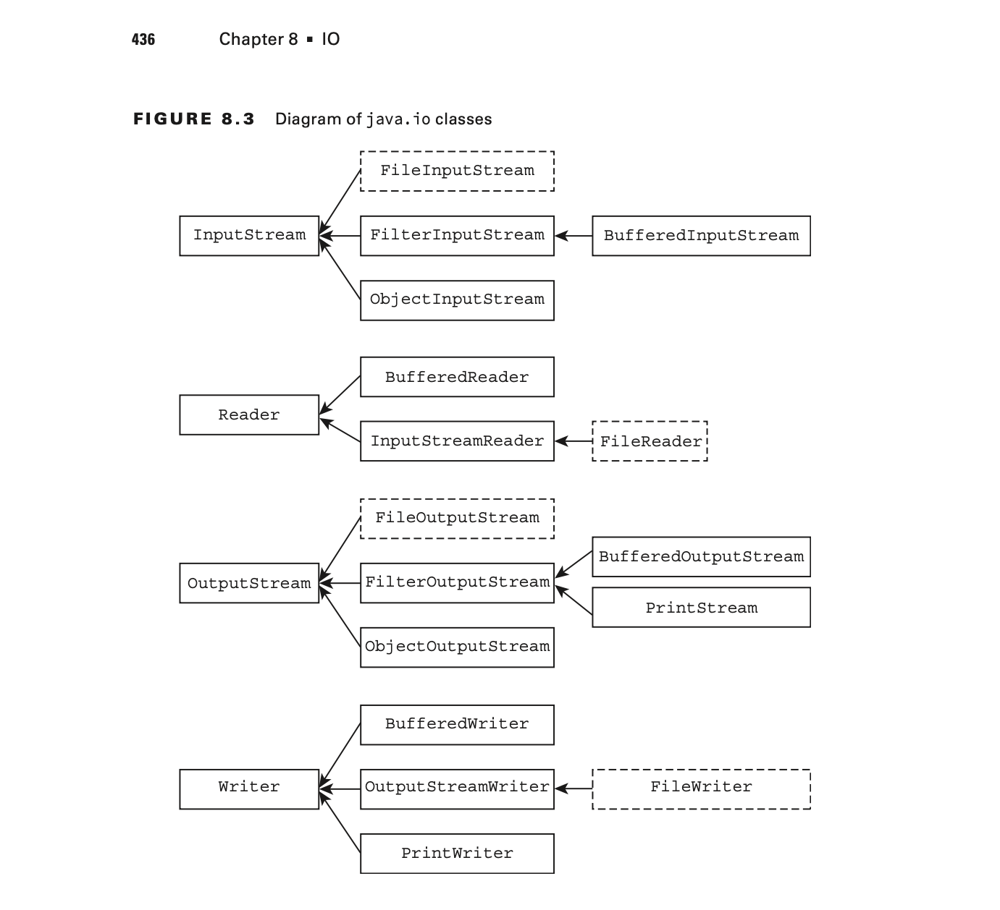

# IO

## Understanding Files and Directories

### Conceptualizing the File System

- A `file` is record within a file system that stores user and system data. Files are organized
using directories
- A `directory` is a record within a file system that contains files as well
as other directories.
- Finally, the root directory is the topmost directory in the file system, from
which all files and directories inherit. 
  + In Windows, it is denoted with a drive name such as `c:\ `
  + While on Linux it is denoted with a single forward slash `/.`
- A `path` is a String representation of a fi le or directory within a fi le system.

### Introducing the File Class

```java
java.io.File
```

The File class is used to read information about existing files and directories, list the contents 
of a directory, and create/delete files and directories.

**Creating a File Object**

```java
import java.io.File;
import java.net.URI;

public class Main {
    public static void main(String[] args) {
        // Using different constructors to create File objects
        File file1 = new File("/path/to/file.txt");

        URI uri = URI.create("file:///path/to/anotherfile.txt");
        File file2 = new File(uri);

        File parentDirectory = new File("/parent/directory");
        File file3 = new File(parentDirectory, "childfile.txt");

        // Displaying information about the File objects
        System.out.println("File 1 path: " + file1.getAbsolutePath());
        System.out.println("File 1 exists: " + file1.exists());

        System.out.println("File 2 path: " + file2.getAbsolutePath());
        System.out.println("File 2 exists: " + file2.exists());

        System.out.println("File 3 path: " + file3.getAbsolutePath());
        System.out.println("File 3 exists: " + file3.exists());
    }
}
```

**Working with a File Object**

| Method Name       | Description                                                                                                                                    |
|-------------------|------------------------------------------------------------------------------------------------------------------------------------------------|
| exists()          | Returns true if the file or directory exists.                                                                                                  |
| getName()         | Returns the name of the file or directory denoted by this path.                                                                                |
| getAbsolutePath() | Returns the absolute pathname string of this path.                                                                                             |
| isDirectory()     | Returns true if the file denoted by this path is a directory.                                                                                  |
| isFile()          | Returns true if the file denoted by this path is a file.                                                                                       |
| length()          | Returns the number of bytes in the file. For performance reasons, the file system may allocate more bytes on disk than the file actually uses. |
| lastModified()    | Returns the number of milliseconds since the epoch when the file was last modified.                                                            |
| delete()          | Deletes the file or directory. If this pathname denotes a directory, then the directory must be empty in order to be deleted.                  |
| renameTo(File)    | Renames the file denoted by this path.                                                                                                         |
| mkdir()           | Creates the directory named by this path.                                                                                                      |
| mkdirs()          | Creates the directory named by this path including any nonexistent parent directories.                                                         |
| getParent()       | Returns the abstract pathname of this abstract pathname’s parent or null if this pathname does not name a parent directory.                    |
| listFiles()       | Returns a File[] array denoting the files in the directory.                                                                                    |

## Introducing Streams 

I/O refers to the nature of how data is accessed, either by reading the data from a resource (input),
or writing the data to a resource (output).

### Stream Fundamentals

All Java Streams Use Byte

### Stream Nomenclature

#### Byte Streams vs. Character Streams

a. The java.io API defines two sets of classes for reading and writing streams:
- Those with `Stream` in their name.
- Those with `Reader/Writer` in their name.

b. Differences between Streams and Readers/Writers

- The stream classes are used for inputting and outputting all types of binary or byte
data.
- The reader and writer classes are used for inputting and outputting only character and
String data.

#### Input and Output

- Most Input stream classes have a corresponding Output class and vice versa.
- It follows, then, that most Reader classes have a corresponding Writer class.
- There are exceptions to this rule. For the exam, you should know that PrintWriter has no accompanying 
PrintReader class. Likewise, the PrintStream class has no corresponding InputStream class.

#### Low-Level vs. High-Level Streams

- A low-level stream connects directly with the source of the data, such as a file, an array,
or a String. 
- Alternatively, a high-level stream is built on top of another stream using wrapping. 

```java
try (BufferedReader bufferedReader = new BufferedReader(new FileReader("zoo-data.txt"))) {
   System.out.println(bufferedReader.readLine());
}
```

- High-level streams can take other high-level streams as input.

```java
try (ObjectInputStream objectStream = new ObjectInputStream(
                                         new BufferedInputStream(
                                            new FileInputStream("zoo-data.txt")))) {
   System.out.println(objectStream.readObject());
}
```

#### Stream Base Classes

The java.io library defines four abstract classes that are the parents of all stream classes
defined within the API:
- InputStream
- OutputStream
- Reader
- Writer

#### Decoding Java I/O Class Names

**Review of java.io Class Properties**

- A class with the word InputStream or OutputStream in its name is used for reading or
writing binary data, respectively.
- A class with the word Reader or Writer in its name is used for reading or writing
character or string data, respectively.
- Most, but not all, input classes have a corresponding output class.
- A low-level stream connects directly with the source of the data.
- A high-level stream is built on top of another stream using wrapping.
- A class with Buffered in its name reads or writes data in groups of bytes or characters
and often improves performance in sequential file systems.

> When wrapping a stream you can mix and match only types that inherit from the same
> abstract parent stream.

**The java.io stream classes**

| Class Name          | Low/High Level | Description                                                                                                   |
|---------------------|----------------|---------------------------------------------------------------------------------------------------------------|
| InputStream         | N/A            | The abstract class all InputStream classes inherit from.                                                      |
| OutputStream        | N/A            | The abstract class all OutputStream classes inherit from.                                                     |
| Reader              | N/A            | The abstract class all Reader classes inherit from.                                                           |
| Writer              | N/A            | The abstract class all Writer classes inherit from.                                                           |
| FileInputStream     | Low            | Reads file data as bytes.                                                                                     |
| FileOutputStream    | Low            | Writes file data as bytes.                                                                                    |
| FileReader          | Low            | Reads file data as characters.                                                                                |
| FileWriter          | Low            | Writes file data as characters.                                                                               |
| BufferedReader      | High           | Reads character data from an existing Reader in a buffered manner, which improves efficiency and performance. |
| BufferedWriter      | High           | Writes character data to an existing Writer in a buffered manner, which improves efficiency and performance.  |
| ObjectInputStream   | High           | Deserializes primitive Java data types and graphs of Java objects from an existing InputStream.               |
| ObjectOutputStream  | High           | Serializes primitive Java data types and graphs of Java objects to an existing OutputStream.                  |
| InputStreamReader   | High           | Reads character data from an existing InputStream.                                                            |
| OutputStreamWriter  | High           | Writes character data to an existing OutputStream.                                                            |
| PrintStream         | High           | Writes formatted representations of Java objects to a binary stream.                                          |
| PrintWriter         | High           | Writes formatted representations of Java objects to a text-based output stream.                               |


#### Common Stream Operations

1. Closing the Stream: `close()`

Since streams are considered resources, it is imperative that they be closed after they
are used lest they lead to resource leaks.

2. Flushing the Stream: ` flush()`

- When data is written to an OutputStream, the underlying operating system does not necessarily 
guarantee that the data will make it to the file immediately. 
- In many operating systems, the data may be cached in memory, with a write occurring only after a 
temporary cache is filled or after some amount of time has passed.
- If the data is cached in memory and the application terminates unexpectedly, the data
would be lost, because it was never written to the file system.

3. Marking the Stream: `mark(int)` and `reset()`

- The InputStream and Reader classes include mark(int) and reset() methods to move
the stream back to an earlier position.
- Before calling either of these methods, you should call the markSupported() method, which returns 
true only if mark() is supported.

4. Skipping over Data: `skip(long)`

## Working with Streams

### The FileInputStream and FileOutputStream Classes

The `FileInputStream` and `FileOutputStream` classes in Java are part of the `java.io` package and are used for reading from and writing to files, respectively. Here's an introduction to these classes:

1. **FileInputStream**:
  - The `FileInputStream` class is used to read bytes from a file in the file system.
  - It is a subclass of the `InputStream` class, which is an abstract class representing input streams of bytes.
  - `FileInputStream` takes the path of the file to be read as its constructor argument.
  - It provides various methods for reading bytes from the file, such as `read()`, `read(byte[])`, and `skip()`.

Example of using `FileInputStream`:
```java
import java.io.*;

public class ReadFileExample {
    public static void main(String[] args) {
        try {
            FileInputStream inputStream = new FileInputStream("example.txt");
            int data;
            while ((data = inputStream.read()) != -1) {
                System.out.print((char) data);
            }
            inputStream.close();
        } catch (IOException e) {
            e.printStackTrace();
        }
    }
}
```

2. **FileOutputStream**:
  - The `FileOutputStream` class is used to write bytes to a file in the file system.
  - It is a subclass of the `OutputStream` class, which is an abstract class representing output streams of bytes.
  - `FileOutputStream` takes the path of the file to be written as its constructor argument.
  - It provides various methods for writing bytes to the file, such as `write(int)`, `write(byte[])`, and `flush()`.

Example of using `FileOutputStream`:
```java
import java.io.*;

public class WriteFileExample {
    public static void main(String[] args) {
        try {
            FileOutputStream outputStream = new FileOutputStream("example.txt");
            String data = "Hello, World!";
            outputStream.write(data.getBytes());
            outputStream.close();
        } catch (IOException e) {
            e.printStackTrace();
        }
    }
}
```

Both `FileInputStream` and `FileOutputStream` are low-level I/O classes and are often used together with higher-level classes such as `BufferedInputStream` and `BufferedOutputStream` for improved performance and functionality. Additionally, they should be properly closed using the `close()` method or in a try-with-resources block to release system resources after use.

### The BufferedInputStream and BufferedOutputStream Classes

The `BufferedInputStream` and `BufferedOutputStream` classes in Java are used to improve the performance of input and output operations by buffering the data read from or written to a file or other input/output streams. Here's an introduction to these classes:

1. **BufferedInputStream**:
  - The `BufferedInputStream` class is a subclass of the `FilterInputStream` class.
  - It adds buffering functionality to an input stream, which reduces the number of system calls made for reading data from the underlying input stream.
  - `BufferedInputStream` takes another input stream (e.g., `FileInputStream`) as its constructor argument.
  - It provides methods for reading bytes from the buffered input stream, such as `read()`, `read(byte[])`, and `skip()`.

Example of using `BufferedInputStream`:
```java
import java.io.*;

public class BufferedInputStreamExample {
    public static void main(String[] args) {
        try {
            FileInputStream fileInputStream = new FileInputStream("example.txt");
            BufferedInputStream bufferedInputStream = new BufferedInputStream(fileInputStream);

            int data;
            while ((data = bufferedInputStream.read()) != -1) {
                System.out.print((char) data);
            }

            bufferedInputStream.close();
        } catch (IOException e) {
            e.printStackTrace();
        }
    }
}
```

2. **BufferedOutputStream**:
  - The `BufferedOutputStream` class is a subclass of the `FilterOutputStream` class.
  - It adds buffering functionality to an output stream, which reduces the number of system calls made for writing data to the underlying output stream.
  - `BufferedOutputStream` takes another output stream (e.g., `FileOutputStream`) as its constructor argument.
  - It provides methods for writing bytes to the buffered output stream, such as `write(int)`, `write(byte[])`, and `flush()`.

Example of using `BufferedOutputStream`:
```java
import java.io.*;

public class BufferedOutputStreamExample {
    public static void main(String[] args) {
        try {
            FileOutputStream fileOutputStream = new FileOutputStream("example.txt");
            BufferedOutputStream bufferedOutputStream = new BufferedOutputStream(fileOutputStream);

            String data = "Hello, World!";
            bufferedOutputStream.write(data.getBytes());
            bufferedOutputStream.close();
        } catch (IOException e) {
            e.printStackTrace();
        }
    }
}
```

Both `BufferedInputStream` and `BufferedOutputStream` are often used to wrap other input and output streams, such as `FileInputStream` and `FileOutputStream`, to improve their performance by reducing the number of system calls. They should be properly closed after use to release system resources.

### The FileReader and FileWriter classes

The `FileReader` and `FileWriter` classes in Java are used to read characters from and write characters to files, respectively. Here's an introduction to these classes:

1. **FileReader**:
  - The `FileReader` class is used to read character data from a file in the file system.
  - It is a subclass of the `InputStreamReader` class and is specifically designed for reading character-based data.
  - `FileReader` takes the path of the file to be read as its constructor argument.
  - It provides methods for reading characters from the file, such as `read()`, `read(char[])`, and `skip()`.

Example of using `FileReader`:
```java
import java.io.*;

public class FileReaderExample {
    public static void main(String[] args) {
        try {
            FileReader fileReader = new FileReader("example.txt");

            int data;
            while ((data = fileReader.read()) != -1) {
                System.out.print((char) data);
            }

            fileReader.close();
        } catch (IOException e) {
            e.printStackTrace();
        }
    }
}
```

2. **FileWriter**:
  - The `FileWriter` class is used to write character data to a file in the file system.
  - It is a subclass of the `OutputStreamWriter` class and is specifically designed for writing character-based data.
  - `FileWriter` takes the path of the file to be written as its constructor argument.
  - It provides methods for writing characters to the file, such as `write(int)`, `write(char[])`, and `flush()`.

Example of using `FileWriter`:
```java
import java.io.*;

public class FileWriterExample {
    public static void main(String[] args) {
        try {
            FileWriter fileWriter = new FileWriter("example.txt");

            String data = "Hello, World!";
            fileWriter.write(data);

            fileWriter.close();
        } catch (IOException e) {
            e.printStackTrace();
        }
    }
}
```

Both `FileReader` and `FileWriter` are commonly used for reading and writing text files. They should be properly closed after use to release system resources. Additionally, you can use them together with other higher-level classes, such as `BufferedReader` and `BufferedWriter`, for improved performance and functionality.

### The BufferedReader and BufferedWriter Classes

The `BufferedReader` and `BufferedWriter` classes in Java are used to improve the performance of reading characters from and writing characters to files, respectively. They provide buffering functionality, which reduces the number of system calls made for reading from or writing to the underlying file or input/output streams. Here's an introduction to these classes:

1. **BufferedReader**:
  - The `BufferedReader` class is used to read characters from a character-input stream with efficiency by using a buffer to reduce the number of I/O operations.
  - It is a subclass of the `Reader` class and is typically used to wrap other character input streams, such as `FileReader` or `InputStreamReader`.
  - `BufferedReader` provides methods for reading characters from the input stream, such as `readLine()`, `read()`, and `skip()`.

Example of using `BufferedReader`:
```java
import java.io.*;

public class BufferedReaderExample {
    public static void main(String[] args) {
        try {
            FileReader fileReader = new FileReader("example.txt");
            BufferedReader bufferedReader = new BufferedReader(fileReader);

            String line;
            while ((line = bufferedReader.readLine()) != null) {
                System.out.println(line);
            }

            bufferedReader.close();
        } catch (IOException e) {
            e.printStackTrace();
        }
    }
}
```

2. **BufferedWriter**:
  - The `BufferedWriter` class is used to write characters to a character-output stream with efficiency by using a buffer to reduce the number of I/O operations.
  - It is a subclass of the `Writer` class and is typically used to wrap other character output streams, such as `FileWriter` or `OutputStreamWriter`.
  - `BufferedWriter` provides methods for writing characters to the output stream, such as `write(String)`, `newLine()`, and `flush()`.

Example of using `BufferedWriter`:
```java
import java.io.*;

public class BufferedWriterExample {
    public static void main(String[] args) {
        try {
            FileWriter fileWriter = new FileWriter("example.txt");
            BufferedWriter bufferedWriter = new BufferedWriter(fileWriter);

            String data = "Hello, World!";
            bufferedWriter.write(data);

            bufferedWriter.close();
        } catch (IOException e) {
            e.printStackTrace();
        }
    }
}
```

Both `BufferedReader` and `BufferedWriter` are commonly used for reading and writing text files. They should be properly closed after use to release system resources. Additionally, they can be used together with other higher-level classes, such as `FileReader` and `FileWriter`, for improved performance and functionality.

###  The ObjectInputStream and ObjectOutputStream Classes

The `ObjectInputStream` and `ObjectOutputStream` classes in Java are used to read and write objects from and to streams, respectively. They are part of the `java.io` package and are used for serialization and deserialization of objects. Here's an introduction to these classes:

1. **ObjectInputStream**:
  - The `ObjectInputStream` class is used to deserialize objects from an input stream.
  - It is a subclass of the `InputStream` class and is specifically designed for reading serialized objects.
  - `ObjectInputStream` takes an input stream (e.g., `FileInputStream`) as its constructor argument.
  - It provides methods for reading objects from the input stream, such as `readObject()`.

Example of using `ObjectInputStream`:
```java
import java.io.*;

public class ObjectInputStreamExample {
    public static void main(String[] args) {
        try {
            FileInputStream fileInputStream = new FileInputStream("objects.dat");
            ObjectInputStream objectInputStream = new ObjectInputStream(fileInputStream);

            Object obj = objectInputStream.readObject();
            System.out.println(obj);

            objectInputStream.close();
        } catch (IOException | ClassNotFoundException e) {
            e.printStackTrace();
        }
    }
}
```

2. **ObjectOutputStream**:
  - The `ObjectOutputStream` class is used to serialize objects and write them to an output stream.
  - It is a subclass of the `OutputStream` class and is specifically designed for writing serialized objects.
  - `ObjectOutputStream` takes an output stream (e.g., `FileOutputStream`) as its constructor argument.
  - It provides methods for writing objects to the output stream, such as `writeObject()`.

Example of using `ObjectOutputStream`:
```java
import java.io.*;

public class ObjectOutputStreamExample {
    public static void main(String[] args) {
        try {
            FileOutputStream fileOutputStream = new FileOutputStream("objects.dat");
            ObjectOutputStream objectOutputStream = new ObjectOutputStream(fileOutputStream);

            Object obj = "Hello, World!";
            objectOutputStream.writeObject(obj);

            objectOutputStream.close();
        } catch (IOException e) {
            e.printStackTrace();
        }
    }
}
```

Both `ObjectInputStream` and `ObjectOutputStream` are commonly used for reading and writing serialized objects. They can serialize and deserialize objects of classes that implement the `Serializable` interface. It's important to properly handle exceptions and close the streams after use to release system resources.

**Serializing and Deserializing Objects**

Serialization is the process of converting an object into a stream of bytes, allowing the object to be saved to a file, sent over a network, or stored in a database. Deserialization is the reverse process of converting a stream of bytes back into an object. In Java, you can serialize and deserialize objects using the `ObjectOutputStream` and `ObjectInputStream` classes, respectively. Here's an example of serializing and deserializing objects:

1. **Serializing Objects**:
```java
import java.io.*;

public class SerializationExample {
    public static void main(String[] args) {
        try {
            // Create an object to serialize
            Student student = new Student("John", 20);

            // Create an ObjectOutputStream to write the object to a file
            FileOutputStream fileOutputStream = new FileOutputStream("student.ser");
            ObjectOutputStream objectOutputStream = new ObjectOutputStream(fileOutputStream);

            // Write the object to the file
            objectOutputStream.writeObject(student);

            // Close the streams
            objectOutputStream.close();
            fileOutputStream.close();

            System.out.println("Object serialized successfully.");
        } catch (IOException e) {
            e.printStackTrace();
        }
    }
}
```

2. **Deserializing Objects**:
```java
import java.io.*;

public class DeserializationExample {
    public static void main(String[] args) {
        try {
            // Create an ObjectInputStream to read the object from the file
            FileInputStream fileInputStream = new FileInputStream("student.ser");
            ObjectInputStream objectInputStream = new ObjectInputStream(fileInputStream);

            // Read the object from the file
            Student student = (Student) objectInputStream.readObject();

            // Close the streams
            objectInputStream.close();
            fileInputStream.close();

            // Print the deserialized object
            System.out.println("Deserialized Student:");
            System.out.println("Name: " + student.getName());
            System.out.println("Age: " + student.getAge());
        } catch (IOException | ClassNotFoundException e) {
            e.printStackTrace();
        }
    }
}
```

3. **Student Class**:
```java
import java.io.Serializable;

public class Student implements Serializable {
    private String name;
    private int age;

    public Student(String name, int age) {
        this.name = name;
        this.age = age;
    }

    public String getName() {
        return name;
    }

    public int getAge() {
        return age;
    }
}
```

In this example, we have a `Student` class that implements the `Serializable` interface. We serialize an instance of the `Student` class to a file using `ObjectOutputStream` in the `SerializationExample` class. Then, we deserialize the object back into an instance of the `Student` class using `ObjectInputStream` in the `DeserializationExample` class. Finally, we print the deserialized student's information.

**Understanding Object Creation**

- When you `deserialize` an object, the constructor of the serialized class is not called.
- In fact, Java calls the first no-arg constructor for the first non-serializable parent class, 
skipping the constructors of any serialized class in between. Furthermore, any static variables or
default initializations are ignored.

```java
public class Animal implements Serializable {

  private static final long serialVersionUID = 2L;
  private transient String name;
  private transient int age = 10;
  private static char type = 'C';

  {
    this.age = 14;
  }

  public Animal() {
    this.name = "Unknown";
    this.age = 12;
    this.type = 'Q';
  }

  public Animal(String name, int age, char type) {
    this.name = name;
    this.age = age;
    this.type = type;
  }
}
```

### The PrintStream and PrintWriter Classes

The `PrintStream` and `PrintWriter` classes in Java are used for writing formatted data to various output streams. They provide convenient methods for writing different types of data, such as primitive types, strings, and objects, to output streams like files, standard output (console), or network sockets. Here's an introduction to these classes:

1. **PrintStream**:
  - The `PrintStream` class provides methods to print formatted representations of objects to an output stream.
  - It is a subclass of the `OutputStream` class and is typically used to write to standard output (`System.out`) or files.
  - `PrintStream` provides methods like `print()` and `println()` to write various types of data, including primitive types, strings, and objects, to the output stream.

Example of using `PrintStream`:
```java
import java.io.*;

public class PrintStreamExample {
    public static void main(String[] args) {
        try {
            PrintStream printStream = new PrintStream("output.txt");

            // Writing to the output stream
            printStream.println("Hello, World!");
            printStream.printf("PI: %.2f\n", Math.PI);

            // Closing the stream
            printStream.close();
        } catch (IOException e) {
            e.printStackTrace();
        }
    }
}
```

2. **PrintWriter**:
  - The `PrintWriter` class provides methods to print formatted representations of objects to a text-output stream.
  - It is a subclass of the `Writer` class and is typically used to write to files, network sockets, or other character-based output streams.
  - `PrintWriter` provides methods like `print()` and `println()` similar to `PrintStream` for writing various types of data to the output stream.

Example of using `PrintWriter`:
```java
import java.io.*;

public class PrintWriterExample {
    public static void main(String[] args) {
        try {
            PrintWriter printWriter = new PrintWriter("output.txt");

            // Writing to the output stream
            printWriter.println("Hello, World!");
            printWriter.printf("PI: %.2f\n", Math.PI);

            // Closing the stream
            printWriter.close();
        } catch (IOException e) {
            e.printStackTrace();
        }
    }
}
```

Both `PrintStream` and `PrintWriter` provide methods to write formatted data to output streams. They handle various types of data and automatically convert them into their string representations. Additionally, they manage the output stream's buffering and character encoding.

### Review of Stream Classes

- The classes on the left side of the diagram are the abstract parent classes. 
- The classes on the right side with dotted borders are low-level streams, and the ones with solid borders are high-level streams.



**Other Stream Classes**

## Interacting with Users

### The Old Way

If you prefer to use `BufferedReader` instead of `Console` for reading input from the console, you can do so as well. Here's how you can achieve that:

```java
import java.io.BufferedReader;
import java.io.IOException;
import java.io.InputStreamReader;

public class ConsoleInputExample {
    public static void main(String[] args) {
        BufferedReader reader = new BufferedReader(new InputStreamReader(System.in));

        try {
            System.out.print("Enter your name: ");
            String name = reader.readLine();

            System.out.print("Enter your password: ");
            String password = reader.readLine();

            System.out.println("Name: " + name);
            System.out.println("Password: " + password);

            reader.close();
        } catch (IOException e) {
            e.printStackTrace();
        }
    }
}
```

In this example, we use `BufferedReader` to read input from the console. We create a `BufferedReader` object by wrapping the standard input stream (`System.in`) with an `InputStreamReader`. Then, we read lines of text from the console using the `readLine()` method of `BufferedReader`. Finally, we print out the input received from the user. Remember to handle any potential `IOException` that might occur during input reading.

### The New Way

The `Console` class in Java provides methods for interacting with the console, including reading input from the console and writing output to the console. It's primarily used when the Java application is run in a console environment, such as a command-line interface. Here's an overview of the `Console` class:

1. **Reading Input from Console**:
  - The `Console` class provides methods like `readLine()` and `readPassword()` for reading input from the console.
  - `readLine()` reads a line of text entered by the user.
  - `readPassword()` reads a password entered by the user without echoing characters to the console.

Example of reading input using `Console`:
```java
import java.io.Console;

public class ConsoleInputExample {
    public static void main(String[] args) {
        Console console = System.console();

        if (console != null) {
            String input = console.readLine("Enter your name: ");
            char[] password = console.readPassword("Enter your password: ");

            System.out.println("Name: " + input);
            System.out.println("Password: " + new String(password));
        } else {
            System.out.println("Console not available.");
        }
    }
}
```

2. **Writing Output to Console**:
  - The `Console` class also provides methods like `printf()` and `format()` for writing formatted output to the console.
  - `printf()` and `format()` are similar to `System.out.printf()` for formatted printing.

Example of writing output using `Console`:
```java
import java.io.Console;

public class ConsoleOutputExample {
    public static void main(String[] args) {
        Console console = System.console();

        if (console != null) {
            console.printf("Hello, %s!%n", "World");
            console.format("PI: %.2f%n", Math.PI);
        } else {
            System.out.println("Console not available.");
        }
    }
}
```

The `Console` class provides a convenient way to interact with the console when running Java applications in a console environment. However, it's important to note that the availability of the `Console` object depends on the underlying platform and how the Java application is executed.

**Console methods**

| Method           | Description                                                                                                                                                                      |
|------------------|----------------------------------------------------------------------------------------------------------------------------------------------------------------------------------|
| `reader()`       | Returns a Reader object for reading text from the console.                                                                                                                       |
| `writer()`       | Returns a PrintWriter object for writing text to the console.                                                                                                                    |
| `format()`       | Writes a formatted string to this console's output stream using the specified format string and arguments.                                                                       |
| `printf()`       | A convenience method to write a formatted string to this console's output stream using the specified format string and arguments.                                                |
| `flush()`        | Flushes the console's output stream.                                                                                                                                             |
| `readLine()`     | Reads a single line of text from the console.                                                                                                                                    |
| `readPassword()` | Reads a password or passphrase from the console with echoing disabled. The password is returned as a character array.                                                            |

# Summary

Indeed, working with files is a fundamental aspect of many Java applications. Here's an overview of the key concepts covered in this chapter:

1. **Files and Directories**:
  - Files represent stored data on a storage device, while directories organize files into a hierarchical structure.
  - Java provides classes for working with files and directories, allowing you to create, read, update, and delete them programmatically.

2. **Path Strings**:
  - Paths are string representations of file and directory locations in a file system.
  - Java's `java.nio.file.Path` class provides a platform-independent way to represent file system paths.

3. **java.io.File Class**:
  - The `java.io.File` class is a legacy class for representing file and directory paths in the file system.
  - It provides methods for querying basic file attributes such as existence, readability, writability, size, and modification time.
  - However, it does not provide methods for directly reading or writing file contents.

4. **Reading File Information**:
  - You can use `File` objects to obtain information about files and directories, such as their names, paths, sizes, and modification timestamps.
  - The `File` class provides methods like `getName()`, `getPath()`, `length()`, `lastModified()`, etc., to retrieve file attributes.

Example:
```java
import java.io.File;

public class FileInfoExample {
    public static void main(String[] args) {
        // Create a File object representing a file or directory
        File file = new File("example.txt");

        // Check if the file exists
        if (file.exists()) {
            // Display file information
            System.out.println("Name: " + file.getName());
            System.out.println("Path: " + file.getPath());
            System.out.println("Size: " + file.length() + " bytes");
            System.out.println("Last Modified: " + file.lastModified());
        } else {
            System.out.println("File does not exist.");
        }
    }
}
```

In this example, we create a `File` object representing a file named "example.txt" and print its attributes if it exists.

Understanding how to work with files and directories is crucial for many Java applications, as it enables reading, writing, and manipulating data stored on disk.

Indeed, Java I/O streams are essential for reading and writing file contents. Here's an overview of the key concepts covered in this chapter:

1. **Java I/O Streams**:
  - Streams provide a way to read from or write to a source of data in a sequential manner.
  - Java's I/O API consists of various stream classes for handling different types of data and sources, including files, network connections, and in-memory data.

2. **Attributes of Streams**:
  - **Low-level vs. High-level Streams**:
    - Low-level streams provide direct access to the underlying data source or sink, while high-level streams offer additional functionality built on top of low-level streams.
  - **Byte vs. Character Streams**:
    - Byte streams operate on raw binary data, while character streams handle character data encoded using a specific character encoding.
  - **Input vs. Output Streams**:
    - Input streams read data from a source, while output streams write data to a destination.

3. **Stream Classes**:
  - Java provides a variety of stream classes, including `InputStream`, `OutputStream`, `Reader`, and `Writer`, for working with different types of data and sources.
  - `InputStream` and `OutputStream` classes are used for byte-oriented I/O operations, while `Reader` and `Writer` classes are used for character-oriented I/O operations.

4. **Stream Naming Convention**:
  - The naming convention of stream classes is designed to provide context clues about their functionality:
    - Classes ending with `InputStream` or `OutputStream` typically work with byte-oriented data.
    - Classes ending with `Reader` or `Writer` typically work with character-oriented data.

Example of Reading from a File using `FileInputStream`:
```java
import java.io.FileInputStream;
import java.io.IOException;

public class ReadFileExample {
    public static void main(String[] args) {
        try (FileInputStream inputStream = new FileInputStream("example.txt")) {
            int data;
            while ((data = inputStream.read()) != -1) {
                System.out.print((char) data);
            }
        } catch (IOException e) {
            e.printStackTrace();
        }
    }
}
```

In this example, we use a `FileInputStream` to read bytes from a file named "example.txt" and convert them to characters to print the file contents to the console.

Understanding the attributes and functionalities of Java I/O streams is crucial for effectively reading from and writing to files and other data sources in Java applications.

Indeed, mastering byte and character stream classes is crucial for handling I/O operations effectively in Java. Here's a summary of the key concepts covered in this section:

1. **Stream Classes**:
  - Java provides a variety of byte and character stream classes for reading and writing data to and from different sources:
    - **Byte Streams**: `InputStream`, `OutputStream`, `FileInputStream`, `FileOutputStream`, etc.
    - **Character Streams**: `Reader`, `Writer`, `FileReader`, `FileWriter`, etc.
  - These classes facilitate input and output operations with files, network sockets, and other data sources.

2. **Buffered Streams**:
  - Buffered streams, such as `BufferedInputStream` and `BufferedOutputStream`, wrap lower-level byte streams to improve performance by reducing the number of physical reads and writes.
  - Similarly, `BufferedReader` and `BufferedWriter` provide buffering for character streams.

3. **Data Streams**:
  - `DataInputStream` and `DataOutputStream` allow for reading and writing primitive data types (e.g., `int`, `double`, `boolean`) directly from and to streams.
  - They provide methods for reading and writing data in a machine-independent way.

4. **Object Streams**:
  - Object streams, represented by `ObjectInputStream` and `ObjectOutputStream`, enable the serialization and deserialization of objects.
  - Serialization is the process of converting an object into a stream of bytes to persist it to disk or transmit it over a network.
  - Deserialization is the process of reconstructing an object from its serialized form.

5. **Serialization**:
  - In Java, objects can be made serializable by implementing the `Serializable` interface.
  - Serializable objects can be written to an object stream and read back into memory later.

Example of Using Object Streams for Serialization:
```java
import java.io.*;

class Student implements Serializable {
    private String name;
    private int age;

    public Student(String name, int age) {
        this.name = name;
        this.age = age;
    }

    @Override
    public String toString() {
        return "Student{" +
                "name='" + name + '\'' +
                ", age=" + age +
                '}';
    }
}

public class SerializationExample {
    public static void main(String[] args) {
        // Serialize object
        try (ObjectOutputStream outputStream = new ObjectOutputStream(new FileOutputStream("student.ser"))) {
            Student student = new Student("Alice", 20);
            outputStream.writeObject(student);
            System.out.println("Object serialized successfully.");
        } catch (IOException e) {
            e.printStackTrace();
        }

        // Deserialize object
        try (ObjectInputStream inputStream = new ObjectInputStream(new FileInputStream("student.ser"))) {
            Student student = (Student) inputStream.readObject();
            System.out.println("Object deserialized successfully:");
            System.out.println(student);
        } catch (IOException | ClassNotFoundException e) {
            e.printStackTrace();
        }
    }
}
```

In this example, we serialize a `Student` object to a file named "student.ser" using `ObjectOutputStream`, and then deserialize it back into memory using `ObjectInputStream`. Understanding these stream classes and their functionalities is essential for effective file handling and object persistence in Java applications.

Indeed, interacting with user input is a crucial aspect of many Java applications. Let's summarize the key points covered in this section:

1. **Reading User Input**:
  - Java provides several mechanisms for reading input from the user, including the legacy `System.in` stream and the newer `Console` class.

2. **System.in**:
  - The `System.in` stream allows reading input data from the standard input stream, typically connected to the keyboard.
  - It is accessed through the `System` class and provides a basic way to read user input using byte-oriented streams like `InputStreamReader` and `BufferedReader`.

3. **Console Class**:
  - The `Console` class provides a more advanced way to interact with the user, offering features like built-in support for password input, formatted output, and safer input reading.
  - It is available through the `System` class and can be obtained using the `System.console()` method.

4. **Reading Passwords Securely**:
  - The `Console` class provides a `readPassword()` method that allows users to enter passwords securely without displaying them on the screen.
  - The entered password is returned as a character array, which can be cleared from memory after use for security reasons.

5. **Formatted Output**:
  - The `Console` class supports formatted output using the `format()` method, similar to `String.format()`.
  - This allows users to construct formatted strings with placeholders for various data types and then print them to the console.

Example of Reading User Input using Console:
```java
import java.io.Console;

public class UserInputExample {
    public static void main(String[] args) {
        Console console = System.console();
        if (console != null) {
            // Reading a line of text
            String name = console.readLine("Enter your name: ");
            console.printf("Hello, %s!%n", name);

            // Reading a password securely
            char[] password = console.readPassword("Enter your password: ");
            console.printf("Password entered.%n");

            // Formatting output
            double value = 123.456;
            console.printf("Formatted value: %.2f%n", value);
        } else {
            System.out.println("Console not available.");
        }
    }
}
```

In this example, we demonstrate reading user input using the `Console` class, including reading a line of text, reading a password securely, and formatting output.

Understanding how to read input from users using both `System.in` and the `Console` class is essential for creating interactive and user-friendly Java applications.

# Exam Essentials

**Understand files, directories, and streams**

Absolutely, understanding files, directories, and streams is fundamental for working with data in Java applications. Here's a breakdown of these concepts:

1. **Files**:
  - Files are units of data storage on a persistent storage device, such as a hard disk or SSD.
  - They store data in a structured or unstructured format and can be of various types, including text files, binary files, and serialized objects.
  - Files are organized within a file system, typically structured into directories (folders) and subdirectories.

2. **Directories**:
  - Directories, also known as folders, are containers for organizing files within a file system.
  - They can contain files and other directories, forming a hierarchical tree-like structure.
  - Directories provide a way to organize and manage files, making it easier to locate and access them.

3. **Streams**:
  - Streams are sequences of data elements made available over time. In the context of file I/O, streams provide a way to read from or write to files in a sequential manner.
  - Java's I/O API provides two main types of streams: byte streams and character streams.
  - Byte streams (`InputStream`, `OutputStream`) handle raw binary data, while character streams (`Reader`, `Writer`) handle character data, typically encoded using a specific character encoding.
  - Streams facilitate efficient reading and writing of data by breaking it down into manageable chunks, or blocks, which are processed sequentially.

Understanding how files, directories, and streams work together is essential for performing file I/O operations effectively in Java applications. It enables developers to read, write, and manipulate data stored on disk or other storage devices efficiently and reliably.

**Be able to use the java.io.File class**

Absolutely, the `java.io.File` class in Java provides a convenient way to interact with files and directories on the file system. Here's an overview of how to use it:

1. **Creating File Instances**:
  - File instances can be created by passing a path String to the constructor of the `File` class.
  - The path String can be either an absolute path or a relative path to the file or directory.
  - Example:
    ```java
    File file = new File("path/to/file.txt");
    ```

2. **Retrieving File Information**:
  - The `File` class provides various methods to retrieve information about files and directories, such as:
    - `exists()`: Checks if the file or directory exists.
    - `getName()`: Retrieves the name of the file or directory.
    - `getPath()`: Retrieves the path of the file or directory.
    - `isFile()`: Checks if the `File` instance represents a file.
    - `isDirectory()`: Checks if the `File` instance represents a directory.
    - `lastModified()`: Retrieves the last modified timestamp of the file.
    - `length()`: Retrieves the size of the file in bytes.
  - Example:
    ```java
    System.out.println("File exists: " + file.exists());
    System.out.println("File name: " + file.getName());
    System.out.println("File path: " + file.getPath());
    System.out.println("Is a file: " + file.isFile());
    ```

3. **Manipulating Files and Directories**:
  - The `File` class includes methods for creating, deleting, and manipulating files and directories, such as:
    - `createNewFile()`: Creates a new file.
    - `mkdir()`: Creates a directory.
    - `delete()`: Deletes the file or directory.
    - `listFiles()`: Retrieves an array of `File` objects representing the files and directories within the directory.
  - Example:
    ```java
    File directory = new File("path/to/directory");
    if (!directory.exists()) {
        directory.mkdir();
    }
    ```

Using the `File` class, you can perform various file I/O operations, such as checking file existence, retrieving file information, creating and deleting files and directories, and listing files within a directory. It's a versatile class that forms the foundation for many file-related tasks in Java applications.

**Distinguish between byte and character streams**

Absolutely, understanding the distinction between byte and character streams is crucial for efficient I/O operations in Java. Here's a breakdown:

1. **Byte Streams**:
  - Byte streams are used for reading and writing raw binary data, typically represented as bytes.
  - They are named with the suffix `InputStream` or `OutputStream`.
  - Byte streams are suitable for handling binary files, such as images, audio, video, or any other non-textual data.
  - Examples of byte stream classes include `FileInputStream`, `FileOutputStream`, `ByteArrayInputStream`, `ByteArrayOutputStream`, etc.

2. **Character Streams**:
  - Character streams are designed for reading and writing character data, usually represented as Unicode characters.
  - They are named with the suffix `Reader` or `Writer`.
  - Character streams internally handle character encoding and decoding, making them suitable for working with text-based data, such as text files, configuration files, or communication protocols that involve textual content.
  - Character streams are more efficient and convenient for processing text because they automatically handle character encoding and decoding, ensuring proper interpretation of characters.
  - Examples of character stream classes include `FileReader`, `FileWriter`, `BufferedReader`, `BufferedWriter`, etc.

In summary, byte streams are used for handling binary data, while character streams are specialized for handling text-based data. Choosing the appropriate stream type depends on the nature of the data being processed and the requirements of the application.

**Distinguish between low-level and high-level streams**

Absolutely, distinguishing between low-level and high-level streams is essential for understanding how Java's I/O API works. Here's a breakdown:

1. **Low-Level Streams**:
  - Low-level streams interact directly with the underlying source or destination of data, such as files, network connections, or byte arrays.
  - They typically provide basic functionality for reading or writing raw data without any additional processing.
  - Low-level streams are often unbuffered, meaning they read or write data directly to or from the source without any intermediary storage.
  - Examples of low-level streams include `FileInputStream`, `FileOutputStream`, `SocketInputStream`, `SocketOutputStream`, etc.

2. **High-Level Streams**:
  - High-level streams build upon low-level streams to provide additional functionality or abstraction, such as buffering, filtering, or data transformation.
  - They operate on other streams, either low-level or high-level, to enhance their capabilities or simplify data processing tasks.
  - High-level streams often improve read/write performance by introducing buffering, which reduces the number of I/O operations by storing data temporarily in memory before writing it to the underlying resource.
  - They may also provide convenience methods or specialized functionality tailored to specific data formats or processing requirements.
  - Examples of high-level streams include `BufferedInputStream`, `BufferedOutputStream`, `ObjectInputStream`, `ObjectOutputStream`, `PrintStream`, `DataInputStream`, `DataOutputStream`, etc.

In summary, low-level streams provide basic functionality for reading or writing raw data directly from or to the underlying source, while high-level streams add additional features or abstraction layers to simplify data processing and improve performance. Choosing between low-level and high-level streams depends on the specific requirements of the application and the level of abstraction needed for the task at hand.

**Be able to recognize and know how to use the following classes: BufferedReader, BufferedWriter, File, FileReader, FileWriter, FileInputStream, FileOutputStream, ObjectOutputStream, ObjectInputStream, and PrintWriter**

Absolutely, let's go through each of these classes and understand their purpose and usage:

1. **BufferedReader**:
  - `BufferedReader` reads text from a character-input stream, buffering characters to provide efficient reading of characters, arrays, and lines.
  - It wraps an existing `Reader` and buffers the input, improving efficiency by reducing the number of I/O operations.
  - Example:
    ```java
    BufferedReader reader = new BufferedReader(new FileReader("file.txt"));
    ```

2. **BufferedWriter**:
  - `BufferedWriter` writes text to a character-output stream, buffering characters to provide efficient writing of characters, arrays, and strings.
  - It wraps an existing `Writer` and buffers the output, improving efficiency by reducing the number of I/O operations.
  - Example:
    ```java
    BufferedWriter writer = new BufferedWriter(new FileWriter("file.txt"));
    ```

3. **File**:
  - `File` represents a file or directory pathname. It provides methods for querying file attributes, creating new files or directories, deleting files or directories, etc.
  - Example:
    ```java
    File file = new File("file.txt");
    ```

4. **FileReader**:
  - `FileReader` is used to read character files. It reads characters from the file in a file-system-independent manner.
  - Example:
    ```java
    FileReader fileReader = new FileReader("file.txt");
    ```

5. **FileWriter**:
  - `FileWriter` is used to write characters to a file. It writes characters to the file in a file-system-independent manner.
  - Example:
    ```java
    FileWriter fileWriter = new FileWriter("file.txt");
    ```

6. **FileInputStream**:
  - `FileInputStream` is used to read binary data from a file. It reads bytes from the file in a file-system-independent manner.
  - Example:
    ```java
    FileInputStream fileInputStream = new FileInputStream("file.txt");
    ```

7. **FileOutputStream**:
  - `FileOutputStream` is used to write binary data to a file. It writes bytes to the file in a file-system-independent manner.
  - Example:
    ```java
    FileOutputStream fileOutputStream = new FileOutputStream("file.txt");
    ```

8. **ObjectOutputStream**:
  - `ObjectOutputStream` is used to serialize objects to an output stream. It writes objects to the stream in a binary format.
  - Example:
    ```java
    ObjectOutputStream objectOutputStream = new ObjectOutputStream(new FileOutputStream("data.dat"));
    ```

9. **ObjectInputStream**:
  - `ObjectInputStream` is used to deserialize objects from an input stream. It reads objects from the stream in a binary format.
  - Example:
    ```java
    ObjectInputStream objectInputStream = new ObjectInputStream(new FileInputStream("data.dat"));
    ```

10. **PrintWriter**:
  - `PrintWriter` is used to write formatted representations of objects to a text-output stream. It provides methods for printing various data types.
  - Example:
    ```java
    PrintWriter printWriter = new PrintWriter(new FileWriter("file.txt"));
    ```

These classes provide essential functionality for performing various file I/O operations in Java. Understanding their purpose and how to use them, including chaining them together to build complex I/O pipelines, is essential for effective file handling in Java applications.

**Be able to perform common stream operations including close(), flush(), mark(), markSupported(), reset(), and skip()**

Absolutely, let's delve into these common stream operations and understand their purpose:

1. **close()**:
  - The `close()` method is used to release any resources associated with the stream.
  - It should be called explicitly to ensure proper resource cleanup, especially for resources like file handles, network connections, etc.
  - Many stream classes implement the `AutoCloseable` interface, allowing them to be used with the try-with-resources statement for automatic resource management.
  - Example:
    ```java
    stream.close();
    ```

2. **flush()**:
  - The `flush()` method is used in output stream classes to ensure that any buffered data is written to the underlying resource immediately.
  - It's particularly useful when dealing with buffered streams to ensure that data is written out promptly, without waiting for the buffer to fill up.
  - Example:
    ```java
    outputStream.flush();
    ```

3. **markSupported(), mark(), and reset()**:
  - These methods are used in conjunction with input stream classes to mark a position in the stream and return to it later on.
  - `markSupported()`: Checks if the stream supports the `mark()` and `reset()` operations.
  - `mark(int readLimit)`: Marks the current position in the stream, with an optional read limit parameter specifying how many bytes can be read before the mark becomes invalid.
  - `reset()`: Returns the stream to the last marked position.
  - Not all input stream classes support the `mark()` and `reset()` operations.
  - Example:
    ```java
    if (inputStream.markSupported()) {
        inputStream.mark(1024); // Mark the current position with a read limit of 1024 bytes
        // Perform operations
        inputStream.reset(); // Reset the stream to the marked position
    }
    ```

4. **skip(long n)**:
  - The `skip(long n)` method is used in input stream classes to skip over a specified number of bytes in the stream.
  - It's particularly useful when you want to skip past a certain portion of the input data without processing it.
  - Example:
    ```java
    inputStream.skip(1024); // Skip 1024 bytes in the input stream
    ```

These common stream operations provide essential functionality for managing streams and manipulating their content effectively. Understanding when and how to use these operations is crucial for efficient stream processing in Java.

**Understand how to use Java serialization**

Absolutely, Java serialization is a powerful feature for saving and restoring object states. Here's a breakdown of how to use it:

1. **Implementing Serializable**:
  - To enable serialization for a class, it needs to implement the `java.io.Serializable` interface.
  - The `Serializable` interface is a marker interface, meaning it doesn't have any methods to implement. It simply marks the class as serializable.
  - All fields of a serializable class must either be serializable themselves or marked as `transient` if they should not be serialized.
  - Example:
    ```java
    import java.io.Serializable;

    public class MyClass implements Serializable {
        private static final long serialVersionUID = 1L;
        private int myInt;
        private transient String myTransientString;
        // Constructors, methods, etc.
    }
    ```

2. **Serialization and Deserialization**:
  - To serialize an object, you use an `ObjectOutputStream`. This class writes objects to a stream in a binary format.
  - To deserialize an object, you use an `ObjectInputStream`. This class reads objects from a stream and reconstructs them into Java objects.
  - Example of serialization:
    ```java
    try (ObjectOutputStream outputStream = new ObjectOutputStream(new FileOutputStream("data.ser"))) {
        outputStream.writeObject(myObject); // Serialize myObject to a file
    } catch (IOException e) {
        e.printStackTrace();
    }
    ```
  - Example of deserialization:
    ```java
    try (ObjectInputStream inputStream = new ObjectInputStream(new FileInputStream("data.ser"))) {
        MyClass myObject = (MyClass) inputStream.readObject(); // Deserialize object from file
    } catch (IOException | ClassNotFoundException e) {
        e.printStackTrace();
    }
    ```

3. **Default Serialization**:
  - If a class does not explicitly implement `Serializable`, its fields will not be serialized, and attempting to serialize such objects will result in a `java.io.NotSerializableException`.
  - Java primitives, wrapper classes, Strings, and arrays of serializable types are serializable by default.

By understanding how to implement `Serializable` and use `ObjectInputStream` and `ObjectOutputStream`, you can easily serialize and deserialize objects in Java, making them suitable for storage, transmission, or any other use case requiring persistence of object state.

**Be able to interact with the user via the Console class**

Indeed, let's explore how to interact with the user using the `Console` class:

1. **Obtaining a Console Instance**:
  - You can obtain a `Console` object by calling the static method `System.console()`. If the JVM is not attached to a console, this method returns `null`.
  - Example:
    ```java
    Console console = System.console();
    ```

2. **Reading User Input**:
  - The `Console` class provides methods for reading user input, such as `readLine()` and `readPassword()`.
  - `readLine()`: Reads a line of text from the console, returning it as a `String`.
  - `readPassword()`: Reads a password or other secure data from the console, returning it as a `char[]`.
  - Example:
    ```java
    String userInput = console.readLine("Enter your name: ");
    char[] password = console.readPassword("Enter your password: ");
    ```

3. **Writing Output**:
  - You can output text to the console using the `printf()` method, similar to `System.out.printf()`.
  - Example:
    ```java
    console.printf("Hello, %s! Your password is: %s%n", userInput, new String(password));
    ```

4. **Closing the Console**:
  - The `Console` class doesn't require explicit closing since it's typically associated with the JVM's lifecycle. However, you might need to close associated resources if you've opened any files or streams.
  - Example:
    ```java
    // Close any resources if needed
    ```

5. **Handling Null Console**:
  - It's essential to check if `System.console()` returns `null` to avoid `NullPointerExceptions` if your application runs in environments without an attached console, such as when running in a container or as a background service.
  - Example:
    ```java
    if (console == null) {
        System.out.println("Console is not available.");
        // Handle the situation gracefully
    }
    ```

Using the `Console` class provides a more secure and convenient way to interact with users, especially when reading passwords or sensitive information, as it offers built-in support for secure input without echoing characters to the console.