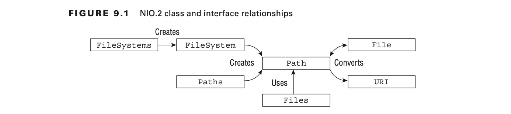

# NIO

## Introducing NIO.2

- The NIO API introduced the concepts of buffers and channels in place of java.io streams.
- The basic idea is that you load the data from a file channel into a temporary buffer that, unlike
  byte streams, can be read forward and backward without blocking on the underlying resource.

### Introducing Path

- The java.nio.file.Path interface, or Path interface for short, is the primary entry point for
  working with the NIO.2 API.
- A Path object represents a hierarchical path on the storage system to a file or directory.
- Unlike the File class, the Path interface contains support for symbolic links. A symbolic link is
  a special file within an operating system that serves as a reference or pointer to another file or
  directory.

#### Creating Instances with Factory and Helper Classes

**NIO.2 class and interface relationships**



### Creating Paths

#### Using the Paths Class

- The simplest and most straightforward way to obtain a Path object is using the
  java.nio.files.Paths factory class, or Paths for short.

```java
import java.nio.file.Path;
import java.nio.file.Paths;

public class Main {

  public static void main(String[] args) {
    // Creating a Path object for an absolute path
    Path absolutePath = Paths.get("/path/to/directory/file.txt");

    // Creating a Path object for a relative path
    Path relativePath = Paths.get("directory", "file.txt");

    // Creating a Path object using varargs for components
    Path varArgsPath = Paths.get("/", "path", "to", "directory", "file.txt");

    // Creating a Path object from a URI
    Path uriPath = Paths.get("file:///path/to/directory/file.txt");

    // Displaying the paths
    System.out.println("Absolute Path: " + absolutePath);
    System.out.println("Relative Path: " + relativePath);
    System.out.println("Varargs Path: " + varArgsPath);
    System.out.println("URI Path: " + uriPath);
  }
}

```

> Absolute vs Relative is file system dependent
>
> - If a path starts with a forward slash, it is an absolute path, such as /bird/parrot.
>
> - If a path starts with a drive letter, it is an absolute path, such as C:\bird\emu.
>
> - Otherwise, it is a relative path, such as ..\eagle.

#### Accessing the Underlying FileSystem Object

- The FileSystem class has a protected constructor, so we use the plural FileSystems factory class
  to obtain an
  instance of FileSystem

```java
import java.nio.file.FileSystem;
import java.nio.file.FileSystems;

public class Main {

  public static void main(String[] args) {
    // Getting the default file system
    FileSystem defaultFileSystem = FileSystems.getDefault();
    System.out.println("Default file system: " + defaultFileSystem);

    // Getting the file system for a specific file URI
    FileSystem uriFileSystem = FileSystems.getFileSystem("file:///"); // for the default file system
    System.out.println("File system for URI: " + uriFileSystem);

    // Getting the file system for a specific provider
    FileSystem providerFileSystem = FileSystems.getFileSystem("jar:file:///example.jar");
    System.out.println("File system for provider: " + providerFileSystem);
  }
}
```

#### Working with Legacy File Instances

- To create a Path object by working with legacy File instances, you can utilize the toPath() method
  available in the File class. Here's how you can do it:

```java
import java.io.File;
import java.nio.file.Path;

public class Main {

  public static void main(String[] args) {
    // Create a legacy File instance
    File file = new File("/path/to/file.txt");

    // Convert the File instance to a Path object
    Path path = file.toPath();

    // Use the Path object...
    System.out.println("Path: " + path);
  }
}
```

## Interacting with Paths and Files

### Providing Optional Arguments

**Common optional arguments in NIO.2**

| Enum Value        | Usage                                                       | Description                                                                                                                                                                                                                            |
|-------------------|-------------------------------------------------------------|----------------------------------------------------------------------------------------------------------------------------------------------------------------------------------------------------------------------------------------|
| NOFOLLOW_LINKS    | Test file existing - Read file data - Copy file - Move file | If provided, symbolic links when encountered will not be traversed. Useful for performing operations on symbolic links themselves rather than their target.                                                                            |
| FOLLOW_LINKS      | Traverse a directory tree                                   | If provided, symbolic links when encountered will be traversed.                                                                                                                                                                        |
| COPY_ATTRIBUTES   | Copy file                                                   | If provided, all metadata about a file will be copied with it.                                                                                                                                                                         |
| REPLACE_EXISTING  | Copy file - Move file                                       | If provided and the target file exists, it will be replaced; otherwise, if it is not provided, an exception will be thrown if the file already exists.                                                                                 |
| ATOMIC_MOVE       | Move file                                                   |  The operation is performed in an atomic manner within the file system, ensuring that any process using the file sees only a complete record. Method using it may throw an exception if the feature is unsupported by the file system. |

### Using Path Objects

#### Viewing the Path with toString(), getNameCount(),and getName()

This describes how you can view a `Path` object using certain methods:

- `toString()`: This method returns a string representation of the `Path`. It essentially gives you
  the full path in string format.
- `getNameCount()`: This method returns the number of elements in the path. For example, if your
  path is `/home/user/file.txt`, `getNameCount()` would return 3 because there are three elements: "
  home", "user", and "file.txt".
- `getName(int index)`: This method returns the name of the element at the specified index in the
  path. Indexing starts from zero. So, using the example path above, `getName(0)` would return "
  home", `getName(1)` would return "user", and `getName(2)` would return "file.txt".

These methods are useful for gaining insights into the structure and components of a `Path` object.

Here's an example in Java using these methods:

```java
import java.nio.file.Path;
import java.nio.file.Paths;

public class PathExample {

  public static void main(String[] args) {
    // Create a Path object
    Path path = Paths.get("/home/user/file.txt");

    // Using toString() to view the full path
    System.out.println("Full Path: " + path.toString());

    // Using getNameCount() to get the number of elements in the path
    int count = path.getNameCount();
    System.out.println("Number of elements in the path: " + count);

    // Using getName(int index) to get each element of the path
    for (int i = 0; i < count; i++) {
      System.out.println("Element " + i + ": " + path.getName(i));
    }
  }
}
```

Output:

```
Full Path: /home/user/file.txt
Number of elements in the path: 3
Element 0: home
Element 1: user
Element 2: file.txt
```

This example demonstrates how to use `toString()`, `getNameCount()`, and `getName(int index)` to
view the components of a `Path` object.

#### Accessing Path Components with getFileName(), getParent() and getRoot()

Certainly! In Java, you can access different components of a `Path` object using the following
methods:

- `getFileName()`: This method returns the file or directory name represented by the last element of
  the path. For example, if your path is `/home/user/file.txt`, `getFileName()` would
  return `file.txt`.
- `getParent()`: This method returns the parent path, which is the path containing all elements of
  the original path except the last one. Using the same example, `getParent()` would
  return `/home/user`.
- `getRoot()`: This method returns the root component of the path, if there is one. For Unix-based
  systems, it returns the root directory (e.g., "/"). For Windows systems, it returns the drive
  letter and colon (e.g., "C:\").

Here's an example in Java demonstrating the usage of these methods:

```java
import java.nio.file.Path;
import java.nio.file.Paths;

public class PathComponentsExample {

  public static void main(String[] args) {
    // Create a Path object
    Path path = Paths.get("/home/user/file.txt");

    // Using getFileName() to get the file name
    System.out.println("File name: " + path.getFileName());

    // Using getParent() to get the parent path
    System.out.println("Parent path: " + path.getParent());

    // Using getRoot() to get the root component
    System.out.println("Root component: " + path.getRoot());
  }
}
```

Output (for Unix-based system):

```
File name: file.txt
Parent path: /home/user
Root component: /
```

Output (for Windows-based system):

```
File name: file.txt
Parent path: \home\user
Root component: null
```

This example demonstrates how to use `getFileName()`, `getParent()`, and `getRoot()` to access
different components of a `Path` object.

#### Checking Path Type with isAbsolute() and toAbsolutePath()

Certainly! In Java, you can check the type of a `Path` object and convert it to an absolute path
using the following methods:

- `isAbsolute()`: This method checks if the path is absolute or relative. An absolute path specifies
  a location from the root directory, while a relative path specifies a location relative to the
  current working directory. It returns `true` if the path is absolute, and `false` otherwise.
- `toAbsolutePath()`: This method converts the path to an absolute path. If the path is already
  absolute, it returns the path unchanged. If the path is relative, it returns an absolute path by
  resolving it against the current working directory.

Here's an example in Java demonstrating the usage of these methods:

```java
import java.nio.file.Path;
import java.nio.file.Paths;

public class PathTypeExample {

  public static void main(String[] args) {
    // Create an absolute path
    Path absolutePath = Paths.get("/home/user/file.txt");

    // Check if the path is absolute
    System.out.println("Is absolute path: " + absolutePath.isAbsolute());

    // Convert the path to absolute
    Path absolutePathConverted = absolutePath.toAbsolutePath();
    System.out.println("Absolute path: " + absolutePathConverted);

    // Create a relative path
    Path relativePath = Paths.get("folder/file.txt");

    // Check if the path is absolute
    System.out.println("Is absolute path: " + relativePath.isAbsolute());

    // Convert the path to absolute
    Path relativePathConverted = relativePath.toAbsolutePath();
    System.out.println("Absolute path: " + relativePathConverted);
  }
}
```

Output:

```
Is absolute path: true
Absolute path: /home/user/file.txt
Is absolute path: false
Absolute path: /path/to/current/directory/folder/file.txt
```

This example demonstrates how to use `isAbsolute()` to check if a `Path` object is absolute or
relative, and `toAbsolutePath()` to convert a path to an absolute path.

#### Creating a New Path with subpath()

In Java, you can create a new `Path` object representing a subpath of an existing `Path` object
using the `subpath(int beginIndex, int endIndex)` method. This method extracts a portion of the
original path between the specified `beginIndex` (inclusive) and `endIndex` (exclusive) and returns
it as a new `Path` object.

Here's an example to demonstrate how to use `subpath()`:

```java
import java.nio.file.Path;
import java.nio.file.Paths;

public class SubpathExample {

  public static void main(String[] args) {
    // Create a Path object
    Path fullPath = Paths.get("/home/user/documents/work/report.txt");

    // Extract a subpath from index 2 to index 4 (exclusive)
    Path subPath = fullPath.subpath(2, 4);

    // Print the subpath
    System.out.println("Subpath: " + subPath);
  }
}
```

Output:

```
Subpath: documents/work
```

In this example, `subpath(2, 4)` extracts the subpath from index 2 (inclusive) to index 4 (
exclusive) of the original path `/home/user/documents/work/report.txt`. The resulting subpath
is `documents/work`.

#### Using Path Symbols

| File system symbols | Description                                        |
|---------------------|----------------------------------------------------|
| .                   | A reference to the current directory               |
| ..                  | A reference to the parent of the current directory |

#### Deriving a Path with relativize()

In Java, you can derive a relative path between two `Path` objects using
the `relativize(Path other)` method. This method computes the relative path that, when resolved
against the first path, yields the second path. It's particularly useful when you have two paths and
you want to express one path relative to another.

Here's an example to demonstrate how to use `relativize()`:

```java
import java.nio.file.Path;
import java.nio.file.Paths;

public class RelativizeExample {

  public static void main(String[] args) {
    // Create two Path objects
    Path path1 = Paths.get("/home/user/documents/work");
    Path path2 = Paths.get("/home/user/downloads/report.txt");

    // Derive the relative path from path1 to path2
    Path relativePath = path1.relativize(path2);

    // Print the relative path
    System.out.println("Relative path: " + relativePath);
  }
}
```

Output:

```
Relative path: ../../downloads/report.txt
```

In this example, `relativize()` computes the relative path
from `path1` (`/home/user/documents/work`) to `path2` (`/home/user/downloads/report.txt`). The
resulting relative path is `../../downloads/report.txt`, which means that to reach `report.txt`
from `work`, you need to navigate up two directories (`..`) to `user`, then go down into `downloads`
, and finally reach `report.txt`.

#### Joining Path Objects with resolve()

In Java, you can join two `Path` objects together to create a new `Path` object representing the
concatenation of the two paths using the `resolve(Path other)` method. This method appends the path
represented by the `other` argument to the end of the path represented by the invoking `Path`
object.

Here's an example to demonstrate how to use `resolve()`:

```java
import java.nio.file.Path;
import java.nio.file.Paths;

public class ResolveExample {

  public static void main(String[] args) {
    // Create two Path objects
    Path path1 = Paths.get("/home/user/documents");
    Path path2 = Paths.get("work");

    // Resolve path2 against path1
    Path resolvedPath = path1.resolve(path2);

    // Print the resolved path
    System.out.println("Resolved path: " + resolvedPath);
  }
}
```

Output:

```
Resolved path: /home/user/documents/work
```

In this example, `resolve()` appends `path2` (`work`) to the end of `path1` (`/home/user/documents`)
, resulting in the resolved path `/home/user/documents/work`.

#### Cleaning Up a Path with normalize()

In Java, you can clean up a `Path` object by removing any redundant elements such as "." (current
directory) and ".." (parent directory) using the `normalize()` method. This method returns a
new `Path` object representing the normalized form of the original path.

Here's an example to demonstrate how to use `normalize()`:

```java
import java.nio.file.Path;
import java.nio.file.Paths;

public class NormalizeExample {

  public static void main(String[] args) {
    // Create a Path object with redundant elements
    Path path = Paths.get("/home/user/./documents/../work");

    // Normalize the path
    Path normalizedPath = path.normalize();

    // Print the normalized path
    System.out.println("Normalized path: " + normalizedPath);
  }
}
```

Output:

```
Normalized path: /home/user/work
```

In this example, the original path is `/home/user/./documents/../work`. After normalization,
redundant elements like "." and ".." are removed, resulting in the normalized path `/home/user/work`
.

#### Checking for File Existence with toRealPath()

In Java, you can check for the existence of a file by obtaining its real path using
the `toRealPath()` method. This method resolves the `Path` object to its real path in the file
system, resolving any symbolic links and returning a new `Path` object representing the real path.

Here's an example to demonstrate how to use `toRealPath()` to check for file existence:

```java
import java.io.IOException;
import java.nio.file.Files;
import java.nio.file.Path;
import java.nio.file.Paths;

public class FileExistenceExample {

  public static void main(String[] args) {
    // Create a Path object representing a file
    Path path = Paths.get("/path/to/file.txt");

    // Check for file existence using toRealPath()
    try {
      Path realPath = path.toRealPath();
      System.out.println("File exists at: " + realPath);
    } catch (IOException e) {
      System.out.println("File does not exist or cannot be accessed.");
    }
  }
}
```

In this example, if the file specified by the `path` variable exists, its real path is obtained
using `toRealPath()` and printed to the console. If the file does not exist or cannot be accessed,
an `IOException` is thrown and caught, and an appropriate message is printed.

### Interacting with Files

#### Testing a Path with exists()

In Java, you can directly test the existence of a file or directory using the `exists()` method of
the `java.io.File` class. This method returns `true` if the file or directory exists, and `false`
otherwise.

Here's an example demonstrating how to use `exists()` to test the existence of a file:

```java
import java.io.File;

public class FileExistenceExample {

  public static void main(String[] args) {
    // Create a File object representing a file
    File file = new File("/path/to/file.txt");

    // Check for file existence using exists()
    if (file.exists()) {
      System.out.println("File exists.");
    } else {
      System.out.println("File does not exist.");
    }
  }
}
```

Alternatively, if you're working with `java.nio.file.Path`, you can use the `exists()` method
from `java.nio.file.Files` class to check the existence of a file or directory.

Here's an example using `java.nio.file.Path`:

```java
import java.nio.file.Files;
import java.nio.file.Path;
import java.nio.file.Paths;

public class PathExistenceExample {

  public static void main(String[] args) {
    // Create a Path object representing a file
    Path path = Paths.get("/path/to/file.txt");

    // Check for file existence using exists()
    if (Files.exists(path)) {
      System.out.println("File exists.");
    } else {
      System.out.println("File does not exist.");
    }
  }
}
```

Both examples achieve the same result: they check whether the file specified by the path exists or
not.

#### Testing Uniqueness with isSameFile()

In Java, you can test if two `Path` objects point to the same file in the file system using
the `isSameFile(Path other)` method from the `java.nio.file.Files` class. This method determines if
two paths reference the same file in the file system, regardless of their actual path
representation.

Here's an example demonstrating how to use `isSameFile()`:

```java
import java.io.IOException;
import java.nio.file.Files;
import java.nio.file.Path;
import java.nio.file.Paths;

public class SameFileExample {

  public static void main(String[] args) {
    // Create two Path objects
    Path path1 = Paths.get("/path/to/file.txt");
    Path path2 = Paths.get("/another/path/to/file.txt");

    try {
      // Check if the two paths refer to the same file
      boolean sameFile = Files.isSameFile(path1, path2);
      if (sameFile) {
        System.out.println("The two paths refer to the same file.");
      } else {
        System.out.println("The two paths refer to different files.");
      }
    } catch (IOException e) {
      System.out.println("An I/O error occurred: " + e.getMessage());
    }
  }
}
```

In this example, `isSameFile(path1, path2)` checks if the files pointed to by `path1` and `path2`
are the same. If they are the same, it prints "The two paths refer to the same file." Otherwise, it
prints "The two paths refer to different files." If an I/O error occurs during the operation, it
catches and handles the exception accordingly.

#### Making Directories with createDirectory() and createDirectories()

In Java, you can create directories using the `createDirectory()` and `createDirectories()` methods
from the `java.nio.file.Files` class.

- `createDirectory(Path dir)` method creates a single directory at the specified location indicated
  by the `Path` argument. If the directory already exists or cannot be created, it throws an
  IOException.
- `createDirectories(Path dir)` method creates a directory and its parent directories if they do not
  exist. It behaves similarly to the `mkdir -p` command in Unix-like systems. This method does not
  throw an exception if the directory already exists.

Here's an example demonstrating how to use these methods:

```java
import java.nio.file.Files;
import java.nio.file.Path;
import java.nio.file.Paths;
import java.io.IOException;

public class CreateDirectoryExample {

  public static void main(String[] args) {
    // Create a Path object representing the directory to be created
    Path directoryPath = Paths.get("/path/to/new/directory");

    try {
      // Create a single directory
      Files.createDirectory(directoryPath);
      System.out.println("Directory created successfully.");
    } catch (IOException e) {
      System.out.println("An error occurred while creating the directory: " + e.getMessage());
    }

    // Create a Path object representing the directory and its parent directories
    Path directoriesPath = Paths.get("/path/to/new/multiple/directories");

    try {
      // Create directories and their parent directories if they do not exist
      Files.createDirectories(directoriesPath);
      System.out.println("Directories created successfully.");
    } catch (IOException e) {
      System.out.println("An error occurred while creating the directories: " + e.getMessage());
    }
  }
}
```

In this example, the `createDirectory()` method is used to create a single directory, while
the `createDirectories()` method is used to create multiple directories along with their parent
directories if they do not exist. If any error occurs during the creation process, it is caught and
handled accordingly.

#### Duplicating File Contents with copy()

In Java, you can duplicate the contents of a file by using the `copy()` method from
the `java.nio.file.Files` class. This method allows you to copy the contents of one file to another.

Here's an example demonstrating how to use `copy()`:

```java
import java.nio.file.Files;
import java.nio.file.Path;
import java.nio.file.Paths;
import java.io.IOException;

public class CopyFileExample {

  public static void main(String[] args) {
    // Define the source and destination file paths
    Path sourcePath = Paths.get("/path/to/sourceFile.txt");
    Path destinationPath = Paths.get("/path/to/destinationFile.txt");

    try {
      // Copy the contents of the source file to the destination file
      Files.copy(sourcePath, destinationPath);
      System.out.println("File contents copied successfully.");
    } catch (IOException e) {
      System.out.println("An error occurred while copying the file: " + e.getMessage());
    }
  }
}
```

In this example, `Files.copy(sourcePath, destinationPath)` copies the contents of the file specified
by `sourcePath` to the file specified by `destinationPath`. If the operation is successful, it
prints "File contents copied successfully." If any error occurs during the copying process, it
catches and handles the exception accordingly.

#### Changing a File Location with move()

In Java, you can move a file from one location to another using the `move()` method from
the `java.nio.file.Files` class. This method allows you to move a file or directory to a new
location.

Here's an example demonstrating how to use `move()` to change the location of a file:

```java
import java.nio.file.Files;
import java.nio.file.Path;
import java.nio.file.Paths;
import java.io.IOException;

public class MoveFileExample {

  public static void main(String[] args) {
    // Define the source and destination file paths
    Path sourcePath = Paths.get("/path/to/sourceFile.txt");
    Path destinationPath = Paths.get("/new/path/destinationFile.txt");

    try {
      // Move the file from the source location to the destination location
      Files.move(sourcePath, destinationPath);
      System.out.println("File moved successfully.");
    } catch (IOException e) {
      System.out.println("An error occurred while moving the file: " + e.getMessage());
    }
  }
}
```

In this example, `Files.move(sourcePath, destinationPath)` moves the file specified by `sourcePath`
to the location specified by `destinationPath`. If the operation is successful, it prints "File
moved successfully." If any error occurs during the moving process, it catches and handles the
exception accordingly.

#### Removing a File with delete() and deleteIfExists()

In Java, you can remove a file or directory using the `delete()` method or `deleteIfExists()` method
from the `java.nio.file.Files` class.

- The `delete(Path path)` method deletes the file or directory specified by the `Path` object. If
  the specified file or directory does not exist, or if it cannot be deleted for any reason, it
  throws an `IOException`.

- The `deleteIfExists(Path path)` method deletes the file or directory specified by the `Path`
  object if it exists. If the file or directory does not exist, it does nothing and returns `false`.
  This method is useful if you want to avoid an `IOException` if the file does not exist.

Here's an example demonstrating how to use `delete()` and `deleteIfExists()`:

```java
import java.nio.file.Files;
import java.nio.file.Path;
import java.nio.file.Paths;
import java.io.IOException;

public class DeleteFileExample {

  public static void main(String[] args) {
    // Define the file path
    Path filePath = Paths.get("/path/to/file.txt");

    try {
      // Delete the file using delete()
      Files.delete(filePath);
      System.out.println("File deleted successfully.");
    } catch (IOException e) {
      System.out.println("An error occurred while deleting the file: " + e.getMessage());
    }

    // Define another file path
    Path anotherFilePath = Paths.get("/path/to/anotherFile.txt");

    // Delete the file if it exists using deleteIfExists()
    try {
      boolean deleted = Files.deleteIfExists(anotherFilePath);
      if (deleted) {
        System.out.println("File deleted successfully.");
      } else {
        System.out.println("File does not exist.");
      }
    } catch (IOException e) {
      System.out.println("An error occurred while deleting the file: " + e.getMessage());
    }
  }
}
```

In this example, `Files.delete(filePath)` deletes the file specified by `filePath`,
and `Files.deleteIfExists(anotherFilePath)` deletes the file specified by `anotherFilePath` if it
exists. If any error occurs during the deletion process, it catches and handles the exception
accordingly.

#### Reading and Writing File Data with newBufferedReader() and newBufferedWriter()

In Java, you can read and write file data using `BufferedReader` and `BufferedWriter` respectively.
To simplify file reading and writing, you can use the `newBufferedReader(Path path)`
and `newBufferedWriter(Path path, Charset charset, OpenOption... options)` methods from
the `java.nio.file.Files` class.

- `newBufferedReader(Path path)`: This method creates a `BufferedReader` object for reading text
  from the specified file.

- `newBufferedWriter(Path path, Charset charset, OpenOption... options)`: This method creates
  a `BufferedWriter` object for writing text to the specified file.

Here's an example demonstrating how to use these methods:

```java
import java.nio.file.Files;
import java.nio.file.Path;
import java.nio.file.Paths;
import java.nio.charset.StandardCharsets;
import java.io.BufferedReader;
import java.io.BufferedWriter;
import java.io.IOException;

public class ReadWriteFileExample {

  public static void main(String[] args) {
    // Define the file path
    Path filePath = Paths.get("/path/to/file.txt");

    // Read file data using BufferedReader
    try (BufferedReader reader = Files.newBufferedReader(filePath, StandardCharsets.UTF_8)) {
      String line;
      while ((line = reader.readLine()) != null) {
        System.out.println(line);
      }
    } catch (IOException e) {
      System.out.println("An error occurred while reading the file: " + e.getMessage());
    }

    // Write file data using BufferedWriter
    try (BufferedWriter writer = Files.newBufferedWriter(filePath, StandardCharsets.UTF_8)) {
      writer.write("Hello, World!");
    } catch (IOException e) {
      System.out.println("An error occurred while writing to the file: " + e.getMessage());
    }
  }
}
```

In this example:

- `Files.newBufferedReader(filePath, StandardCharsets.UTF_8)` creates a `BufferedReader` object for
  reading text from the file specified by `filePath`.

- `Files.newBufferedWriter(filePath, StandardCharsets.UTF_8)` creates a `BufferedWriter` object for
  writing text to the file specified by `filePath`.

Both reading and writing operations are wrapped in try-with-resources statements, which
automatically close the resources after use to ensure proper resource management.

#### Reading Files with readAllLines()

In Java, you can read all lines from a file into a `List<String>` using
the `readAllLines(Path path, Charset charset)` method from the `java.nio.file.Files` class. This
method reads all lines from the specified file and returns them as a `List<String>`, where each
element of the list represents a line from the file.

Here's an example demonstrating how to use `readAllLines()`:

```java
import java.nio.file.Files;
import java.nio.file.Path;
import java.nio.file.Paths;
import java.nio.charset.StandardCharsets;
import java.io.IOException;
import java.util.List;

public class ReadFileExample {

  public static void main(String[] args) {
    // Define the file path
    Path filePath = Paths.get("/path/to/file.txt");

    try {
      // Read all lines from the file into a List
      List<String> lines = Files.readAllLines(filePath, StandardCharsets.UTF_8);

      // Print each line
      for (String line : lines) {
        System.out.println(line);
      }
    } catch (IOException e) {
      System.out.println("An error occurred while reading the file: " + e.getMessage());
    }
  }
}
```

In this example:

- `Files.readAllLines(filePath, StandardCharsets.UTF_8)` reads all lines from the file specified
  by `filePath` using UTF-8 charset, and returns them as a `List<String>`.

- The `List<String>` containing the lines from the file is then iterated over, and each line is
  printed to the console.

If an error occurs during the reading process, an `IOException` is caught and handled accordingly.

## Understanding File Attributes

### Discovering Basic File Attributes

#### Reading Common Attributes with isDirectory(), isRegularFile(), and isSymbolicLink()

In Java, you can discover basic file attributes using methods provided by
the `java.nio.file.attribute.BasicFileAttributes` interface and the `java.nio.file.Files` class.
Three common attributes you can read are whether a file is a directory, a regular file, or a
symbolic link. You can determine these attributes using the following methods:

- `isDirectory()`: This method checks if the file is a directory.
- `isRegularFile()`: This method checks if the file is a regular file (i.e., not a directory or a
  symbolic link).
- `isSymbolicLink()`: This method checks if the file is a symbolic link.

Here's an example demonstrating how to use these methods:

```java
import java.nio.file.Files;
import java.nio.file.Path;
import java.nio.file.Paths;
import java.nio.file.attribute.BasicFileAttributes;
import java.io.IOException;

public class FileAttributesExample {

  public static void main(String[] args) {
    // Define the file path
    Path filePath = Paths.get("/path/to/file.txt");

    try {
      // Read basic file attributes
      BasicFileAttributes attributes = Files.readAttributes(filePath, BasicFileAttributes.class);

      // Check if the file is a directory
      if (attributes.isDirectory()) {
        System.out.println("The file is a directory.");
      }

      // Check if the file is a regular file
      if (attributes.isRegularFile()) {
        System.out.println("The file is a regular file.");
      }

      // Check if the file is a symbolic link
      if (attributes.isSymbolicLink()) {
        System.out.println("The file is a symbolic link.");
      }
    } catch (IOException e) {
      System.out.println("An error occurred while reading file attributes: " + e.getMessage());
    }
  }
}
```

In this example:

- `Files.readAttributes(filePath, BasicFileAttributes.class)` reads basic file attributes for the
  file specified by `filePath`.

- `isDirectory()`, `isRegularFile()`, and `isSymbolicLink()` methods are used to determine if the
  file is a directory, a regular file, or a symbolic link, respectively.

If an error occurs during the reading process, an `IOException` is caught and handled accordingly.

#### Checking File Visibility with isHidden()

In Java, you can check if a file is hidden using the `isHidden()` method from
the `java.nio.file.Files` class. This method returns `true` if the file is hidden, and `false`
otherwise.

Here's an example demonstrating how to use `isHidden()`:

```java
import java.nio.file.Files;
import java.nio.file.Path;
import java.nio.file.Paths;
import java.io.IOException;

public class FileVisibilityExample {

  public static void main(String[] args) {
    // Define the file path
    Path filePath = Paths.get("/path/to/file.txt");

    try {
      // Check if the file is hidden
      boolean isHidden = Files.isHidden(filePath);

      if (isHidden) {
        System.out.println("The file is hidden.");
      } else {
        System.out.println("The file is not hidden.");
      }
    } catch (IOException e) {
      System.out.println("An error occurred while checking file visibility: " + e.getMessage());
    }
  }
}
```

In this example:

- `Files.isHidden(filePath)` checks if the file specified by `filePath` is hidden.

If the file is hidden, it prints "The file is hidden." Otherwise, it prints "The file is not
hidden." If any error occurs during the process, it catches and handles the exception accordingly.

#### Testing File Accessibility with isReadable() and isExecutable()

In Java, you can test file accessibility using the `isReadable()` and `isExecutable()` methods from
the `java.nio.file.Files` class.

- `isReadable(Path path)`: This method checks whether the file specified by the `Path` object is
  readable.

- `isExecutable(Path path)`: This method checks whether the file specified by the `Path` object is
  executable.

Here's an example demonstrating how to use these methods:

```java
import java.nio.file.Files;
import java.nio.file.Path;
import java.nio.file.Paths;
import java.io.IOException;

public class FileAccessibilityExample {

  public static void main(String[] args) {
    // Define the file path
    Path filePath = Paths.get("/path/to/file.txt");

    try {
      // Check if the file is readable
      boolean isReadable = Files.isReadable(filePath);

      if (isReadable) {
        System.out.println("The file is readable.");
      } else {
        System.out.println("The file is not readable.");
      }

      // Check if the file is executable
      boolean isExecutable = Files.isExecutable(filePath);

      if (isExecutable) {
        System.out.println("The file is executable.");
      } else {
        System.out.println("The file is not executable.");
      }
    } catch (IOException e) {
      System.out.println("An error occurred while testing file accessibility: " + e.getMessage());
    }
  }
}
```

In this example:

- `Files.isReadable(filePath)` checks whether the file specified by `filePath` is readable.
- `Files.isExecutable(filePath)` checks whether the file specified by `filePath` is executable.

If the file is readable or executable, it prints a corresponding message. Otherwise, it prints a
message indicating that the file is not readable or not executable. If any error occurs during the
process, it catches and handles the exception accordingly.

#### Reading File Length with size()

In Java, you can obtain the size of a file in bytes using the `size()` method from
the `java.nio.file.Files` class. This method returns the size of the file represented by the `Path`
object.

Here's an example demonstrating how to use `size()`:

```java
import java.nio.file.Files;
import java.nio.file.Path;
import java.nio.file.Paths;
import java.io.IOException;

public class FileSizeExample {

  public static void main(String[] args) {
    // Define the file path
    Path filePath = Paths.get("/path/to/file.txt");

    try {
      // Get the size of the file
      long fileSize = Files.size(filePath);
      System.out.println("File size: " + fileSize + " bytes");
    } catch (IOException e) {
      System.out.println("An error occurred while getting file size: " + e.getMessage());
    }
  }
}
```

In this example:

- `Files.size(filePath)` retrieves the size of the file specified by `filePath` in bytes.

If the size of the file is successfully obtained, it prints the file size in bytes. If any error
occurs during the process, it catches and handles the exception accordingly.

#### Managing File Modifications with getLastModifiedTime() and setLastModifiedTime()

In Java, you can manage file modifications, such as getting and setting the last modified time of a
file, using the `getLastModifiedTime()` and `setLastModifiedTime()` methods from
the `java.nio.file.Files` class.

- `getLastModifiedTime(Path path)`: This method retrieves the last modified time of the file
  specified by the `Path` object.

- `setLastModifiedTime(Path path, FileTime time)`: This method sets the last modified time of the
  file specified by the `Path` object to the specified `FileTime`.

Here's an example demonstrating how to use these methods:

```java
import java.nio.file.Files;
import java.nio.file.Path;
import java.nio.file.Paths;
import java.nio.file.attribute.FileTime;
import java.io.IOException;
import java.time.Instant;

public class FileModificationExample {

  public static void main(String[] args) {
    // Define the file path
    Path filePath = Paths.get("/path/to/file.txt");

    try {
      // Get the last modified time of the file
      FileTime lastModifiedTime = Files.getLastModifiedTime(filePath);
      System.out.println("Last modified time: " + lastModifiedTime);

      // Set a new last modified time for the file
      FileTime newLastModifiedTime = FileTime.from(Instant.now());
      Files.setLastModifiedTime(filePath, newLastModifiedTime);
      System.out.println("New last modified time set successfully.");
    } catch (IOException e) {
      System.out.println("An error occurred while managing file modifications: " + e.getMessage());
    }
  }
}
```

In this example:

- `Files.getLastModifiedTime(filePath)` retrieves the last modified time of the file specified
  by `filePath`.
- `FileTime.from(Instant.now())` creates a `FileTime` object representing the current time.
- `Files.setLastModifiedTime(filePath, newLastModifiedTime)` sets the last modified time of the file
  specified by `filePath` to the newly created `FileTime`.

If the operations are successful, it prints the last modified time of the file and a message
indicating that the new last modified time was set successfully. If any error occurs during the
process, it catches and handles the exception accordingly.

#### Managing Ownership with getOwner() and setOwner()

In Java, you can manage ownership of a file using the `getOwner()` and `setOwner()` methods from
the `java.nio.file.Files` class.

- `getOwner(Path path)`: This method retrieves the owner of the file or directory specified by
  the `Path` object.

- `setOwner(Path path, UserPrincipal owner)`: This method sets the owner of the file or directory
  specified by the `Path` object to the specified `UserPrincipal`.

Here's an example demonstrating how to use these methods:

```java
import java.nio.file.Files;
import java.nio.file.Path;
import java.nio.file.Paths;
import java.nio.file.attribute.UserPrincipal;
import java.nio.file.attribute.FileOwnerAttributeView;
import java.io.IOException;

public class FileOwnershipExample {

  public static void main(String[] args) {
    // Define the file path
    Path filePath = Paths.get("/path/to/file.txt");

    try {
      // Get the owner of the file
      FileOwnerAttributeView fileAttributeView = Files.getFileAttributeView(filePath,
          FileOwnerAttributeView.class);
      UserPrincipal owner = fileAttributeView.getOwner();
      System.out.println("Current owner: " + owner);

      // Set a new owner for the file
      UserPrincipal newOwner = filePath.getFileSystem().getUserPrincipalLookupService()
          .lookupPrincipalByName("newOwner");
      fileAttributeView.setOwner(newOwner);
      System.out.println("New owner set successfully.");
    } catch (IOException e) {
      System.out.println("An error occurred while managing file ownership: " + e.getMessage());
    }
  }
}
```

In this example:

- `Files.getFileAttributeView(filePath, FileOwnerAttributeView.class)` retrieves
  the `FileOwnerAttributeView` for the file specified by `filePath`.
- `fileAttributeView.getOwner()` retrieves the current owner of the file.
- `filePath.getFileSystem().getUserPrincipalLookupService().lookupPrincipalByName("newOwner")`
  obtains a `UserPrincipal` object representing the new owner with the username "newOwner".
- `fileAttributeView.setOwner(newOwner)` sets the owner of the file specified by `filePath` to the
  new owner.

If the operations are successful, it prints the current owner of the file and a message indicating
that the new owner was set successfully. If any error occurs during the process, it catches and
handles the exception accordingly.

### Improving Access with Views

#### Understanding Views

**The attributes and view classes**

| Attributes Class      | View Class             | Description                                                                |
|-----------------------|------------------------|----------------------------------------------------------------------------|
| BasicFileAttributes   | BasicFileAttributeView | Basic set of attributes supported by all file systems                      |
| DosFileAttributes     | DosFileAttributeView   | Attributes supported by DOS/Windows-based systems                          |
| PosixFileAttributes   | PosixFileAttributeView | Attributes supported by POSIX systems, such as UNIX, Linux, Mac, and so on |

#### Reading Attributes

**BasicFileAttributes**

In Java, you can read basic file attributes using the `BasicFileAttributes` interface from
the `java.nio.file.attribute` package. This interface provides a basic set of file attributes that
are common across all file systems.

To read file attributes, you typically use the `Files.readAttributes()` method, which returns an
instance of `BasicFileAttributes`.

Here's an example demonstrating how to read basic file attributes using `BasicFileAttributes`:

```java
import java.nio.file.Files;
import java.nio.file.Path;
import java.nio.file.Paths;
import java.nio.file.attribute.BasicFileAttributes;
import java.io.IOException;

public class ReadBasicAttributesExample {

  public static void main(String[] args) {
    // Define the file path
    Path filePath = Paths.get("/path/to/file.txt");

    try {
      // Read basic file attributes
      BasicFileAttributes attributes = Files.readAttributes(filePath, BasicFileAttributes.class);

      // Print basic file attributes
      System.out.println("File creation time: " + attributes.creationTime());
      System.out.println("File last access time: " + attributes.lastAccessTime());
      System.out.println("File last modified time: " + attributes.lastModifiedTime());
      System.out.println("Is directory: " + attributes.isDirectory());
      System.out.println("Is regular file: " + attributes.isRegularFile());
      System.out.println("Is symbolic link: " + attributes.isSymbolicLink());
      System.out.println("File size: " + attributes.size() + " bytes");
    } catch (IOException e) {
      System.out.println("An error occurred while reading file attributes: " + e.getMessage());
    }
  }
}
```

In this example:

- `Files.readAttributes(filePath, BasicFileAttributes.class)` reads basic file attributes for the
  file specified by `filePath`.
- `BasicFileAttributes` provides methods to access various attributes such as creation time, last
  access time, last modified time, whether the file is a directory, a regular file, or a symbolic
  link, and the size of the file.
- Each attribute is accessed using its corresponding method from the `BasicFileAttributes`
  interface.

If any error occurs during the reading process, an `IOException` is caught and handled accordingly.

#### Modifying Attributes

**BasicFileAttributeView**

In Java, you can modify basic file attributes using the `BasicFileAttributeView` interface from
the `java.nio.file.attribute` package. This interface provides methods for modifying the basic
attributes of a file, such as last modified time and last access time.

To modify file attributes, you typically obtain an instance of `BasicFileAttributeView` using
the `Files.getFileAttributeView()` method, passing in the `Path` object representing the file and
the `BasicFileAttributeView` class.

Here's an example demonstrating how to modify basic file attributes using `BasicFileAttributeView`:

```java
import java.nio.file.Files;
import java.nio.file.Path;
import java.nio.file.Paths;
import java.nio.file.attribute.BasicFileAttributeView;
import java.nio.file.attribute.FileTime;
import java.io.IOException;
import java.util.concurrent.TimeUnit;

public class ModifyBasicAttributesExample {

  public static void main(String[] args) {
    // Define the file path
    Path filePath = Paths.get("/path/to/file.txt");

    try {
      // Get the BasicFileAttributeView for the file
      BasicFileAttributeView attributeView = Files.getFileAttributeView(filePath,
          BasicFileAttributeView.class);

      // Get the current last modified time
      FileTime lastModifiedTime = attributeView.readAttributes().lastModifiedTime();

      // Add 1 hour to the last modified time
      FileTime newLastModifiedTime = FileTime.fromMillis(
          lastModifiedTime.toMillis() + TimeUnit.HOURS.toMillis(1));

      // Set the new last modified time
      attributeView.setTimes(newLastModifiedTime, null, null);

      System.out.println("Last modified time modified successfully.");
    } catch (IOException e) {
      System.out.println("An error occurred while modifying file attributes: " + e.getMessage());
    }
  }
}
```

In this example:

- `Files.getFileAttributeView(filePath, BasicFileAttributeView.class)` obtains
  a `BasicFileAttributeView` for the file specified by `filePath`.
- `attributeView.readAttributes().lastModifiedTime()` retrieves the current last modified time of
  the file.
- `FileTime.fromMillis(lastModifiedTime.toMillis() + TimeUnit.HOURS.toMillis(1))` creates a
  new `FileTime` object representing the last modified time increased by 1 hour.
- `attributeView.setTimes(newLastModifiedTime, null, null)` sets the new last modified time for the
  file.

If the operation is successful, it prints a message indicating that the last modified time was
modified successfully. If any error occurs during the process, it catches and handles the exception
accordingly.

## Presenting the New Stream Methods

### Conceptualizing Directory Walking

**Selecting a Search Strategy**

Depth-First Search and Breadth-First Search are two different traversal strategies with distinct
characteristics and use cases. DFS explores as deep as possible along each branch before
backtracking, while BFS explores all neighbors at each depth level before moving on to the next
level. The choice between DFS and BFS depends on the specific requirements of the task at hand and
the properties of the data structure being traversed.

### Walking a Directory

In Java, `Files.walk(path)` is a method provided by the `java.nio.file.Files` class. This method is
used to perform a depth-first traversal of a directory tree starting at the specified `Path` object.

Here's how `Files.walk(path)` works:

1. **Input**: It takes a `Path` object as input, representing the starting directory from which the
   traversal will begin.

2. **Traversal**: `Files.walk(path)` traverses the directory tree rooted at the specified `Path`
   object in a depth-first manner. It visits all files and directories within the tree, including
   those nested within subdirectories.

3. **Order of Visitation**: During the traversal, files and directories are visited in depth-first
   order. This means that it will visit all descendants of a directory before moving on to the next
   sibling directory.

4. **Stream of Paths**: The method returns a `Stream<Path>` object, which represents the sequence
   of `Path` objects encountered during the traversal. Each `Path` object in the stream corresponds
   to a file or directory within the directory tree.

5. **Closing the Stream**: It's important to properly close the `Stream<Path>` after use to release
   any resources associated with it. This can be done using the `close()` method or by using the
   try-with-resources statement, which automatically closes the stream when it's no longer needed.

Here's a basic example of using `Files.walk(path)` to traverse a directory tree and print the paths
of all files and directories:

```java
import java.nio.file.Files;
import java.nio.file.Path;
import java.nio.file.Paths;
import java.io.IOException;

public class FileTraversalExample {

  public static void main(String[] args) {
    // Define the starting directory
    Path startPath = Paths.get("/path/to/directory");

    try {
      // Perform depth-first traversal of the directory tree
      Files.walk(startPath)
          .filter(p -> p.toString().endsWith(".java"))
          .forEach(System.out::println); // Print each path encountered
    } catch (IOException e) {
      System.err.println("An error occurred during traversal: " + e.getMessage());
    }
  }
}
```

In this example, `Files.walk(startPath)` traverses the directory tree rooted at `startPath` and
returns a `Stream<Path>`. The `forEach` method is then used to print each `Path` encountered during
the traversal.

### Searching a Directory

The `Files.find(Path, int, BiPredicate)` method is a feature of Java's NIO.2 API used to search for
files or directories within a directory tree based on a given condition.

Here's a breakdown of how this method works:

1. **Parameters**:

- `Path start`: Represents the starting directory for the search.
- `int maxDepth`: Specifies the maximum depth to which the search will descend into subdirectories.
  If set to -1, the search will be performed at all depths.
- `BiPredicate<Path, BasicFileAttributes> matcher`: A `BiPredicate` that takes a path and basic file
  attributes and returns `true` if the file or directory matches the search condition.

2. **Search Process**:

- The `Files.find()` method starts at the `start` path and traverses the directory tree up to the
  specified maximum depth.
- If a file or directory matches the condition specified by the `matcher`, it is included in the
  result.

3. **Result**:

- The result of this method is a `Stream<Path>` containing the paths found that match the search
  condition.

4. **Closing the Stream**:

- After using the stream, it's important to close the `Stream<Path>` to release any resources
  associated with it.

Here's an example demonstrating the usage of `Files.find()` to search for all files with the `.txt`
extension within a directory and all its subdirectories:

```java
import java.nio.file.Files;
import java.nio.file.Path;
import java.nio.file.Paths;
import java.io.IOException;

public class FileFinder {

  public static void main(String[] args) throws IOException {
    Path start = Paths.get("/path/to/directory");

    Files.find(start, Integer.MAX_VALUE, (path, attributes) ->
            path.toString().endsWith(".txt") && attributes.isRegularFile())
        .forEach(System.out::println);
  }
}
```

In this example, we search for all files with the `.txt` extension and are regular files (not
directories) within a directory and all its subdirectories.

### Listing Directory Contents

The `Files.list(Path)` method is part of Java's NIO.2 API and is used to list the contents of a
directory specified by the given `Path`.

Here's how the `Files.list()` method works:

1. **Input**:

- It takes a `Path` object as input, representing the directory whose contents you want to list.

2. **Listing Contents**:

- The method returns a `Stream<Path>` containing the paths of all entries (files and directories) in
  the specified directory.
- The paths returned by the stream are relative to the directory specified by the `Path` input.

3. **Stream Operations**:

- Once you have the stream, you can perform various stream operations to process the paths, such as
  filtering, mapping, and collecting them into a list or array.

4. **Closing the Stream**:

- After using the stream, it's important to close it to release any resources associated with it.
  This can be done by calling the `close()` method on the stream.

Here's a basic example demonstrating the usage of `Files.list()` to list the contents of a
directory:

```java
import java.nio.file.Files;
import java.nio.file.Path;
import java.nio.file.Paths;
import java.io.IOException;

public class DirectoryLister {

  public static void main(String[] args) {
    Path directory = Paths.get("/path/to/directory");

    try {
      Files.list(directory)
          .filter(p -> !Files.isDirectory(p))
          .map(p -> p.toAbsolutePath())
          .forEach(System.out::println); // Print each entry in the directory
    } catch (IOException e) {
      System.err.println("An error occurred: " + e.getMessage());
    }
  }
}
```

In this example, the `Files.list(directory)` method lists the contents of the directory specified by
the `directory` `Path`. Each entry in the directory is then printed to the console.

### Printing File Contents

To print the contents of a file using `Files.lines(Path)` in Java, you can utilize the Stream API to read lines from the file and print them to the console. Here's how you can do it:

```java
import java.nio.file.Files;
import java.nio.file.Paths;
import java.io.IOException;

public class FilePrinter {
    public static void main(String[] args) {
        // Specify the path to the file
        String filePath = "/path/to/file.txt";

        try {
            // Read lines from the file using Files.lines() and print each line
            Files.lines(Paths.get(filePath))
                 .forEach(System.out::println);
        } catch (IOException e) {
            System.err.println("An error occurred: " + e.getMessage());
        }
    }
}
```

In this code:
- We specify the path to the file we want to print (`filePath`).
- We use `Files.lines(Paths.get(filePath))` to obtain a Stream of lines from the file.
- We use the `forEach()` method to iterate over each line in the stream and print it to the console.
- The `try-with-resources` statement ensures that the stream is properly closed after use.

This approach is concise and efficient, as it utilizes the Stream API to process the file contents in a streamlined manner.

## Comparing Legacy File and NIO.2 Methods

| Legacy Method               | NIO.2 Method                              |
|-----------------------------|-------------------------------------------|
| file.exists()               | Files.exists(path)                        |
| file.getName()              | path.getFileName()                        |
| file.getAbsolutePath()      | path.toAbsolutePath()                     |
| file.isDirectory()          | Files.isDirectory(path)                   |
| file.isFile()               | Files.isRegularFile(path)                 |
| file.isHidden()             | Files.isHidden(path)                      |
| file.length()               | Files.size(path)                          |
| file.lastModified()         | Files.getLastModifiedTime(path)           |
| file.setLastModified(t ime) | Files.setLastModifiedTime(path, fileTime) |
| file.delete()               | Files.delete(path)                        |
| file.renameTo(otherFile)    | Files.move(path, otherPath)               |
| file.mkdir()                | Files.createDirectory(path)               |
| file.mkdirs()               | Files.createDirectories(path)             |
| file.listFiles()            | Files.list(path)                          |

# Summary

Absolutely, NIO.2 (New I/O) API introduced in Java 7 provides more comprehensive support for file and directory operations, and the `Path` interface is at the heart of it. Here's a breakdown of its key aspects:

1. **Introduction to Path Interface**:
  - The `Path` interface represents a file or directory path in the file system. It can reference both files and directories.
  - Unlike the `java.io.File` class, which represents files and directories as abstract pathname strings, the `Path` interface provides more flexibility and functionality for working with paths.

2. **Key Differences from java.io.File**:
  - The `Path` interface provides a more object-oriented approach to file system operations compared to the static methods of `java.io.File`.
  - It offers support for symbolic links, file system-specific attributes, and more advanced file operations.
  - `Path` objects are immutable, meaning that operations on paths return new `Path` instances rather than modifying the original path.

3. **Creating and Using Path Objects**:
  - You can create `Path` objects using the `Paths` class, which provides factory methods for creating paths.
  - Common factory methods include `Paths.get(String first, String... more)` for creating a path from one or more strings representing path components.
  - Example:
    ```java
    Path path = Paths.get("/path/to/file.txt");
    ```

4. **Combining or Resolving Paths**:
  - The `resolve()` method is used to resolve one path against another, effectively appending one path to another.
  - Example:
    ```java
    Path basePath = Paths.get("/base/path");
    Path subPath = basePath.resolve("subdir/file.txt");
    ```
  - The `relativize()` method is used to construct a relative path between two paths.
  - Example:
    ```java
    Path relativePath = basePath.relativize(subPath);
    ```

Understanding the `Path` interface and its capabilities is crucial for efficient and robust file and directory operations in Java, especially when working with the modern NIO.2 API.

Absolutely, the `Files` class in the NIO.2 API provides numerous static methods for performing various file and directory operations. Here's an overview of some common methods and their functionalities:

1. **File and Directory Manipulation**:
  - `createDirectory(Path dir, FileAttribute<?>... attrs)`: Creates a new directory at the specified path.
  - `createDirectories(Path dir, FileAttribute<?>... attrs)`: Creates a directory and its parent directories if they do not exist.
  - `delete(Path path)`: Deletes the file or directory at the specified path.
  - `copy(Path source, Path target, CopyOption... options)`: Copies the contents of the source file or directory to the target path.
  - `move(Path source, Path target, CopyOption... options)`: Moves the source file or directory to the target path.
  - `isDirectory(Path path, LinkOption... options)`: Checks if the specified path represents a directory.
  - `isRegularFile(Path path, LinkOption... options)`: Checks if the specified path represents a regular file.
  - `exists(Path path, LinkOption... options)`: Checks if the specified path exists.

2. **File Attributes**:
  - `getAttribute(Path path, String attribute, LinkOption... options)`: Retrieves the value of a file attribute.
  - `setAttribute(Path path, String attribute, Object value, LinkOption... options)`: Sets the value of a file attribute.

3. **Reading and Writing Files**:
  - `readAllLines(Path path, Charset cs)`: Reads all lines from a file as a `List<String>`.
  - `newBufferedReader(Path path, Charset cs)`: Opens a `BufferedReader` to read from the specified file.
  - `write(Path path, Iterable<? extends CharSequence> lines, Charset cs, OpenOption... options)`: Writes lines of text to a file.

4. **Other Operations**:
  - `isReadable(Path path)`, `isWritable(Path path)`, `isExecutable(Path path)`: Checks file permissions.
  - `size(Path path)`: Returns the size of a file in bytes.
  - `walk(Path start, int maxDepth, FileVisitOption... options)`: Traverses a directory tree.

These methods are powerful tools for working with files and directories in Java, and their names usually provide clear indications of their functionalities. However, keep in mind that many of these methods can throw `IOException`, so proper exception handling is necessary. Additionally, some methods accept optional vararg enum values to provide additional options or behavior customization.

Indeed, Java 8 introduced powerful functional programming features, including lambda expressions and the Streams API, which can be applied to the NIO.2 `Files` class for more concise and expressive file and directory processing. Here's how you can use the Streams API in NIO.2 for various file operations:

1. **Walking a Directory Tree**:
  - The `Files.walk(Path start, int maxDepth, FileVisitOption... options)` method returns a `Stream<Path>` that traverses the directory tree rooted at the specified starting path.
  - You can use lambda expressions to perform operations on each path in the stream.
  - Example:
    ```java
    try (Stream<Path> paths = Files.walk(Paths.get("/path/to/directory"))) {
        paths.forEach(System.out::println);
    } catch (IOException e) {
        e.printStackTrace();
    }
    ```

2. **Searching for Files**:
  - The `Files.find(Path start, int maxDepth, BiPredicate<Path, BasicFileAttributes> matcher, FileVisitOption... options)` method returns a `Stream<Path>` of files that match the specified criteria.
  - You can define a `BiPredicate<Path, BasicFileAttributes>` lambda expression to filter files based on attributes such as name, size, etc.
  - Example:
    ```java
    try (Stream<Path> paths = Files.find(Paths.get("/path/to/directory"), 1,
                                         (path, attrs) -> path.toString().endsWith(".txt"))) {
        paths.forEach(System.out::println);
    } catch (IOException e) {
        e.printStackTrace();
    }
    ```

3. **Listing Contents of a Directory**:
  - The `Files.list(Path dir)` method returns a `Stream<Path>` of entries (files and directories) in the specified directory.
  - You can use this stream to process each entry using lambda expressions.
  - Example:
    ```java
    try (Stream<Path> paths = Files.list(Paths.get("/path/to/directory"))) {
        paths.forEach(System.out::println);
    } catch (IOException e) {
        e.printStackTrace();
    }
    ```

These examples demonstrate how you can leverage the Streams API in combination with the NIO.2 `Files` class to perform various file and directory operations in a functional and concise manner.

# Exam Essentials

**Understand how to create and use Path objects**

Absolutely, working with `Path` objects in the NIO.2 API is fundamental for file and directory operations. Here's how you can create and use `Path` objects effectively:

1. **Creating Path Objects**:
  - You can create a `Path` object using the `Paths` factory class, which provides static methods for creating `Path` instances.
  - The most common method is `Paths.get(String first, String... more)`, which takes one or more strings representing path components and constructs a `Path` object.
  - Example:
    ```java
    import java.nio.file.Path;
    import java.nio.file.Paths;
    
    Path path = Paths.get("/path/to/directory");
    ```

2. **Working with Path Methods**:
  - The `Path` interface provides numerous methods for working with paths, including:
    - `getFileName()`: Returns the file or directory name represented by this `Path`.
    - `getParent()`: Returns the parent directory of this `Path`, or `null` if this `Path` does not have a parent.
    - `resolve(Path other)`: Resolves the given path against this `Path`.
    - `normalize()`: Normalizes this `Path`.
    - `toAbsolutePath()`: Returns the absolute path representation of this `Path`.
    - `toString()`: Returns the string representation of this `Path`.
  - Example:
    ```java
    Path path = Paths.get("/path/to/directory");
    Path parent = path.getParent();
    Path resolvedPath = path.resolve("file.txt");
    ```

3. **Iterating Over Path Components**:
  - You can iterate over the components of a `Path` using the `getName(int index)` method, where `index` specifies the position of the component (0-based).
  - Example:
    ```java
    for (int i = 0; i < path.getNameCount(); i++) {
        System.out.println(path.getName(i));
    }
    ```

4. **Converting Paths to Other Formats**:
  - You can convert a `Path` object to other formats such as `File`, `URI`, or `String` using convenience methods like `toFile()`, `toUri()`, and `toString()`.
  - Example:
    ```java
    File file = path.toFile();
    URI uri = path.toUri();
    ```

These methods provide essential functionality for creating, manipulating, and converting `Path` objects, enabling you to perform various file and directory operations efficiently and effectively using the NIO.2 API.

**Understand how to interact with Path objects using the Files API**

Absolutely! The `Files` class in the NIO.2 API provides a wide range of methods for interacting with `Path` objects. Here's how you can use the `Files` API to perform various file and directory operations:

1. **Creating Directories**:
  - You can create directories using the `Files.createDirectory(Path dir)` method.
  - Example:
    ```java
    import java.nio.file.Files;
    import java.nio.file.Path;
    import java.nio.file.Paths;
    
    Path directoryPath = Paths.get("/path/to/new/directory");
    Files.createDirectory(directoryPath);
    ```

2. **Copying and Moving Files/Directories**:
  - You can copy and move files or directories using the `Files.copy(Path source, Path target, CopyOption... options)` and `Files.move(Path source, Path target, CopyOption... options)` methods, respectively.
  - Example:
    ```java
    Path sourcePath = Paths.get("/path/to/source");
    Path targetPath = Paths.get("/path/to/target");
    Files.copy(sourcePath, targetPath);
    ```

3. **Deleting Files/Directories**:
  - You can delete files or directories using the `Files.delete(Path path)` method.
  - Example:
    ```java
    Path filePath = Paths.get("/path/to/file");
    Files.delete(filePath);
    ```

4. **Checking Existence**:
  - You can check if a file or directory exists using the `Files.exists(Path path)` method.
  - Example:
    ```java
    Path path = Paths.get("/path/to/file");
    boolean exists = Files.exists(path);
    ```

5. **Reading File Contents**:
  - You can read the contents of a file into a byte array or a list of strings using the `Files.readAllBytes(Path path)` and `Files.readAllLines(Path path)` methods, respectively.
  - Example:
    ```java
    byte[] fileBytes = Files.readAllBytes(Paths.get("/path/to/file"));
    List<String> fileLines = Files.readAllLines(Paths.get("/path/to/file"));
    ```

6. **Reading Metadata**:
  - You can read metadata about a file or directory using methods like `Files.size(Path path)` to get the size of a file, `Files.getLastModifiedTime(Path path)` to get the last modified time, etc.
  - Example:
    ```java
    long fileSize = Files.size(Paths.get("/path/to/file"));
    ```

These are just some examples of how you can interact with `Path` objects using the `Files` API in the NIO.2 package. This API provides comprehensive support for file and directory operations in a platform-independent manner.

**Be able to read and update file attributes using views**

Certainly! In the NIO.2 API, file views provide a way to access and manipulate file system-specific attributes of a file or directory. Let's see how you can read and update file attributes using file views:

1. **BasicFileAttributes**:
  - The `BasicFileAttributes` interface provides a read-only view of a file's basic attributes such as size, creation time, last modified time, etc.
  - You can obtain `BasicFileAttributes` using the `Files.readAttributes(Path path, Class<A> type, LinkOption... options)` method, where `type` is the class of the file attributes view you want to read.
  - Example:
    ```java
    import java.nio.file.Files;
    import java.nio.file.Path;
    import java.nio.file.attribute.BasicFileAttributes;
    
    Path filePath = Paths.get("/path/to/file");
    BasicFileAttributes attributes = Files.readAttributes(filePath, BasicFileAttributes.class);
    ```

2. **BasicFileAttributeView**:
  - The `BasicFileAttributeView` interface provides an updateable view of a file's basic attributes. It extends `BasicFileAttributes` and adds methods to update the file's attributes.
  - You can obtain `BasicFileAttributeView` using the `Files.getFileAttributeView(Path path, Class<V> type, LinkOption... options)` method, where `type` is the class of the file attribute view you want to obtain.
  - Example:
    ```java
    import java.nio.file.Files;
    import java.nio.file.Path;
    import java.nio.file.attribute.BasicFileAttributeView;
    
    Path filePath = Paths.get("/path/to/file");
    BasicFileAttributeView attributeView = Files.getFileAttributeView(filePath, BasicFileAttributeView.class);
    ```

3. **Reading File Attributes**:
  - You can read individual file attributes using methods provided by the `BasicFileAttributes` interface, such as `size()`, `creationTime()`, `lastModifiedTime()`, etc.
  - Example:
    ```java
    long size = attributes.size();
    ```

4. **Updating File Attributes**:
  - You can update file attributes using methods provided by the `BasicFileAttributeView` interface, such as `setTimes(FileTime lastModifiedTime, FileTime lastAccessTime, FileTime createTime)`.
  - Example:
    ```java
    BasicFileAttributeView attributeView = Files.getFileAttributeView(filePath, BasicFileAttributeView.class);
    FileTime newModifiedTime = FileTime.fromMillis(System.currentTimeMillis());
    attributeView.setTimes(newModifiedTime, null, null);
    ```

These views provide a convenient way to access and manipulate file attributes efficiently in the NIO.2 API. Remember, file attribute views may vary across different file systems, so always check the documentation for specific details and compatibility.

**Be able to read files using lambda expressions**

Absolutely! Here's how you can read files using lambda expressions and Streams with the NIO.2 API introduced in Java 8:

1. **Files.walk()**:
  - Traverse a directory tree in a depth-first manner.
  - Returns a Stream<Path> containing all paths in the directory tree.
  - Example:
    ```java
    import java.nio.file.Files;
    import java.nio.file.Path;
    import java.nio.file.Paths;
    import java.io.IOException;
    
    Path directory = Paths.get("/path/to/directory");
    try (Stream<Path> paths = Files.walk(directory)) {
        paths.forEach(System.out::println);
    } catch (IOException e) {
        e.printStackTrace();
    }
    ```

2. **Files.find()**:
  - Traverse a directory tree finding paths that match a specific set of search criteria.
  - Returns a Stream<Path> containing matching paths.
  - Example:
    ```java
    import java.nio.file.Files;
    import java.nio.file.Path;
    import java.nio.file.Paths;
    import java.nio.file.attribute.BasicFileAttributes;
    import java.io.IOException;
    
    Path directory = Paths.get("/path/to/directory");
    try (Stream<Path> paths = Files.find(directory, 3, 
                                          (path, attrs) -> path.toString().endsWith(".txt"))) {
        paths.forEach(System.out::println);
    } catch (IOException e) {
        e.printStackTrace();
    }
    ```

3. **Files.list()**:
  - Retrieve the contents of a single directory level and make them available as a stream.
  - Returns a Stream<Path> containing the paths of files and directories in the specified directory.
  - Example:
    ```java
    import java.nio.file.Files;
    import java.nio.file.Path;
    import java.nio.file.Paths;
    import java.io.IOException;
    
    Path directory = Paths.get("/path/to/directory");
    try (Stream<Path> paths = Files.list(directory)) {
        paths.forEach(System.out::println);
    } catch (IOException e) {
        e.printStackTrace();
    }
    ```

4. **Files.lines()**:
  - Read all lines from a file and process them as they are read.
  - Returns a Stream<String> containing the lines read from the file.
  - Example:
    ```java
    import java.nio.file.Files;
    import java.nio.file.Path;
    import java.nio.file.Paths;
    import java.io.IOException;
    
    Path file = Paths.get("/path/to/file.txt");
    try (Stream<String> lines = Files.lines(file)) {
        lines.forEach(System.out::println);
    } catch (IOException e) {
        e.printStackTrace();
    }
    ```

These methods provide convenient ways to read files and directories using lambda expressions and Streams, enabling functional-style programming in file I/O operations.